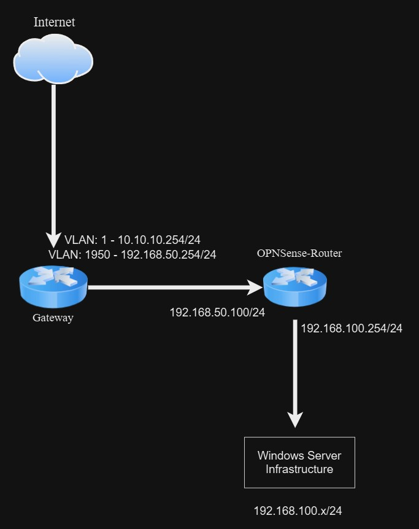

## Welcome to my little project for Windows Server

My goal for this project is to explore the world of Microsoft Windows Server. See, what it can do and how it integrates with other systems out there. 

Firstly, let's get a few things out of the way. What is Windows Server? I go through this in more details in my Overview discussion. However, Windows Server is an operating system that's mainly targeted to Business and Enterprise customers. Unlike Microsoft Windows 8, 10 and 11 which is targeted towards consumers and users, Windows Server exist to server these operating System. Windows Server is unique in the idea that it can become something like a Domain Controller, File Server, VPN Server or a Remote Desktop Server. Sure you can install Jellyfin or something else on your Windows computer that makes it into a server but Windows Servers are specifically designed to carry out these roles. Windows Server comes pre-baked with all kinds of roles and features that you can use to accomplish a given task.

My goal for this project is to somewhat re-educate myself on Windows Server and with the newly released Windows Server 2025, I think it's a great time to start. 

So before we get the our installation, let's get a few thing out of the way. What am I install Windows Server on and what does my networking looks like?

So I'll be use VMWare ESXi as my host, but you can use any Virtualization platform you're comfortable with. VMWare Workstation, Virtualbox, Proxmox, XCP-NG etc.

## HomeLab Setup

My VMWare ESXi Server has the following resources:

- 2 x Intel Xeon Gold 6118 - 24 Cores
- 138GB RAM
- 4 x 1TB SSD

I'm able to build a few virtual machines using these resources.

I'll briefly go through how the networking is setup. My Gateway is my home router. It's a Mikrotik Router. It's currently setup in Bridge Mode so my public IP address is managed on my router. The OPNSense-Router there is actually a Virtual Machine on my ESXi Server. I choose to use another router because my Mikrotik Router handles all the routing for my personal devices, so I prefer to have a separate network for all of my Windows Server since some servers can be chatty. Also, I don't need to worry about conflicting IP addresses within my Networking, I can just freely assigned any IP address I choose to whichever server I feel will be best. Since I am double NAT, I will need to add a few networking rules here and there to ensure that I can communication back and forth between the 10.10.10.0/24 and the 192.168.100.0/24 network.

If you're interested you can see how I setup my opnsense router here.

My Mikrotik router has a few VLANs on it. 10.10.10.0/24 is my main VLAN that all of my personal devices are on, VLAN 1950 with the subnet: 192.168.50.0/24, it a test subnet that I use for testing different servers and devices that I don't want on my main network. Subnet: 192.168.100.0/254 will be the network all of my Windows Devices will exist on.

This is what my networking looks like:

