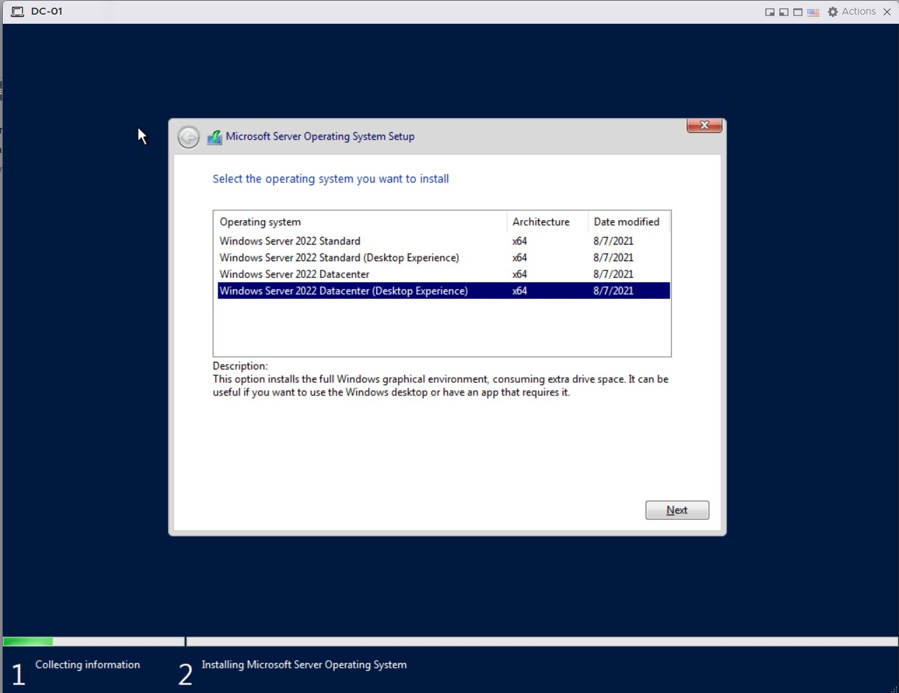

## Windows Server Installation

Welcome to your first hands-on experience with Windows Server if you've never used it before. Here I will be going through the installation process with you to get an idea as to what to look for. We will be installation Windows Server 2022 as it's currently the one I'm most comfortable with. I will going a blog write up of Windows Server 2025 when time permits.

First things first. Let's grab a copy of Windows Server 2022. You can find that here: [Download Windows Server 2022](https://www.microsoft.com/en-us/evalcenter/download-windows-server-2022)

As with my opnsense router. I will be creating a Virtual Machine using my ESXi server.

## Creating a Virtual Machine for Windows Server 2022

Click Create/Register VM

Select **Create a new virtual machine** and then click **NEXT**

**Select a name and guest OS**

I'm planning on making this server my domain controller so I will call it DC-01. The rest of the details are as follows:

- **Compatibility**: ESXi 8.0 U2 virtual machine
- **Guest OS family**: Windows
- **Guest OS Version**: Microsoft Windows Server 2022 (64-bit)

Click Next once you're done:

Next it will ask me where I would like to storae my virtual machine files. I have a few option but I will choose DS2-1TB and then click next:

Next it will want me to customize my settings. Here's what I want:

- **CPU** - 4 vCPU
- **Memory** - 8196MB or 8GB
- **Hard Disk1** - 90GB
- **Network Adapter 1** - PGroup19100 - This network is connected to my opnsense LAN.
- **CD/DVD Drive1** - Select the Windows Server 2022 ISO file.

Once you're done with everything, click **Next**

Then **Finish**

## Installing Windows Server 2022

Once you're done with the creating the virtual machine. It's time to start it up and install Windows Server

**Press any key to boot from CD or DVDs**

The installation process is fairly simple and straight-forward. First you will be asked the following:

- **Language to Install** - English (United States)
- **Time and currency format** - English (United States)
- **Keyboard or input method** - US

Click **Install now** to begin the installation

On the **Select the operating system you want to install** I will choose Windows Server 2022 Datacenter (Desktop Experience) has a GUI whereas the ones without is only a command prompt.

Accept the License terms and agreement and proceed

For **Which type of installation do you want?** Choose **Custom: Install Microsoft Server Operating System only (advanced)** to install a fresh copy of Windows Server.

Next we're ask **Where do you want to install the operating system?** I only have one drive available so I will click **Next**

Click next will begin the installation process

Once the installation is completed, it will automatically reboot the System within 10 seconds, you can also, click restart to reboot right away.

