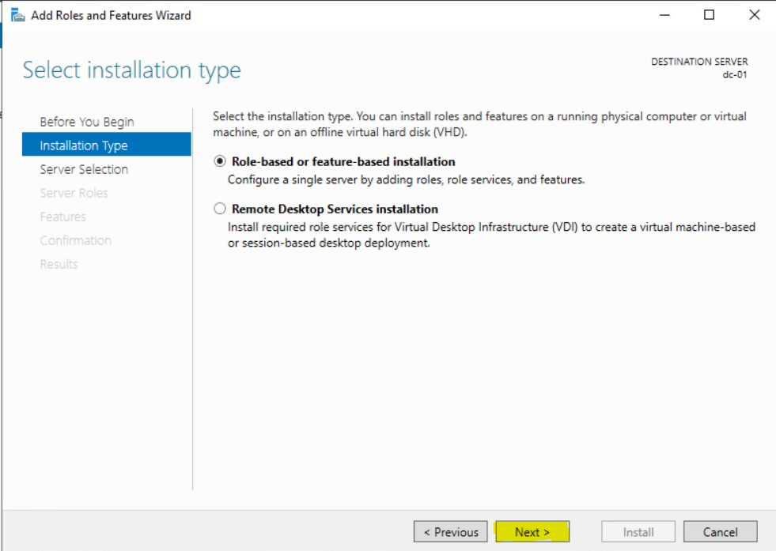
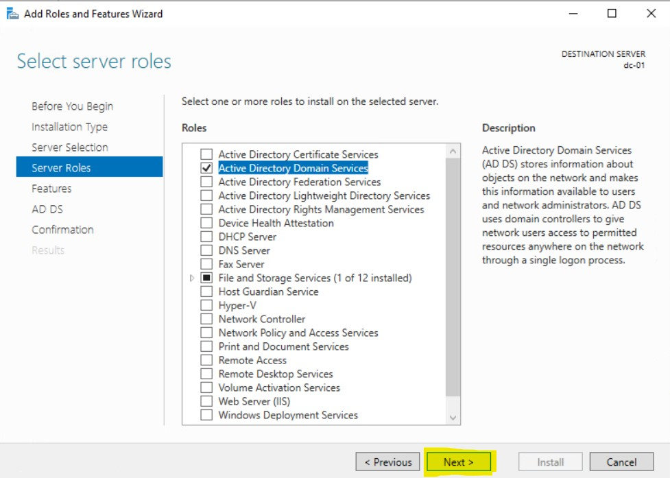
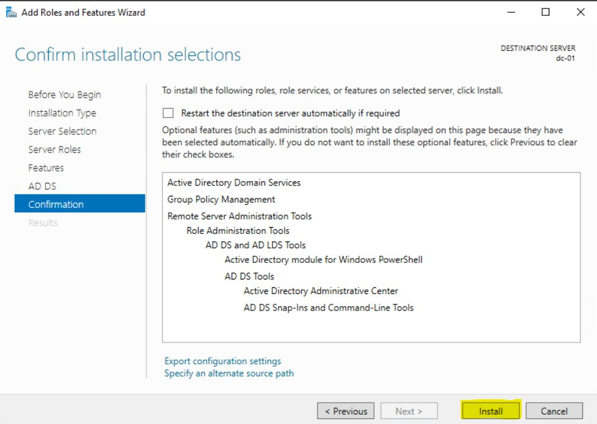

### Install Active Directory Domain Services

To Install **Active Directory Domain Services**, if you don't have it already, open **Server Manager**, then you'll want to click on **Add Roles and Features** there are a few places you can do this from.

On your main Dashboard under **WELCOME TO SERVER MANAGER** the second (2nd) option **Add roles and features** you can click on that to add the required roles but you can also click on **Manage** then **Add roles and features**. Both of these do the exactly same thing so it doesn't matter which one you use.

[](dc-01_install/adds1.jpg)

After you click on **Add Roles and Features** you will have a **Before you begin** information about some recommended task to be completed. We've done all except the updates which we will do another time. From here click **Next**

[](dc-01_install/adds2.jpg)

For the **Select installation type** we will choose **Role-based or feature-base installation** The second (2nd) option **Remote Desktop Services** is another feature we will visit in the future.

[](dc-01_install/adds3.jpg)

Next up we have **Select destination server**, currently we only have one (1) server to choose from but add we begin to add more and more servers to our Infrastructure, we'll be able to add roles and features on different servers which having to log into them. We can basically perform management task of many servers from just one server. Also another option here you might have notice is too **Select a virtual hard disk** where you can install choose to install the role on a .vhdx file. Currently we only have **dc-01**, so we'll click next here.

[](dc-01_install/adds4.jpg)

This is probably the screen where you'll be a bit intimidated if it's you're first time seeing it, but this is what I mean when I said that Windows Server can become something and all of these options is something that it can become. You can click through each role and read the brief description it gives you. You might notice that we already have the **File and storage Services** installed. By default, all Windows Server comes with this pre-installed. The role we want is the **Active Directory Domain Services role** so we'll check that off. 

[](dc-01_install/adds5.jpg)

Right after we check the box, you will get another pop-up asking you if you want to **Add features that are required for Active Directory Domain Services**. As you can see from the name these are required services that are needed to install Active Directory, you do not install these the installation cannot proceed. This is very common, most roles that you will be adding requires additional features for it proceed. Click **Add Features** to proceed.

[](dc-01_install/adds6.jpg)

Once you've click **Add Features** you'll notice that **Active Directory Domain Services** is now checked off, so we'll click **Next**

[](dc-01_install/adds7.jpg)

After clicking next, you will be brought to the **Select features** options. If you've read through the features we added early, you would have noticed that they is a feature called **Group Policy** and as you can see **Group Policy** is checked off here already along with the **Remote Server Administration Tool**. If you're wondering if you could have just checked it off yourself here, the answer is yes, remember you just need to features to installed Active Directory but you can choose when to install the features, but I like follow this way of doing it, I never have an issue when installing Active Directory by just adding the features when it asks. So from here, I will click **Next**

[](dc-01_install/adds8.jpg)

On the next screen **Active Directory Domain Services** it gives you some things to note about it. Like installing two Domain controllers to avoid server outages if your one domain controller goes down and Active Directory requires a DNS server to be installed on the network. The Domain Naming System or DNS is an integral part of Active Directory and All Domain Controllers are DNS servers. It also tries to sell you **Azure Active Directory** which is the Software as a Service (SAAS), plaform that they provide. I will click **next** here.

[](dc-01_install/adds9.jpg)

Finally you'll arrive at the **Confirm installation selections** screen where you have the opportunity to go back and check all of your settings to ensure that you selected the correct Roles and Features. **Active Directory Domain Service** is a very straightforward installation and if you've been following along what I've been doing, then you should not have any issues. Click **Install** to begin the installation. You can also check the box to **Restart the destination server automatically if required** installing **Active Directory Domain Services** does not require a reboot so I will just will install for now

[](dc-01_install/adds10.jpg)

## Promoting Domain Controller

As long as you've added the correct features your install should finish without any errors, it also gives you a summery of all the roles and features that it successfully installed. If it does error out you might have to do some research to figure out why it errored out. Now that the role is successfully installed, you will see under Active Directory Domain Services that **Additional steps are required to make this machine a domain controller** and under that you have **Promote this server to a domain controller**.

[](dc-01_install/adds10.jpg)

Next we will click the option **Promote this server to a domain controller** to begin the process. The first screen that comes up is **Deployment Configuration**. Here, you have a few options and I'll go through these.

- **Add a Domain controller to an existing domain** - This option would be useful if we were adding a second (2nd) Domain Controller to an existing forest. We currently don't have an Active Directory forest so this option will not work for us.

- **Add a new domain to an existing forest** - This option would be useful if we were adding another domain to our forest. For example if our Domain was called infotech.ca we can add a sub-domain called us.infotech.ca or even something something completely different like techlabs.ca. Let's say that we did indeed have all three of these domains, infotech.ca, us.infotech.ca and techlabs.ca, we can have all three of these domain exist within something called an Active Directory **Forest**. Think of an Forest as a container for domains. and Within the forest you can manage all of your domains and share resources between them.

- **Add a new forest:** - THis is the option you want to choose if you starting from the beginning, you don't have any forest or domain pre-existing. This is the first step you take. As I mentioned earlier, think of a forest as a container for your domains. We will choose **Add a new forest** and we will enter the domain: **prblabs.ca**

[](dc-01_install/adds12.jpg)

Your next screen will take you to **Domain Controller Options**. Your first choice is: Select functional level of the new forest and root domain. Forest and Domain functional levels are classified by different version of Windows Server operation system. The more 

Your last option is the create a **Type the Directory Services Restore Mode (DSRM) password**. Some short information about this: 

*The Directory Services Restore Mode (DSRM) password is a special password used in Active Directory (AD) environments. It is required when you need to boot a domain controller into Directory Services Restore Mode (DSRM), a special recovery mode for performing maintenance and repair tasks on the Active Directory database.*

I will be creating a password here then I will click next.

[](dc-01_install/adds13.jpg)

Click next will bring you to **Specify DNS delegation options** If you click on Show more you will see the following message:

[](dc-01_install/adds14.jpg)

This isn't anything to be alarmed about. It's basically saying that it's trying to create something in DNS, but we currently don't have DNS installed, however the installation will solve this issue for us. Click **Next** to proceed.

[](dc-01_install/adds15.jpg)

It will then automatically create a NetBios name for you. NetBIOS (Network Basic Input/Output System) is a legacy networking protocol that provides communication services for applications on a local network (LAN). It was developed in the early 1980s by IBM and Sytek and was designed to allow computers to communicate with each other over small, local networks. Although it is not used as much today in modern networks, it still has some legacy applications, especially in older versions of Windows and in environments where backward compatibility is necessary.

It will automatically create a NetBios name for us. I usually leave this as the default. Unless I need to change this for a specific reason.

[](dc-01_install/adds16.jpg)

Next it will ask us to **Specify the location of the AD DS database, log files and SYSVOL**. I usually leave these as the default. Unless I would want to store these on a remote server somewhere. I will click **Next**

[](dc-01_install/adds17.jpg)

The installation will give you a **Review Options** screen where you can go through your selections to ensure what you choose is what you want. You can click on the **View script** option that will show you some powershell commands for you to automate the installation. I will save it for my next server. Then I will click **Next**

[](dc-01_install/adds18.jpg)

The Third (3rd) to last screen will bring you to the **Prequisites Check** where it will ensure that your Windows Server meets of the requirements to become a Domain Controller. If there is any issues, your check will fail and you will see a few error messages with some action items. Usually you will have a few warnings, but these is standard, they installation will still proceed with the even if the warnings are not resolved. There is also a message at the bottom that tell you **If you click install, the server automatically reboots at the end of the promotion operations.** I'm working on a test Virtual Machine in my situation but if this was a server in production and you always need to give notice prior to reboot a server you will need to ensure the correct parties are notified. Lastly I will click **Install**

[](dc-01_install/adds19.jpg)

Once your installation is successful, the server will automatically reboot and it will bring you to a login screen. You can sign in with the same password you had before. Once to note about a Domain Controller is that the concept of Local Users no longer exist on a Domain Controller. What happens is that all of your accounts are now Domain Accounts that are managed by your Domain Controller. Once your DC reboots and you're back at the login screen, you will have to type CTRL+ALT+DEL for you to be able to type in your password. Another thing to log is that the account you're logging into is called **PRBLABS\Administrator** remember **prblabs.ca** was the name I chose for my Domain Controller. For now I will login with my password to proceed. I will enter my password and press enter.

[](dc-01_install/adds20.jpg)

As long as my credentials is correct, I will be logged into my Server's Desktop and as usual the Server Manage Dashboard will automatically load. If you're wondering if there's a way to have the Server Manager not come up, yes there is. You have to Click on **Manage > Server Manager Properties** and check the box for **Do no start Server Manager automatically at logon**

[](dc-01_install/adds21.jpg)

[](dc-01_install/adds22.jpg)

## Verifying your Windows Server is a Domain Controller

Okay so you've just promoted your computer to be a **Domain Controller** but how do you know that your computer is indeed a **Domain Controller**. Here's a few ways to get that information.

You can open up command prompt and type the following command: 

```
nltest/dsgetdc:<domain_name>
```
For my domain it will look like the following:

```
nltest /dsgetdc:prblabs.ca
```
You can see from the results, my **DC** is \\dc-01.prblabs.ca which is the name of my Windows Server.

[](dc-01_install/adds23.jpg)

Something else you can is the tools your Windows Server has installed. Usually Active Directory Comes with a few unique tools that's used to manage Active Directory. These are:

- Active Directory Users and Computers

- Active Directory Domains and Trust

- Active Directory Sites and Services

- Active Directory Module for Windows PowerShell

- Active Directory Administrative Center

- Group Policy Management

You might have recalled that we also installed the DNS server, however all Domain Controllers are DNS servers but not all DNS servers are Domain Controller. You can have a standalone DNS server without the Active Directory Roles installed.

[](dc-01_install/adds24.jpg)

Next you can open powershell as an Administrator and run the following command

```
Get-ADDomainController
```

And you show see the following results

[](dc-01_install/adds25.jpg)


From here you should see **Hostname: DC-01.prblabs.ca** which indicates that this server is indeed a **Domain Controller**

## Creating a Domain User Account

Okay, usually the first thing I like to do after I create a new Active Directory Domain is to create a user account that I will use for my Domain Operations.

I can do that in the following ways.

Open up **Server Manager** if you don't have it already. Click on **Tools** then **Active Directory Users and Computers**

[](dc-01_install/adds26.jpg)

**Active Directory Users and Computers** should now open up for you. It looks like this:

[](dc-01_install/adds27.jpg)

From here you can my Domain **prblabs.ca** and I'm able to expand that by click on the triangle next to my domain name

[](dc-01_install/adds28.jpg)

From here, you should see the default structure of Active Directory Users and Computers. Here's some information about the **Active Directory Users and Computers** console:

Active Directory Users and Computers (ADUC) is a Microsoft Management Console (MMC) snap-in used for managing objects within an Active Directory (AD) domain. It provides a graphical interface that allows administrators to manage and organize resources like users, computers, groups, and organizational units (OUs) in a domain.

## Key Features of ADUC:

### User Management:

- Create, modify, and manage user accounts.

- Set user properties, such as passwords, group memberships, logon hours, and account expiration.

### Computer Management:

- Add and manage computer accounts in the domain.

- Organize computers into Organizational Units (OUs) for easier management and policy application.

### Group Management:

- Create and manage security and distribution groups to control resource access and email distribution.

Organizational Units (OUs):

- OUs are containers that help organize and structure resources (users, computers, etc.) in the domain. You can apply Group Policies to OUs for centralized management.

### Delegate Administrative Control:

- ADUC allows you to delegate specific administrative tasks to users or groups without giving them full domain administrator privileges.

### Active Directory Search:

- You can use ADUC to search for and locate objects (users, computers, etc.) across the entire domain or within specific OUs.

### Typical Use Cases:

- Creating and managing user accounts (e.g., adding a new employee).

- Organizing resources into OUs for better management.

- Assigning group memberships to manage access to resources.

- Resetting passwords and unlocking user accounts.

The folders you see there aren't really folders. They are called: Organizational Units (OU) and they can used as a container for all of your Active Directory Objects like user accounts, group accounts and computer accounts. Let's create a new Organizational Unit (OU) under our **prblabs.ca** domain.

We'll right click on prblabs.ca and can choose:

[](dc-01_install/adds29.jpg)

I'll name my new Organization Unit **prbUsers** because this is where I'm going to store all of my new user accounts. I'll click **OK** once I'm done.

[](dc-01_install/adds30.jpg)

Once I click OK, my new Organizational Unit is create and I can begin using. After creation my OU will appear below Users but the Active Directory organizes all of it's OUs by alphabetical order so if I were to refresh or close Active Directory and re-open it since **P** comes before **U**, you will see prbUsers above Users.

[](dc-01_install/adds31.jpg)

## Creating an Active Directory User account

To create my first user account I will right-click on my **prbUsers Organizational Unit** then click **New** then **User**

[](dc-01_install/adds32.jpg)

From here the **New Object - User** box comes up and I will add the following information

- **First Name**: Prb
- **Last Name**: Admin 
- **Full Name** Prb Admin
- **User logon name**: prbadmin

The User logon name (pre-Windows 2000) will automatically be generated when you add the **User logon name**. Click next will ask me to create a password, here I have a few more options:

- User must change password at next logon:
- User cannot change password: 
- Password never expires
- Account is disable

I will uncheck all of these boxes because I do not need any of these options and click **Next** then **Finish**

[](dc-01_install/adds33.jpg)

[](dc-01_install/adds34.jpg)

[](dc-01_install/adds35.jpg)

Perfect, I've just created a user account. Cool, but what can I do it with? Well a **Domain account** like the one we just created will allow me to log into a **Domain Computer**. If your next questions is what is a **Domain computer?**. Well, it's a computer that is joined to the **Active Directory Domain**. You can see me domain my 2nd domain controller dc-02 to my Active Directory Domain here: [DC-02 - Joining Domain](dc-02.md). I will explain more about what I can do with my **Domain account** but first I would like to add my account to two **Security Groups** these are: **Domain Admin** and **Enterprise Admin**. 

I do this by right clicking on my **Prb Admin** then click **Properties**:

[](dc-01_install/adds36.jpg)

and click the **MemberOf** tab:

[](dc-01_install/adds37.jpg)

Then click the **Add** button:

[](dc-01_install/adds38.jpg)

Then type in **Domain Admins** in the **Enter the object names to select (examples):**

[](dc-01_install/adds39.jpg)

From where I will click **Check Names** and then Click OK. I will repeat the process to add the **Enterprise Admins** group as well.

[](dc-01_install/adds40.jpg)

From there I will click **Apply** and then **OK**

[](dc-01_install/adds41.jpg)

Perfect and we're done. We've just created an **Domain Account** and we've added this account to be the **Domain Admins** and **Enterprise Admins** security groups.

Here's how you can do the exact same thing in powershell.

First we'll click on our Start Menu and open up **Active Directory Module for Windows Powershell**. If you're wondering what's the difference between this and the regular powershell. This special powershell session comes with Active Directory commands pre-load, so we can use this special version of powershell to manage our Active Directory session. You can also launch regular powershell and load the Active Directory Module from there.

[](dc-01_install/adds42.jpg)

```
New-ADUser -Name "Prb User1" -GivenName "PRB" -Surname "User" -SamAccountName "prbuser1" -UserPrincipalName "prbuser1@yourdomain.com" -Path "CN=Users,DC=yourdomain,DC=com" -AccountPassword (ConvertTo-SecureString "Winter2024!" -AsPlainText -Force) -Enabled $true
```

[](dc-01_install/adds43.jpg)

Then back in Active Directory Users and Computer we might need to refresh the Window to see our new user account.

[](dc-01_install/adds44.jpg)

Once the refresh is completed, we should see our new user account inside of Active Directory:

[](dc-01_install/adds45.jpg)

Okay, I think I will end it here. I might have overloaded this section with a lot of information but I felt like the information was needed to get an idea of what's going on. It's nice to follow a tutorial to get something done but if you don't know what you're doing you might run into some issues the next time you have to do it on your own.

This was just our first stop for our Windows Servers. Next up we will be creating a Secondary Domain Controller called: DC-02. You can find that information here: [DC-02](dc-02.md)


