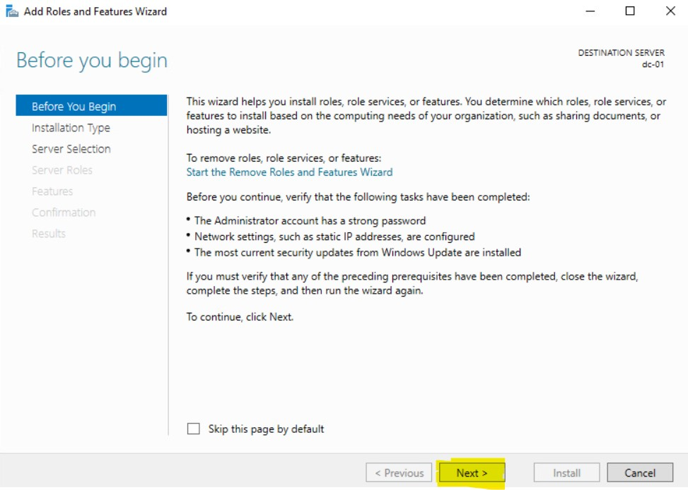

# What is Active Directory?

Okay, so at that the beginning of this project we talked about Windows Server and the roles they server in an On-prem Infrastructure. When you access something like google.com or Microsoft.com you are accessing a web-server that is providing a service. That web-server's job is to display the website for anyone that is accessing it. Let's say you wanted to self-host you own File Server, so you download a software called **Nextcloud** and you install it on a Linux Machine. The job of that **Nextcloud** server to ensure that you can share your files with your family and friends. 

Active Directory is directory service that is used to manage and store information about network resources like computers, users, services and devices, providing centralized administration and security for these resources. Active Directory has multiple components that it uses to manage these resources:

## Domain: 

- A domain is a logical group of objects (such as users and computers) that share the same Active Directory database. Each domain has its own security policies and relationships with other domains. A Domain has an hierarchical structure to store objects.

## Domain Controllers(DCs):

A Domain Controller is a server that host the **Active Directory Domain Services** role, You can think of it as a centralize location that all computers has to talk too.  Domain controllers are servers that store a copy of the Active Directory database and manage authentication and access to resources within the domain. They handle tasks like:

- User authentication (e.g., logging in to the network)
- Managing group policies
- Storing user, computer, and resource data

## Organizational Units (OUs):

- OUs are containers that organize users, computers, groups, and other OUs within a domain. They allow for delegation of administrative control and the application of group policies.

## Active Directory Objects:

The main entities stored in Active Directory are objects, which include:

- Users: Individual accounts representing people who access the network.
- Computers: Machines that are joined to the domain.
- Groups: Collections of users, computers, or other resources that can be managed together.
- Printers and Shared Folders: Devices and directories shared across the network.

## Trust

- Active Directory allows the creation of trust relationships between domains, enabling users from one domain to access resources in another domain. Trusts can be one-way or two-way.

## Global Catalog (GC):

- The Global Catalog contains a partial, read-only copy of all objects in an Active Directory forest, allowing users and applications to search for resources across multiple domains.

## Group Policy:

- Group Policy allows administrators to define settings and configurations for users and computers in the domain. These can include security settings, software deployment, and user environment customization.

## Active Directory Roles:

Active Directory provides several server roles that can be assigned to domain controllers, such as:

- Schema Master: Controls updates and changes to the Active Directory schema.
- Domain Naming Master: Manages changes to the domain name space in the forest.
- PDC Emulator: Emulates a Windows NT primary domain controller (PDC) and handles password changes and time synchronization.

## Use Cases of Active Directory:

- Centralized user management: Admins can manage user accounts, passwords, and permissions from a single location.
- Resource access control: AD enables secure access to network resources such as shared files, printers, and applications.
- Security policies: Admins can enforce password policies, software restrictions, and desktop settings through Group Policy.


## Installing Microsoft Active Directory

Before we get into the installation, let's pause a bit and think about what we're doing. Currently we have a Windows Server called **dc-01** and it's currently not really doing anything. If we want this server to serve a purpose we need to give it a role. For **dc-01** the we're going to give it a role called a **Active Directory Domain Server** so it can become a **Domain Controller**. If you're planning on creating a new Windows Server Infrastructure, the **Domain Controller** is probably the most important and critical server in your Infrastructure and it's always the first server we should install unless you have a specific reason for not doing so.

### What is a Domain Controller?

A Domain Controller (DC) is a server in a network that manages and controls security authentication requests, such as user logins, and enforces security policies within a Windows domain. It is a core component of Microsoft Active Directory (AD), which is a centralized directory service that provides management and configuration of resources, such as users, computers, printers, and security policies, within a domain.

### Key Functions of a Domain Controller:

- Authentication: The DC authenticates users, computers, and services within the domain. For example, when a user logs in to their computer, the DC verifies their credentials (username and password).

- Authorization: After authentication, the DC grants or denies access to resources (files, folders, printers, applications) based on the permissions and policies set by the administrators.

- Active Directory (AD) Management: The DC hosts a copy of the Active Directory database, which stores information about all domain objects (users, computers, groups, etc.) and their attributes.

- Group Policy Enforcement: Domain controllers enforce security policies and group policies across the network. Administrators can set rules for password complexity, account lockouts, or application restrictions centrally, and the DC ensures they are applied to all users and computers.

- Replication: In multi-DC environments, domain controllers replicate the Active Directory database to ensure that changes (like adding a new user or modifying security settings) are consistent across the network.

### Domain Controller in a Windows Domain:

- Primary Domain Controller (PDC): Historically, there was a single PDC in older Windows Server environments, but now all domain controllers in modern Active Directory are considered peers.

- Read-Only Domain Controller (RODC): This is a type of domain controller that contains a read-only copy of the Active Directory database, often used in environments with lower security, such as branch offices.

### Benefits of Domain Controllers:

- Centralized management: Administrators can manage all users and resources from a single location, ensuring consistency across the network.

- Security: Policies can be enforced network-wide, providing strong control over access to resources.

- Scalability: Adding new users, computers, or other objects is simple and managed centrally.

I know that's a lot of words and if you're new to Microsoft Domains, you're probably not sure what any of that means, but not to worry. We will install our First Domain Controller here.

### Perquisites for Setting up your Domain Controller

Prior to setting up your Domain Controller they are a few things you should probably have ready:

- **Static IP address** - You'll definitely want your Domain Controller to have a IP address that doesn't change, this means you will have to manually assigned an IP address. I prefer this method over a DHCP reservation

- **Assigned Computer Name** - Ensure that you've renamed your computer and not leave it with the default name. In Production environments, I like to name my Servers after the role it's serving. So DC-01 will be my first Domain Controller, DC-02 will be my second Domain Controller, WFS-01 will be my first Windows File Server, VPN-01 will be my first Windows VPN server. You don't have to follow naming scheme, but ensure that you're able to tell what kind of server it is just by looking at the name.

- **Domain Name** - This is the most important decision you will make. What will you call your Domain. Most Admins will name their domain after their company, for example. Microsoft's domain will be called Microsoft.com, an insurance company named: Starlight insurance can call their domain, starlightinsurance.ca or starlightin.local. Notice that I have different top level domain (TLD) for example. .com, .ca. .local, .internal etc. These are all acceptable Top-Level Domains that you can use. 

Before proceeding, I want to expand a bit more on the different Top-Level Domain. You can say that they are two types of TLD, you have an External TLD like .com, .ca, .org .edu or .net. Usually you will find these Top-Level Domains out on the internet but you also have a few internal Top-Level Domain like .local, .internal or .lan. 

So which one should you pick? an external TLD or an internal one?

Here's a some information to help you make the choice:

When setting up a domain for your Active Directory (AD) environment, choosing between an internal TLD (used only within the internal network) and an external TLD (which may be publicly available and used for external resources) comes with its own set of pros and cons. Your decision impacts DNS resolution, security, and compatibility with internal and external systems.

Here’s a breakdown of the pros and cons of using an internal TLD versus an external TLD for your Domain Controller.

# Internal TLD

An internal TLD is a domain suffix that is not publicly registered or resolvable outside of your internal network. Examples include .internal, .lan, .corp, or custom internal domains like infotech.local.

## Pros of Internal TLD

### Increased Security:

- Internal resolution only: Internal TLDs aren’t accessible or resolvable on the public internet, which reduces the attack surface for external threats.

- Data isolation: There’s a clear separation between internal and external resources, reducing the risk of inadvertently exposing internal systems or sensitive data to the public.
Simplicity in Name Management:

- No public domain conflicts: Since internal TLDs are not publicly registered, there's no concern about name collisions with public domains.

- Control over internal namespace: Administrators have full control over how the internal DNS is structured and managed without needing to consider external factors or domain registration processes.

- Flexibility: You can define internal domains without worrying about availability on the public internet. Custom or internal-only TLDs (like .internal or .lan) can be freely used for Active Directory without conflict.


### Cons of Internal TLD

### Potential for Future Conflicts:

- Some commonly used internal TLDs (like .corp or .local) may conflict with future public TLDs or technologies like mDNS (Multicast DNS), which reserves .local for use by devices such as Apple’s Bonjour.

## Limited External Access:

- Internal TLDs are not accessible outside your network without complex configurations (e.g., VPN or split-brain DNS). This makes accessing internal resources from the internet more challenging.

- Compatibility Issues: Some internal-only TLDs may cause issues when integrating with external services or when using hybrid cloud environments (e.g., Microsoft Azure or Office 365), as these services expect publicly resolvable domain names.

### No Public Resolution:

- If you need to resolve domain names externally (for remote workers, services in the cloud, etc.), you’ll need to manage separate DNS entries for internal and external resources.

- External TLD: An external TLD refers to a publicly registered domain name (e.g., .com, .org, .net, or a country code TLD like .ca), which is accessible both internally and externally.

### Pros of External TLD

## Unified Namespace:

- Using the same TLD both internally and externally creates a single, consistent namespace. For example, if your external domain is infotech.ca, using the same domain internally (e.g., ad.infotech.ca) simplifies DNS management and provides a seamless experience for both internal and external users.

## Easier Remote Access:

- External TLDs are resolvable over the internet, which simplifies external access to internal resources (e.g., VPN, web services, remote workers) without needing separate DNS configurations for different environments.

## Future-Proof:

- Using a registered external TLD ensures compatibility with future technologies, cloud services, and hybrid environments. Many external services (like Office 365 or Azure AD) expect publicly resolvable domain names, making it easier to integrate without renaming domains.

## Public and Internal Consistency:

- A unified TLD (for both internal and external use) eliminates the need for split-brain DNS configurations, where different records are served to internal and external users.
Cons of External TLD

## Potential Security Risks:

- If external and internal resources share the same domain, there’s a risk that internal resources may accidentally be exposed to the public internet if DNS or firewall configurations are mismanaged.
Public exposure of the TLD could provide attackers with insight into your internal infrastructure.

## DNS Complexity:

- Managing a publicly registered domain name requires careful planning for DNS zones and record separation. Internal resources should be kept isolated from external DNS servers, typically requiring split-horizon (split-brain) DNS.

## Domain Registration and Renewal Costs:

- Using an external TLD requires registering and maintaining a public domain, which incurs ongoing costs for domain renewal and DNS hosting.
Confusion Between Internal and External Resources:

- If not properly configured, users (or systems) might access the external versions of services rather than internal ones, causing confusion, slower access times, or exposing sensitive data.

## Creating a Domain Controller

Alright, now that we have our prequisites our of the way, we can start adding the **Active Directory Domain Services** role, so DC-01 can become a **Domain Controller**. There is really two steps in this process. First we need to install the Active Directory Domain Services role then we need to promote the Server to be a **Domain Controller**.

### Install Active Directory Domain Services

To Install **Active Directory Domain Services**, if you don't have it already, open **Server Manager**, then you'll want to click on **Add Roles and Features** there are a few places you can do this from.

On your main Dashboard under **WELCOME TO SERVER MANAGER** the second (2nd) option **Add roles and features** you can click on that to add the required roles but you can also click on **Manage** then **Add roles and features**. Both of these do the exactly same thing so it doesn't matter which one you use.

[](dc-01_install/adds1.jpg)

After you click on **Add Roles and Features** you will have a **Before you begin** information about some recommended task to be completed. We've done all except the updates which we will do another time. From here click **Next**

[](dc-01_install/adds2.jpg)

For the **Select installation type** we will choose **Role-based or feature-base installation** The second (2nd) option **Remote Desktop Services** is another feature we will visit in the future.

[](dc-01_install/adds3.jpg)

Next up we have **Select destination server**, currently we only have one (1) server to choose from but add we begin to add more and more servers to our Infrastructure, we'll be able to add roles and features on different servers which having to log into them. We can basically perform management task of many servers from just one server. Also another option here you might have notice is too **Select a virtual hard disk** where you can install choose to install the role on a .vhdx file. Currently we only have **dc-01**, so we'll click next here.

[](dc-01_install/adds4.jpg)

This is probably the screen where you'll be a bit intimidated if it's you're first time seeing it, but this is what I mean when I said that Windows Server can become something and all of these options is something that it can become. You can click through each role and read the brief description it gives you. You might notice that we already have the **File and storage Services** installed. By default, all Windows Server comes with this pre-installed. The role we want is the **Active Directory Domain Services role** so we'll check that off. 

[](dc-01_install/adds5.jpg)

Right after we check the box, you will get another pop-up asking you if you want to **Add features that are required for Active Directory Domain Services**. As you can see from the name these are required services that are needed to install Active Directory, you do not install these the installation cannot proceed. This is very common, most roles that you will be adding requires additional features for it proceed. Click **Add Features** to proceed.

[](dc-01_install/adds6.jpg)

Once you've click **Add Features** you'll notice that **Active Directory Domain Services** is now checked off, so we'll click **Next**

[](dc-01_install/adds7.jpg)

After clicking next, you will be brought to the **Select features** options. If you've read through the features we added early, you would have noticed that they is a feature called **Group Policy** and as you can see **Group Policy** is checked off here already along with the **Remote Server Administration Tool**. If you're wondering if you could have just checked it off yourself here, the answer is yes, remember you just need to features to installed Active Directory but you can choose when to install the features, but I like follow this way of doing it, I never have an issue when installing Active Directory by just adding the features when it asks. So from here, I will click **Next**

[](dc-01_install/adds8.jpg)

On the next screen **Active Directory Domain Services** it gives you some things to note about it. Like installing two Domain controllers to avoid server outages if your one domain controller goes down and Active Directory requires a DNS server to be installed on the network. The Domain Naming System or DNS is an integral part of Active Directory and All Domain Controllers are DNS servers. It also tries to sell you **Azure Active Directory** which is the Software as a Service (SAAS), plaform that they provide. I will click **next** here.

[](dc-01_install/adds9.jpg)

Finally you'll arrive at the **Confirm installation selections** screen where you have the opportunity to go back and check all of your settings to ensure that you selected the correct Roles and Features. **Active Directory Domain Service** is a very straightforward installation and if you've been following along what I've been doing, then you should not have any issues. Click **Install** to begin the installation. You can also check the box to **Restart the destination server automatically if required** installing **Active Directory Domain Services** does not require a reboot so I will just will install for now

[](dc-01_install/adds10.jpg)

## Promoting Domain Controller

As long as you've added the correct features your install should finish without any errors, it also gives you a summery of all the roles and features that it successfully installed. If it does error out you might have to do some research to figure out why it errored out. Now that the role is successfully installed, you will see under Active Directory Domain Services that **Additional steps are required to make this machine a domain controller** and under that you have **Promote this server to a domain controller**.

[](dc-01_install/adds10.jpg)

Next we will click the option **Promote this server to a domain controller** to begin the process. The first screen that comes up is **Deployment Configuration**. Here, you have a few options and I'll go through these.

- **Add a Domain controller to an existing domain** - This option would be useful if we were adding a second (2nd) Domain Controller to an existing forest. We currently don't have an Active Directory forest so this option will not work for us.

- **Add a new domain to an existing forest** - This option would be useful if we were adding another domain to our forest. For example if our Domain was called infotech.ca we can add a sub-domain called us.infotech.ca or even something something completely different like techlabs.ca. Let's say that we did indeed have all three of these domains, infotech.ca, us.infotech.ca and techlabs.ca, we can have all three of these domain exist within something called an Active Directory **Forest**. Think of an Forest as a container for domains. and Within the forest you can manage all of your domains and share resources between them.

- **Add a new forest:** - THis is the option you want to choose if you starting from the beginning, you don't have any forest or domain pre-existing. This is the first step you take. As I mentioned earlier, think of a forest as a container for your domains. We will choose **Add a new forest** and we will enter the domain: **prblabs.ca**

[](dc-01_install/adds12.jpg)

Your next screen will take you to **Domain Controller Options**. Your first choice is: Select functional level of the new forest and root domain. Forest and Domain functional levels are classified by different version of Windows Server operation system. The more 

Here's some additional information about Forest and Domain functional level

The **Forest Functional Level (FFL)** in Active Directory defines the set of Active Directory features that are available across all domains within a forest. It determines the version of Windows Server that can be used on domain controllers (DCs) and the features that can be used across the forest. It also ensures that domain controllers in the forest are running compatible versions of Windows Server for the selected functional level.

## Key Points About Forest Functional Levels:

- **Compatibility:** The FFL specifies the minimum version of Windows Server that domain controllers must run. For example, if the FFL is set to Windows Server 2016, all domain controllers in the forest must be running Windows Server 2016 or later.

- **Features:** Each functional level introduces new Active Directory features, improving the management, security, and functionality of the forest. Some advanced features only become available when the forest is raised to a higher functional level.

- **Per-Forest Setting:** The FFL applies to all domains within the forest. In contrast, Domain Functional Level (DFL) applies to individual domains within the forest. However, a domain cannot have a higher DFL than the forest’s FFL.

## Raising the Forest Functional Level:

You can raise the FFL to enable new features, but once you do so, older domain controllers running older versions of Windows Server cannot be part of the forest.

- To raise the forest functional level, you must ensure that all domain controllers in the forest are running the minimum Windows Server version required by the new functional level.

- This action is one-way—you cannot lower the FFL once it is raised without performing a domain or forest restore.

## Available Forest Functional Levels:

Here’s a breakdown of the available forest functional levels and the features they provide:

## Windows 2000 Native:

- Basic Active Directory features such as organizational units (OUs), Group Policy, and universal groups.

## Windows Server 2003:

- Forest Trusts: Allows the creation of trust relationships between different forests.

- Linked Value Replication: Improves replication of multi-valued attributes like group memberships.

- Improved security: More granular password policies.

## Windows Server 2008:

- Read-only Domain Controllers (RODCs): Allows domain controllers with read-only copies of Active Directory, improving security in less trusted locations.

- DFS Replication for SYSVOL: Replaces the older File Replication Service (FRS) for better replication.
Windows Server 2008 R2:

- Active Directory Recycle Bin: Allows restoration of accidentally deleted objects (such as users and groups) without restoring from a backup.

## Windows Server 2012:

- Dynamic Access Control (DAC): Provides more granular access control based on user attributes and security policies.

- Kerberos Armoring: Strengthens Kerberos authentication.

## Windows Server 2012 R2:

- Improved Kerberos Authentication: Additional security features like shadow principals for resource forests.

## Windows Server 2016 (highest available FFL):

- Privileged Access Management (PAM): Allows for time-limited privileged access using Microsoft Identity Manager.

- Azure AD integration: Enhanced support for hybrid identity setups involving both on-premises AD and Azure AD.

**Important Considerations:

- Raising the FFL is permanent: You cannot lower the functional level once it is raised.

- All domain controllers must be compatible: Before raising the FFL, ensure that all domain controllers are running at least the minimum Windows Server version required for the new functional level.

- New features become available: Some advanced Active Directory features, like the Active Directory Recycle Bin or Privileged Access Management, require a higher FFL to function.

## When to Raise the Forest Functional Level:

You should raise the FFL when:

- All domain controllers in the forest are running a compatible Windows Server version (e.g., Windows Server 2016 or higher).

- You want to take advantage of new features and security enhancements introduced in newer functional levels.

For our Functional level we will choose **2016**

Next is the Domain Function level:

## What Are Domain Functional Levels (DFL)?

The Domain Functional Level (DFL) determines the set of advanced features available in a particular Active Directory domain. It also specifies the minimum version of Windows Server that domain controllers in the domain can run. Higher functional levels unlock additional Active Directory features, but to raise the DFL, all domain controllers in the domain must be running a Windows Server version that supports the chosen functional level.

## Key Points About Domain Functional Levels: 

- Compatibility: DFL defines the minimum Windows Server version required for all domain controllers in a domain. For instance, if the DFL is set to Windows Server 2016, then all domain controllers must be running Windows Server 2016 or later.

- Feature Availability: Higher domain functional levels enable more advanced Active Directory features. As you raise the DFL, new features become available, but older domain controllers that do not meet the functional level requirements can no longer be used.

- Per-Domain Setting: The DFL is specific to each domain. Multiple domains within the same forest can operate at different functional levels, but no domain can have a functional level higher than the forest's functional level (FFL).

- Permanent Change: Raising the DFL is a one-way operation—you can raise it, but you cannot lower it without restoring the domain from a backup. This ensures that all domain controllers are upgraded before the new functionality is introduced.

## Available Domain Functional Levels and Their Features:

Here is a list of the available DFLs and the key features they introduce:

## Windows 2000 Native:

- Basic Active Directory features such as Organizational Units (OUs), Group Policy, and Universal Groups.

- Domain controllers can run Windows 2000 or higher.

## Windows Server 2003:

- Linked Value Replication (LVR): Reduces replication traffic by replicating changes to individual group members instead of the entire group.

- Improved password policies: Supports fine-grained password and account lockout policies for different sets of users.
Last logon timestamp attribute: Tracks the last time a user successfully authenticated in the domain.

- Domain controllers must run Windows Server 2003 or higher.

## Windows Server 2008:

- Read-only Domain Controllers (RODCs): Allows for domain controllers with read-only copies of Active Directory, useful in less secure locations.

- DFS Replication for SYSVOL: Replaces the older File Replication Service (FRS) with DFS Replication for better performance and reliability.

- Domain controllers must run Windows Server 2008 or higher.

## Windows Server 2008 R2:

- Active Directory Recycle Bin: Enables administrators to restore deleted AD objects (users, groups, etc.) without needing to restore from a backup.

- Authentication Mechanism Assurance: Adds the ability to enforce more stringent security policies based on the method of authentication.

- Domain controllers must run Windows Server 2008 R2 or higher.

## Windows Server 2012:

- Dynamic Access Control (DAC): Provides more flexible access control policies that are based on user attributes (claims-based access control).

- Kerberos Armoring: Provides stronger security for Kerberos authentication, preventing certain types of attacks.

- Domain controllers must run Windows Server 2012 or higher.

## Windows Server 2012 R2:

- Improved Kerberos Authentication: Adds claims-based authentication, which allows for more granular and flexible control over resource access.

- Domain controllers must run Windows Server 2012 R2 or higher.


## Windows Server 2016 (Highest available functional level): 

- Privileged Access Management (PAM): Provides mechanisms to control and monitor privileged administrative access with time-bound access controls.

- Improved security features: Better security auditing, protection from credential theft, and stronger encryption protocols between domain controllers and clients.

## Domain controllers must run Windows Server 2016 or higher.

### Windows Server 2019 / 2022:

- No new DFL introduced: Windows Server 2019 and Windows Server 2022 continue to use the Windows Server 2016 DFL as the highest available functional level. These newer server versions introduce performance and security enhancements but do not require a new domain functional level.

- Domain controllers can run Windows Server 2019 or Windows Server 2022, but the functional level remains at Windows Server 2016.

Okay, I'm you've probably scrolled through all of that block of text, but I figured I'd add it there just in case you were curious what the forest and domain functional levels. 
However, just to recap we will be be selecting ***2016** for both the **Forest functional level** and **Domain functional level**

Another option is the **Specific domain controller capabilities**, notice that it pre-checked **Domain Name System (DNS) server** and **Global Catalog (GC)**. You're able to uncheck DNS if you want to but I would advise you not too, a domain controller heavily relies on the DNS service to perform most of it's duties, if you were to uncheck **DNS** from the list of options, your installation will fail. The other option **Global Catalog** here's some information about the **Global Catalog** feature. 

## Global Catalog

In Active Directory (AD), the Global Catalog (GC) is a distributed data repository that contains a partial, read-only copy of all objects from every domain in the forest. The Global Catalog is designed to help users and applications find and access directory information across multiple domains within a forest quickly, without the need to contact each domain individually.

### Key Features of the Global Catalog:

### Partial Attribute Set:

- The Global Catalog doesn’t store a complete copy of every object. Instead, it stores a subset of attributes, known as the partial attribute set. This subset includes attributes that are most frequently used in search queries, such as a user’s first name, last name, email address, and group membership.

- Each domain controller that hosts the Global Catalog holds the partial attribute set for all objects in every domain of the forest, not just the domain it belongs to.

### Full Copies of Local Domain Data:

- For the domain in which a Global Catalog server resides, the Global Catalog contains a full copy of all objects and their attributes. This ensures that domain controllers can still perform full queries for objects in their own domain without needing to refer to another domain controller.

### Global Search:

- One of the main functions of the Global Catalog is to provide an efficient search mechanism across all domains in the forest. When a user or application searches for an object (such as another user or printer), the Global Catalog allows the search to include all domains in the forest without needing to contact every domain controller separately.

### Authentication:

- The Global Catalog plays an important role in user logon. When a user logs into a domain, the domain controller checks the user’s membership in universal groups, which may be stored in other domains. The Global Catalog provides this information quickly, enabling the logon process to complete even if the user belongs to universal groups from other domains.
If the Global Catalog is unavailable, users may experience issues logging into the domain, especially if they belong to groups that span multiple domains.

### Universal Group Membership Caching:

- The Global Catalog contains information about universal groups in the forest. Universal groups can contain members from any domain within the forest, so storing membership details in the Global Catalog makes it possible to resolve group memberships without needing to contact every domain individually.

### Location of Global Catalog Servers:

- Global Catalog Servers are domain controllers that have been specifically configured to hold the Global Catalog. Not every domain controller in a forest has to be a Global Catalog server, but it's common to have at least one Global Catalog server per site for performance and redundancy.

- By default, the first domain controller in a forest is configured as a Global Catalog server. Additional domain controllers can be designated as Global Catalog servers as needed.

### Why Is the Global Catalog Important?

- Forest-Wide Searches: The Global Catalog allows users to search for resources (such as users, computers, and printers) across all domains within the forest. Without the Global Catalog, users would have to query domain controllers for each domain individually to find what they are looking for.

- Faster Authentication: The Global Catalog is critical during the logon process because it stores universal group memberships. When a user logs in, their group memberships are checked, and the Global
Catalog provides that information. If no Global Catalog server is available, logging in may fail or be delayed.

- Multi-Domain Environments: In environments where there are multiple domains in a forest, the Global Catalog provides a way to efficiently handle directory searches and group membership queries across domains. It simplifies the process by storing key information about objects across the entire forest in one place.

### Global Catalog and Domain Controllers:

- Global Catalog servers are a special role that can be assigned to domain controllers. Not all domain controllers need to be Global Catalog servers, but it's recommended to have at least one in each Active Directory site to ensure high availability and quick directory searches.

- To make a domain controller a Global Catalog server, you can enable the Global Catalog feature via the Active Directory Sites and Services tool.

### How the Global Catalog Works:

- The Global Catalog contains:
    - A full replica of all objects and attributes in its own domain.
    - A partial replica (subset of key attributes) for objects in all other domains in the forest.

When a user or application performs a global search, such as looking for all users with a particular attribute, the Global Catalog server provides the relevant information without needing to query domain controllers in each domain individually.

### Key Attributes Stored in the Global Catalog:

Some of the key attributes stored in the Global Catalog include:

- User attributes such as first name, last name, email address.

- Computer object attributes such as name and location.

- Universal group memberships.

The Active Directory schema defines which attributes are stored in the Global Catalog. By default, frequently searched attributes are included, but administrators can modify the schema to add or remove attributes from the Global Catalog.

### Benefits of the Global Catalog:

- Efficient Searches: Allows users and applications to search for directory information across multiple domains without needing to contact every domain controller.

- Faster Logon Process: Provides quick access to universal group membership information during user logon, enabling faster authentication.

- Simplifies Multi-Domain Queries: For large forests with multiple domains, the Global Catalog greatly simplifies and speeds up directory queries by storing a partial copy of objects from all domains.

### Considerations:

- Availability: It’s a good practice to ensure there’s a Global Catalog server in each Active Directory site to avoid issues with logon and directory queries, especially in large, multi-domain environments.

- Network Traffic: Global Catalog replication can increase network traffic since the Global Catalog needs to be updated across domains whenever an object or attribute in the forest changes.

### Example Scenario:

If you have two domains in your forest, infotech.ca and prblabs.ca, and a user from infotech.ca needs to search for a user or resource in prblabs.ca, they would contact a Global Catalog server. The Global Catalog server would provide the necessary information about objects in prblabs.ca without needing to query a domain controller in prblabs.ca directly, making the search process faster and more efficient.

The last option we have that is greyed out is **Read only domain controller (RODC)**. Here is some information about the RODC:

A **Read-Only Domain Controller (RODC)** is a special type of domain controller in Active Directory introduced in Windows Server 2008. Unlike a traditional writable domain controller, an RODC contains a read-only copy of the Active Directory database, which means that it does not allow changes to be made directly on it. Any changes that need to be made to the Active Directory database (such as password updates, group changes, etc.) must be sent to a writable domain controller.

RODCs are designed for use in environments where security is a concern, or in locations where physical security or connectivity to the network is less reliable, such as branch offices. They provide many of the benefits of a traditional domain controller, such as authenticating logon requests and servicing queries, but with added security restrictions.

## Key Features of an RODC:

## Read-Only Active Directory Database:

- The Active Directory database on an RODC is read-only, meaning it cannot accept or process updates. Any changes made to AD objects must be forwarded to a writable domain controller, which then replicates the updates back to the RODC.

- This limits the potential for accidental or malicious changes to the Active Directory database on the RODC.

## Credential Caching:

- By default, an RODC does not store user or computer credentials (passwords) locally. However, specific credentials can be cached on the RODC to allow for faster logon processes, particularly useful in remote locations where WAN connections to a writable domain controller might be slow or unreliable.

- You can control which user or group credentials are cached using a feature called Password Replication Policy (PRP). This allows administrators to specify which accounts’ credentials are allowed to be stored on the RODC, adding an extra layer of security.

## Improved Security in Less Secure Locations:

- The RODC is particularly useful in environments where physical security may be compromised, such as branch offices or remote sites. Since it only contains a read-only copy of the AD database, any compromise of the RODC does not allow an attacker to make changes directly to Active Directory.

- If an RODC is stolen or compromised, no changes can be made to the Active Directory environment, and the credential data stored on it is limited.

## Unidirectional Replication:

- Replication between an RODC and a writable domain controller is unidirectional. The RODC receives updates from a writable domain controller but does not replicate changes back to the writable domain controller. This means that any changes made locally on the RODC (if somehow attempted) will not affect the writable domain controllers in the environment.

Administrator Role Separation:

- RODCs allow for administrator role separation, which means that you can delegate local administration of the RODC to non-domain administrators without giving them full domain administrator rights. This is useful in scenarios where local IT staff need to manage the RODC but should not have broader privileges within the domain.

### Key Benefits of an RODC:

Enhanced Security for Remote or Less Secure Locations:

- Since the RODC holds only a read-only copy of the Active Directory database and can limit credential caching, it reduces the risk of data compromise in environments where physical or network security cannot be guaranteed.

- Even if an RODC is physically compromised, attackers cannot modify the AD database or elevate privileges on the domain.

### Reduced Risk of Credential Exposure:

- By using Password Replication Policies (PRP) to control which credentials are cached locally, you can ensure that only a subset of users’ credentials are stored on the RODC, minimizing the risk if the RODC is compromised.

### Local Authentication Without Full DC:

- In remote sites with poor network connectivity, an RODC can provide local authentication and authorization for users, even if the connection to a writable domain controller is slow or intermittent. Cached credentials enable users to authenticate even if the RODC temporarily loses connection to the main network.

### Delegated Administration:

- The ability to delegate local administration to non-domain administrators (without giving them access to the full Active Directory infrastructure) is beneficial for branch offices where IT staff need to perform maintenance on the RODC but should not have broader access rights.

## Password Replication Policy (PRP):

A Password Replication Policy (PRP) defines which user and computer credentials are allowed to be cached on the RODC. By default, an RODC does not cache any credentials unless explicitly allowed via PRP. This helps prevent credential theft in the event that an RODC is compromised.

- Allowed List: Specifies which user accounts or computer accounts can have their credentials cached on the RODC.

- Denied List: Specifies which user or computer credentials can never be cached on the RODC. This typically includes sensitive accounts like domain admins, enterprise admins, and server administrators.

## Use Cases for RODC:

### Branch Offices:

- RODCs are ideal for branch offices where there might be limited IT staff and less secure infrastructure. They provide local authentication and replication while mitigating risks associated with physical security breaches.

### Remote Locations with Poor Connectivity:

- In areas where network connectivity to a writable domain controller might be unreliable or slow, an RODC can serve as a local domain controller, caching credentials and servicing logon requests without requiring continuous access to the central AD infrastructure.

### Edge Environments or DMZs:

- RODCs can be deployed in a perimeter network (DMZ) to allow secure access to the network for certain services without exposing the writable domain controller to potential external threats.

The reason why the RODC option is currently unchecked is mostly because we currently don't have a primary domain controller. The Primary Domain Controller is usually the first domain controller, however, any domain controller can be the primary as long as they hold the 5 FMSO roles.

Your last option is the create a **Type the Directory Services Restore Mode (DSRM) password**. Some short information about this: 

*The Directory Services Restore Mode (DSRM) password is a special password used in Active Directory (AD) environments. It is required when you need to boot a domain controller into Directory Services Restore Mode (DSRM), a special recovery mode for performing maintenance and repair tasks on the Active Directory database.*

I will be creating a password here then I will click next.

[](dc-01_install/adds13.jpg)

Click next will bring you to **Specify DNS delegation options** If you click on Show more you will see the following message:

[](dc-01_install/adds14.jpg)

This isn't anything to be alarmed about. It's basically saying that it's trying to create something in DNS, but we currently don't have DNS installed, however the installation will solve this issue for us. Click **Next** to proceed.

[](dc-01_install/adds15.jpg)

It will then automatically create a NetBios name for you. NetBIOS (Network Basic Input/Output System) is a legacy networking protocol that provides communication services for applications on a local network (LAN). It was developed in the early 1980s by IBM and Sytek and was designed to allow computers to communicate with each other over small, local networks. Although it is not used as much today in modern networks, it still has some legacy applications, especially in older versions of Windows and in environments where backward compatibility is necessary.

It will automatically create a NetBios name for us. I usually leave this as the default. Unless I need to change this for a specific reason.

[](dc-01_install/adds16.jpg)

Next it will ask us to **Specify the location of the AD DS database, log files and SYSVOL**. I usually leave these as the default. Unless I would want to store these on a remote server somewhere. I will click **Next**

[](dc-01_install/adds17.jpg)

The installation will give you a **Review Options** screen where you can go through your selections to ensure what you choose is what you want. You can click on the **View script** option that will show you some powershell commands for you to automate the installation. I will save it for my next server. Then I will click **Next**

[](dc-01_install/adds18.jpg)

The Third (3rd) to last screen will bring you to the **Prequisites Check** where it will ensure that your Windows Server meets of the requirements to become a Domain Controller. If there is any issues, your check will fail and you will see a few error messages with some action items. Usually you will have a few warnings, but these is standard, they installation will still proceed with the even if the warnings are not resolved. There is also a message at the bottom that tell you **If you click install, the server automatically reboots at the end of the promotion operations.** I'm working on a test Virtual Machine in my situation but if this was a server in production and you always need to give notice prior to reboot a server you will need to ensure the correct parties are notified. Lastly I will click **Install**

[](dc-01_install/adds19.jpg)

Once your installation is successful, the server will automatically reboot and it will bring you to a login screen. You can sign in with the same password you had before. Once to note about a Domain Controller is that the concept of Local Users no longer exist on a Domain Controller. What happens is that all of your accounts are now Domain Accounts that are managed by your Domain Controller. Once your DC reboots and you're back at the login screen, you will have to type CTRL+ALT+DEL for you to be able to type in your password. Another thing to log is that the account you're logging into is called **PRBLABS\Administrator** remember **prblabs.ca** was the name I chose for my Domain Controller. For now I will login with my password to proceed. I will enter my password and press enter.

[](dc-01_install/adds20.jpg)

As long as my credentials is correct, I will be logged into my Server's Desktop and as usual the Server Manage Dashboard will automatically load. If you're wondering if there's a way to have the Server Manager not come up, yes there is. You have to Click on **Manage > Server Manager Properties** and check the box for **Do no start Server Manager automatically at logon**

[](dc-01_install/adds21.jpg)

[](dc-01_install/adds22.jpg)

## Verifying your Windows Server is a Domain Controller

Okay so you've just promoted your computer to be a **Domain Controller** but how do you know that your computer is indeed a **Domain Controller**. Here's a few ways to get that information.

You can open up command prompt and type the following command: 

```
nltest/dsgetdc:<domain_name>
```
For my domain it will look like the following:

```
nltest /dsgetdc:prblabs.ca
```
You can see from the results, my **DC** is \\dc-01.prblabs.ca which is the name of my Windows Server.

[](dc-01_install/adds23.jpg)

Something else you can is the tools your Windows Server has installed. Usually Active Directory Comes with a few unique tools that's used to manage Active Directory. These are:

- Active Directory Users and Computers

- Active Directory Domains and Trust

- Active Directory Sites and Services

- Active Directory Module for Windows PowerShell

- Active Directory Administrative Center

- Group Policy Management

You might have recalled that we also installed the DNS server, however all Domain Controllers are DNS servers but not all DNS servers are Domain Controller. You can have a standalone DNS server without the Active Directory Roles installed.

[](dc-01_install/adds24.jpg)

Next you can open powershell as an Administrator and run the following command

```
Get-ADDomainController
```

And you show see the following results

[](dc-01_install/adds25.jpg)


From here you should see **Hostname: DC-01.prblabs.ca** which indicates that this server is indeed a **Domain Controller**

## Creating a Domain User Account

Okay, usually the first thing I like to do after I create a new Active Directory Domain is to create a user account that I will use for my Domain Operations.

I can do that in the following ways.

Open up **Server Manager** if you don't have it already. Click on **Tools** then **Active Directory Users and Computers**

[](dc-01_install/adds26.jpg)

**Active Directory Users and Computers** should now open up for you. It looks like this:

[](dc-01_install/adds27.jpg)

From here you can my Domain **prblabs.ca** and I'm able to expand that by click on the triangle next to my domain name

[](dc-01_install/adds28.jpg)

From here, you should see the default structure of Active Directory Users and Computers. Here's some information about the **Active Directory Users and Computers** console:

Active Directory Users and Computers (ADUC) is a Microsoft Management Console (MMC) snap-in used for managing objects within an Active Directory (AD) domain. It provides a graphical interface that allows administrators to manage and organize resources like users, computers, groups, and organizational units (OUs) in a domain.

## Key Features of ADUC:

### User Management:

- Create, modify, and manage user accounts.

- Set user properties, such as passwords, group memberships, logon hours, and account expiration.

### Computer Management:

- Add and manage computer accounts in the domain.

- Organize computers into Organizational Units (OUs) for easier management and policy application.

### Group Management:

- Create and manage security and distribution groups to control resource access and email distribution.

Organizational Units (OUs):

- OUs are containers that help organize and structure resources (users, computers, etc.) in the domain. You can apply Group Policies to OUs for centralized management.

### Delegate Administrative Control:

- ADUC allows you to delegate specific administrative tasks to users or groups without giving them full domain administrator privileges.

### Active Directory Search:

- You can use ADUC to search for and locate objects (users, computers, etc.) across the entire domain or within specific OUs.

### Typical Use Cases:

- Creating and managing user accounts (e.g., adding a new employee).

- Organizing resources into OUs for better management.

- Assigning group memberships to manage access to resources.

- Resetting passwords and unlocking user accounts.

The folders you see there aren't really folders. They are called: Organizational Units (OU) and they can used as a container for all of your Active Directory Objects like user accounts, group accounts and computer accounts. Let's create a new Organizational Unit (OU) under our **prblabs.ca** domain.

We'll right click on prblabs.ca and can choose:

[](dc-01_install/adds29.jpg)

I'll name my new Organization Unit **prbUsers** because this is where I'm going to store all of my new user accounts. I'll click **OK** once I'm done.

[](dc-01_install/adds30.jpg)

Once I click OK, my new Organizational Unit is create and I can begin using. After creation my OU will appear below Users but the Active Directory organizes all of it's OUs by alphabetical order so if I were to refresh or close Active Directory and re-open it since **P** comes before **U**, you will see prbUsers above Users.

[](dc-01_install/adds31.jpg)

## Creating an Active Directory User account

To create my first user account I will right-click on my **prbUsers Organizational Unit** then click **New** then **User**

[](dc-01_install/adds32.jpg)

From here the **New Object - User** box comes up and I will add the following information

- **First Name**: Prb
- **Last Name**: Admin 
- **Full Name** Prb Admin
- **User logon name**: prbadmin

The User logon name (pre-Windows 2000) will automatically be generated when you add the **User logon name**. Click next will ask me to create a password, here I have a few more options:

- User must change password at next logon:
- User cannot change password: 
- Password never expires
- Account is disable

I will uncheck all of these boxes because I do not need any of these options and click **Next** then **Finish**

[](dc-01_install/adds33.jpg)

[](dc-01_install/adds34.jpg)

[](dc-01_install/adds35.jpg)

Perfect, I've just created a user account. Cool, but what can I do it with? Well a **Domain account** like the one we just created will allow me to log into a **Domain Computer**. If your next questions is what is a **Domain computer?**. Well, it's a computer that is joined to the **Active Directory Domain**. You can see me domain my 2nd domain controller dc-02 to my Active Directory Domain here: [DC-02 - Joining Domain](dc-02.md). I will explain more about what I can do with my **Domain account** but first I would like to add my account to two **Security Groups** these are: **Domain Admin** and **Enterprise Admin**. 

I do this by right clicking on my **Prb Admin** then click **Properties**:

[](dc-01_install/adds36.jpg)

and click the **MemberOf** tab:

[](dc-01_install/adds37.jpg)

Then click the **Add** button:

[](dc-01_install/adds38.jpg)

Then type in **Domain Admins** in the **Enter the object names to select (examples):**

[](dc-01_install/adds39.jpg)

From where I will click **Check Names** and then Click OK. I will repeat the process to add the **Enterprise Admins** group as well.

[](dc-01_install/adds40.jpg)

From there I will click **Apply** and then **OK**

[](dc-01_install/adds41.jpg)

Perfect and we're done. We've just created an **Domain Account** and we've added this account to be the **Domain Admins** and **Enterprise Admins** security groups.

Here's how you can do the exact same thing in powershell.

First we'll click on our Start Menu and open up **Active Directory Module for Windows Powershell**. If you're wondering what's the difference between this and the regular powershell. This special powershell session comes with Active Directory commands pre-load, so we can use this special version of powershell to manage our Active Directory session. You can also launch regular powershell and load the Active Directory Module from there.

[](dc-01_install/adds42.jpg)

```
New-ADUser -Name "Prb User1" -GivenName "PRB" -Surname "User" -SamAccountName "prbuser1" -UserPrincipalName "prbuser1@yourdomain.com" -Path "CN=Users,DC=yourdomain,DC=com" -AccountPassword (ConvertTo-SecureString "Winter2024!" -AsPlainText -Force) -Enabled $true
```

[](dc-01_install/adds43.jpg)

Then back in Active Directory Users and Computer we might need to refresh the Window to see our new user account.

[](dc-01_install/adds44.jpg)

Once the refresh is completed, we should see our new user account inside of Active Directory:

[](dc-01_install/adds45.jpg)

Okay, I think I will end it here. I might have overloaded this section with a lot of information but I felt like the information was needed to get an idea of what's going on. It's nice to follow a tutorial to get something done but if you don't know what you're doing you might run into some issues the next time you have to do it on your own.

This was just our first stop for our Windows Servers. Next up we will be creating a Secondary Domain Controller called: DC-02. You can find that information here: [DC-02](dc-02.md)


