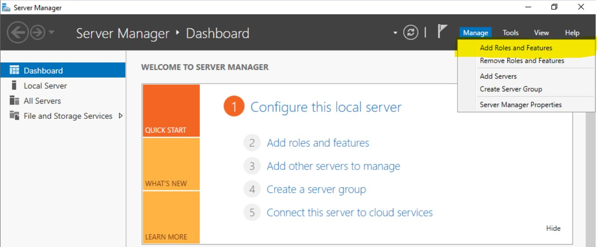
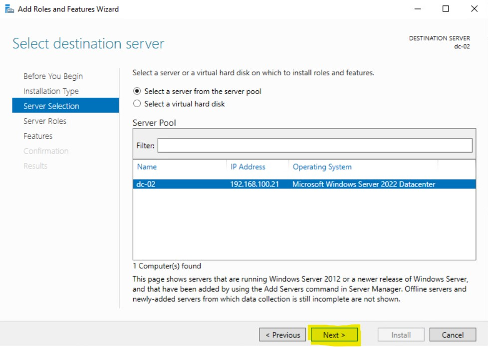

## Building a Secondary Domain Controller

In the previous section we created a New Domain Controller called: DC-01 you can find that setup here: [DC-01](dc-01.md). Now we're going to be creating a new domain controller. I've essentially built a new Windows Server and called it: **DC-02** following the same methods I did in this page: [Windows Server Installation](Windows_Server_Install\WinSrvInstall.md). The only things I changed here where was the name of the Virtual Machine, the Hostname and the IP address where I used: 

- **IP address**: 192.168.100.21
- **Subnet Mask**: 255.255.255.0
- **Gateway**: 192.168.100.254
- **DNS Server 1**: 192.168.100.20
- **DNS Server 2**: 192.168.100.21

You might have noticed that I used DC-01 as the DNS Server 1 and DC-02 will be the secondary DNS Server. If you're think that you prefer to use google's DNS at 8.8.8.8. Let's see why that won't work for you.

So we currently have an Active Directory Domain. Awesome right, but how do we use it and what does that really mean? Currently inside of our Active Directory Domain we only have 1 server within our Domain and that is DC-01. Which means we can only manage DC-01 and any user accounts that we create can only log into DC-01. Which is not very useful at the moment but we'll change that. We'll add DC-02 to our prblabs.ca domain. Here's how we do that but first, I changed my DNS settings on DC-02 to be the following.

Notice I have my DNS servers set to 8.8.8.8 and 1.1.1.1. These are what you call: Public DNS Servers. Which means anyone can use this to get out to the internet. 

Now to add DC-02 to my prblabs.ca Domain. First I open up Server Manager and go to Local Computer then I click on Computer Name: **dc-02** 

Then I click on **Change**

And under **Member of** I change this from **Workgroup** to a **Domain** and I enter **prblabs.ca** in the Domain field:

And I will then click **OK** and spoiler alert there is going to be an error message:

Now the reason why this gave us an error message is because we have our DNS entries set to: 8.8.8.8 and 1.1.1.1. And because of that, we cannot contact DC-01 to join the domain. 

Here's a few test:

Can I ping DC-01 IP address 192.168.100.20:

The answer is yes, but what this means is that they are in the same network so yes they can communicate with each, but when it comes to name resolution. dc-01's domain name is dc-01.prblabs.ca, DC-02 knows go to get to 192.168.100.20 because our gateway handles that but when it comes to name resolution, we are relying on Google's and Cloudflare's DNS which does not know what DC-01 is and what it's IP address is. We can see that by trying the following command in CMD:

nslookup is a command that we can use to tell us what the IP address of a DNS entry like google.com and Microsoft.com. You can see we can get information on google.com but not one dc-01.prblabs.ca. The fix this we need a DNS server that can resolve the hostname dc-01.prblabs.ca and lucky for us we do have a DNS server that can do that. It's DC-01.

So we'll change our DNS IP address as the following:

Alright, let's try out nslookup command again.

There is a DNS request timed out message, but we were able to resolve dc-01.prblabs.ca to 192.168.100.20. Perfect. let's trying adding DC-02 to our Domain now.

If a Windows Security box comes up for you to enter your username and password, that's means we're able to contact DC-01 to join the domain. From here, we need to enter a **Domain Account** credential for authentications. This is important. Domain Accounts and objects that are created within Active Directory. When we first promoted DC-01 to be a domain controller our Administrator account got converted to a domain account. So we can use that, but we also created a user account called: **prbadmin**. I will use this but you can use something else. Again, the user account you created on DC-02 will not work. Only a Domain Account is needed here.

Once I enter my domain admin credential here I will click **OK**

If you see **Welcome to the prblabs.ca domain** it means you were successful, if you had a incorrect user name and password, it means there is something wrong with your credentials. If you got an insufficient permission message it means that your user account does not have the necessary rights to add a computer to a domain. You can resolve this by adding your user account to the domain admins security group.

Once you're done and it's working you can click **OK**

Then it will tell you that you need to restart for it to take effect. Click **OK**

After that you can click **Close** 

On the System Properties box and there is will ask you if you want to reboot, I will click restart now.

Once it's completed rebooting, you will be bring to the login screen.

## Local Account vs. Domain Account

Before you log back into DC-02. There's a few things you should know. Prior to joining DC-02 to the Domain, whenever we log into DC-02, we're using an user account that exist on DC-02. This is call a **local account** which means the account exist on DC-02 local hard drive, we can also create many more Local Accounts for DC-02 and log into with those as well, but they will all still be stored on  DC-02's local hard drive. So even if DC-02 has no network access, you will still be able to log into DC-02 using the local account. Now that we've added DC-02 to our **prblabs.ca** Domain, we can now log into the DC-02 using **Domain Accounts** these accounts are stored inside of Active Directory, so when we log into DC-02, it reaches out to the network and then contacts our Domain Controller which is DC-01, and from there DC-01 will authenticate and authorize DC-02 to login using the **Domain Account** as long as the account as the relevant permissions. 

Let's try logging into our Local Account on DC-02, at the login screen click on **Other user**

Notice when I click on **Other User** at the bottom left hand corner of the screen, right below the credentials boxes, I see **Sign in to: PRBLABS**. What this means that when I'm logging in, I need to use a domain credential to get in. If you're wondering, how can you log in as your local administrator account. If you enter a **./** at the user logon box it will change the sign in location to be your local computer, let's try that.

Notice when I enter the symbols **./** my prompt gets changed to say **Sign in to: DC-02**. What this means is that I will be using local credentials instead of domain credentials. 

We'll explore more about credentials as we go along. For now, Let's sign in using a domain credentials. I'll use my **prbadmin** credentials and then I'll press enter.

As long as your credentials is correct, it will log you into the desktop as the domain user. Now let's trying logging in as a local user. I will log out of my server by click on the start menu then clicking on my profile icon then logout.

Once we're logged out we'll be brought back to the Log in screen and from here we'll log in as the local administrator. Once again press CTRL + ALT + DEL and then log in as using **.\Administrator** and the administrator password you created after completing the installation of Windows.

Once again, we're choosing to log in as **Other user** and notice that **Sign in to** changes from **prblabs** to **DC-02**. This is important to note because we're telling it that we want to log into the Server using our local account that exist on the hard drive and not the Domain Account that exist on DC-02. 

Once we press enter, you'll be logged in as the local administrator. Please know that a Domain Administrator and Local user have different permissions. We'll dive a bit more into that as we go along. For now, I will sign out of local session and we'll sign back in as our Domain account.

## Installing Active Directory Domain Services Role

First thing, we'll install the the **Active Directory Domain Services** role. If you remember how to do this, you can go ahead and install it. If you need a refresher you can following the steps below:

Launch **Server Manager** and click on **Manage** then click **Add Roles and Features**

From there press **Next**

Select **Role-based or feature-based installation** then click **Next**

Select **DC-02** for your destination server:

Select **Active Directory Domain Services** for the Server Role:

Select **Add Features** to add the required features:

Then Click **Next**

Click **Next** for Select Feature:

Then **Next** for **Active Directory Domain Services**:

Click **Install** to begin the installation:

The installation is was successful. Now I can easily click **Promote this server to a domain controller**, however. I will hit close and show you where you can complete the rest of the task.

## Promoting DC-02 to be a Secondary Domain Controller

Back inside of **Server Manager**, you should notice a yellow exclamation mark on the flag in the top right hand corner.

If you click on it, you will see that they are is a **Post-Deployment Configuration** that needs to be completed. We will click on **Promote this server to a domain controller**. I wanted to show you this because there are other server roles that has post-deployment configurations. In the event that you mistakenly closed out the completed installation window, you can alway complete your post-deployment task here.

For Deployment Configuration we will choose **Add a domain controller to an existing domain**.

For **Domain** enter: **prblabs.ca**

Then click on **Change** to supply an account with the proper privileges. Remember your account needs to be added to the **Domain Admin** group within **Active Directory**

Then enter your credentials in the pop-up box:

Once you're done, click **Next**

For **Domain Controller Options** we'll keep all of the defaults and enter a password for **Directory Services Restore Mode DSRM**. This is a very important password so be sure to remember it.

Click **Next** for DNS Options.

For **Additional Options**, For the replication options, you can leave **Any Domain Controller** unless you need to choose something else.

For the **Paths** you can leave all of the default location for the database and log files:

For the **Review Options** you can click next:

At the **Prerequisites Check** you can click on **Install** providing that you passed all of the **Prequisites**

Once the installation is completed. DC-02 will reboot automatically. Once it comes back online. It will officially be a Domain Controller for the prblabs.ca domain.

