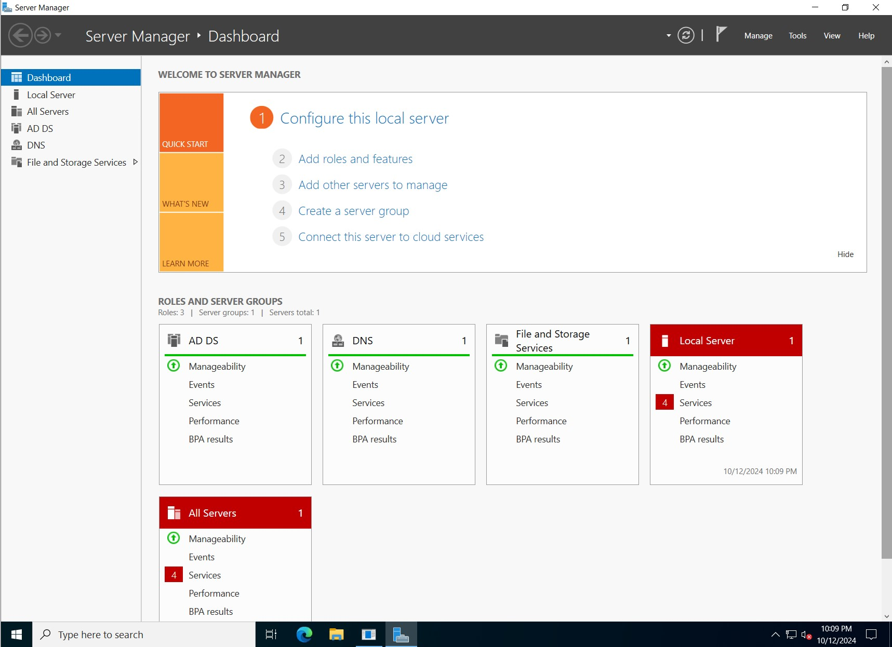

# DC-01

DC-01 is a Domain Controller running Windows Server.

## Configuration

- Operating System: Windows Server 2019
- Role: Domain Controller
- IP Address: 192.168.50.20
- Active Directory Version: 2019