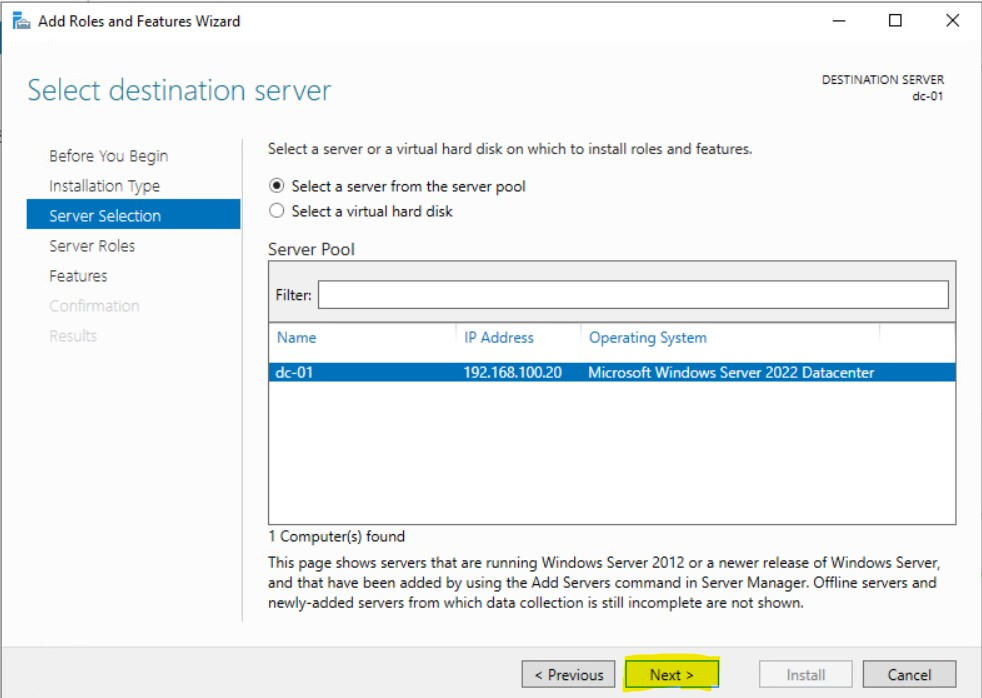

# What is Active Directory?

Okay, so at that the beginning of this project we talked about Windows Server and the roles they server in an On-prem Infrastructure. When you access something like google.com or Microsoft.com you are accessing a web-server that is providing a service. That web-server's job is to display the website for anyone that is accessing it. Let's say you wanted to self-host you own File Server, so you download a software called **Nextcloud** and you install it on a Linux Machine. The job of that **Nextcloud** server to ensure that you can share your files with your family and friends. 

Active Directory is directory service that is used to manage and store information about network resources like computers, users, services and devices, providing centralized administration and security for these resources. Active Directory has multiple components that it uses to manage these resources:

## Domain: 

- A domain is a logical group of objects (such as users and computers) that share the same Active Directory database. Each domain has its own security policies and relationships with other domains. A Domain has an hierarchical structure to store objects.

## Domain Controllers(DCs):

A Domain Controller is a server that host the **Active Directory Domain Services** role, You can think of it as a centralize location that all computers has to talk too.  Domain controllers are servers that store a copy of the Active Directory database and manage authentication and access to resources within the domain. They handle tasks like:

- User authentication (e.g., logging in to the network)
- Managing group policies
- Storing user, computer, and resource data

## Organizational Units (OUs):

- OUs are containers that organize users, computers, groups, and other OUs within a domain. They allow for delegation of administrative control and the application of group policies.

## Active Directory Objects:

The main entities stored in Active Directory are objects, which include:

- Users: Individual accounts representing people who access the network.
- Computers: Machines that are joined to the domain.
- Groups: Collections of users, computers, or other resources that can be managed together.
- Printers and Shared Folders: Devices and directories shared across the network.

## Trust

- Active Directory allows the creation of trust relationships between domains, enabling users from one domain to access resources in another domain. Trusts can be one-way or two-way.

## Global Catalog (GC):

- The Global Catalog contains a partial, read-only copy of all objects in an Active Directory forest, allowing users and applications to search for resources across multiple domains.

## Group Policy:

- Group Policy allows administrators to define settings and configurations for users and computers in the domain. These can include security settings, software deployment, and user environment customization.

## Active Directory Roles:

Active Directory provides several server roles that can be assigned to domain controllers, such as:

- Schema Master: Controls updates and changes to the Active Directory schema.
- Domain Naming Master: Manages changes to the domain name space in the forest.
- PDC Emulator: Emulates a Windows NT primary domain controller (PDC) and handles password changes and time synchronization.

## Use Cases of Active Directory:

- Centralized user management: Admins can manage user accounts, passwords, and permissions from a single location.
- Resource access control: AD enables secure access to network resources such as shared files, printers, and applications.
- Security policies: Admins can enforce password policies, software restrictions, and desktop settings through Group Policy.

## Installing Microsoft Active Directory

Before we get into the installation, let's pause a bit and think about what we're doing. Currently we have a Windows Server called **dc-01** and it's currently not really doing anything. If we want this server to serve a purpose we need to give it a role. For **dc-01** the we're going to give it a role called a **Active Directory Domain Server** so it can become a **Domain Controller**. If you're planning on creating a new Windows Server Infrastructure, the **Domain Controller** is probably the most important and critical server in your Infrastructure and it's always the first server we should install unless you have a specific reason for not doing so.

### What is a Domain Controller?

A Domain Controller (DC) is a server in a network that manages and controls security authentication requests, such as user logins, and enforces security policies within a Windows domain. It is a core component of Microsoft Active Directory (AD), which is a centralized directory service that provides management and configuration of resources, such as users, computers, printers, and security policies, within a domain.

### Key Functions of a Domain Controller:

- Authentication: The DC authenticates users, computers, and services within the domain. For example, when a user logs in to their computer, the DC verifies their credentials (username and password).

- Authorization: After authentication, the DC grants or denies access to resources (files, folders, printers, applications) based on the permissions and policies set by the administrators.

- Active Directory (AD) Management: The DC hosts a copy of the Active Directory database, which stores information about all domain objects (users, computers, groups, etc.) and their attributes.

- Group Policy Enforcement: Domain controllers enforce security policies and group policies across the network. Administrators can set rules for password complexity, account lockouts, or application restrictions centrally, and the DC ensures they are applied to all users and computers.

- Replication: In multi-DC environments, domain controllers replicate the Active Directory database to ensure that changes (like adding a new user or modifying security settings) are consistent across the network.

### Domain Controller in a Windows Domain:

- Primary Domain Controller (PDC): Historically, there was a single PDC in older Windows Server environments, but now all domain controllers in modern Active Directory are considered peers.

- Read-Only Domain Controller (RODC): This is a type of domain controller that contains a read-only copy of the Active Directory database, often used in environments with lower security, such as branch offices.

### Benefits of Domain Controllers:

- Centralized management: Administrators can manage all users and resources from a single location, ensuring consistency across the network.

- Security: Policies can be enforced network-wide, providing strong control over access to resources.

- Scalability: Adding new users, computers, or other objects is simple and managed centrally.

I know that's a lot of words and if you're new to Microsoft Domains, you're probably not sure what any of that means, but not to worry. We will install our First Domain Controller here.

### Perquisites for Setting up your Domain Controller

Prior to setting up your Domain Controller they are a few things you should probably have ready:

- **Static IP address** - You'll definitely want your Domain Controller to have a IP address that doesn't change, this means you will have to manually assigned an IP address. I prefer this method over a DHCP reservation

- **Assigned Computer Name** - Ensure that you've renamed your computer and not leave it with the default name. In Production environments, I like to name my Servers after the role it's serving. So DC-01 will be my first Domain Controller, DC-02 will be my second Domain Controller, WFS-01 will be my first Windows File Server, VPN-01 will be my first Windows VPN server. You don't have to follow naming scheme, but ensure that you're able to tell what kind of server it is just by looking at the name.

- **Domain Name** - This is the most important decision you will make. What will you call your Domain. Most Admins will name their domain after their company, for example. Microsoft's domain will be called Microsoft.com, an insurance company named: Starlight insurance can call their domain, starlightinsurance.ca or starlightin.local. Notice that I have different top level domain (TLD) for example. .com, .ca. .local, .internal etc. These are all acceptable Top-Level Domains that you can use. 

Before proceeding, I want to expand a bit more on the different Top-Level Domain. You can say that they are two types of TLD, you have an External TLD like .com, .ca, .org .edu or .net. Usually you will find these Top-Level Domains out on the internet but you also have a few internal Top-Level Domain like .local, .internal or .lan. 

So which one should you pick? an external TLD or an internal one?

Here's a some information to help you make the choice:

When setting up a domain for your Active Directory (AD) environment, choosing between an internal TLD (used only within the internal network) and an external TLD (which may be publicly available and used for external resources) comes with its own set of pros and cons. Your decision impacts DNS resolution, security, and compatibility with internal and external systems.

Here’s a breakdown of the pros and cons of using an internal TLD versus an external TLD for your Domain Controller.

# Internal TLD

An internal TLD is a domain suffix that is not publicly registered or resolvable outside of your internal network. Examples include .internal, .lan, .corp, or custom internal domains like infotech.local.

## Pros of Internal TLD

### Increased Security:

- Internal resolution only: Internal TLDs aren’t accessible or resolvable on the public internet, which reduces the attack surface for external threats.

- Data isolation: There’s a clear separation between internal and external resources, reducing the risk of inadvertently exposing internal systems or sensitive data to the public.
Simplicity in Name Management:

- No public domain conflicts: Since internal TLDs are not publicly registered, there's no concern about name collisions with public domains.

- Control over internal namespace: Administrators have full control over how the internal DNS is structured and managed without needing to consider external factors or domain registration processes.

- Flexibility: You can define internal domains without worrying about availability on the public internet. Custom or internal-only TLDs (like .internal or .lan) can be freely used for Active Directory without conflict.

### Cons of Internal TLD

### Potential for Future Conflicts:

- Some commonly used internal TLDs (like .corp or .local) may conflict with future public TLDs or technologies like mDNS (Multicast DNS), which reserves .local for use by devices such as Apple’s Bonjour.

## Limited External Access:

- Internal TLDs are not accessible outside your network without complex configurations (e.g., VPN or split-brain DNS). This makes accessing internal resources from the internet more challenging.

- Compatibility Issues: Some internal-only TLDs may cause issues when integrating with external services or when using hybrid cloud environments (e.g., Microsoft Azure or Office 365), as these services expect publicly resolvable domain names.

### No Public Resolution:

- If you need to resolve domain names externally (for remote workers, services in the cloud, etc.), you’ll need to manage separate DNS entries for internal and external resources.

- External TLD: An external TLD refers to a publicly registered domain name (e.g., .com, .org, .net, or a country code TLD like .ca), which is accessible both internally and externally.

### Pros of External TLD

## Unified Namespace:

- Using the same TLD both internally and externally creates a single, consistent namespace. For example, if your external domain is infotech.ca, using the same domain internally (e.g., ad.infotech.ca) simplifies DNS management and provides a seamless experience for both internal and external users.

## Easier Remote Access:

- External TLDs are resolvable over the internet, which simplifies external access to internal resources (e.g., VPN, web services, remote workers) without needing separate DNS configurations for different environments.

## Future-Proof:

- Using a registered external TLD ensures compatibility with future technologies, cloud services, and hybrid environments. Many external services (like Office 365 or Azure AD) expect publicly resolvable domain names, making it easier to integrate without renaming domains.

## Public and Internal Consistency:

- A unified TLD (for both internal and external use) eliminates the need for split-brain DNS configurations, where different records are served to internal and external users.
Cons of External TLD

## Potential Security Risks:

- If external and internal resources share the same domain, there’s a risk that internal resources may accidentally be exposed to the public internet if DNS or firewall configurations are mismanaged.
Public exposure of the TLD could provide attackers with insight into your internal infrastructure.

## DNS Complexity:

- Managing a publicly registered domain name requires careful planning for DNS zones and record separation. Internal resources should be kept isolated from external DNS servers, typically requiring split-horizon (split-brain) DNS.

## Domain Registration and Renewal Costs:

- Using an external TLD requires registering and maintaining a public domain, which incurs ongoing costs for domain renewal and DNS hosting.
Confusion Between Internal and External Resources:

- If not properly configured, users (or systems) might access the external versions of services rather than internal ones, causing confusion, slower access times, or exposing sensitive data.

## Creating a Domain Controller

Alright, now that we have our prequisites our of the way, we can start adding the **Active Directory Domain Services** role, so DC-01 can become a **Domain Controller**. There is really two steps in this process. First we need to install the Active Directory Domain Services role then we need to promote the Server to be a **Domain Controller**.

### Install Active Directory Domain Services

To Install **Active Directory Domain Services**, if you don't have it already, open **Server Manager**, then you'll want to click on **Add Roles and Features** there are a few places you can do this from.

On your main Dashboard under **WELCOME TO SERVER MANAGER** the second (2nd) option **Add roles and features** you can click on that to add the required roles but you can also click on **Manage** then **Add roles and features**. Both of these do the exactly same thing so it doesn't matter which one you use.

After you click on **Add Roles and Features** you will have a **Before you begin** information about some recommended task to be completed. We've done all except the updates which we will do another time. From here click **Next**

For the **Select installation type** we will choose **Role-based or feature-base installation** The second (2nd) option **Remote Desktop Services** is another feature we will visit in the future.

Next up we have **Select destination server**, currently we only have one (1) server to choose from but add we begin to add more and more servers to our Infrastructure, we'll be able to add roles and features on different servers which having to log into them. We can basically perform management task of many servers from just one server. Also another option here you might have notice is too **Select a virtual hard disk** where you can install choose to install the role on a .vhdx file. Currently we only have **dc-01**, so we'll click next here.

This is probably the screen where you'll be a bit intimidated if it's you're first time seeing it, but this is what I mean when I said that Windows Server can become something and all of these options is something that it can become. You can click through each role and read the brief description it gives you. You might notice that we already have the **File and storage Services** installed. By default, all Windows Server comes with this pre-installed. The role we want is the **Active Directory Domain Services role** so we'll check that off. 

Right after we check the box, you will get another pop-up asking you if you want to **Add features that are required for Active Directory Domain Services**. As you can see from the name these are required services that are needed to install Active Directory, you do not install these the installation cannot proceed. This is very common, most roles that you will be adding requires additional features for it proceed. Click **Add Features** to proceed.

Once you've click **Add Features** you'll notice that **Active Directory Domain Services** is now checked off, so we'll click **Next**

After clicking next, you will be brought to the **Select features** options. If you've read through the features we added early, you would have noticed that they is a feature called **Group Policy** and as you can see **Group Policy** is checked off here already along with the **Remote Server Administration Tool**. If you're wondering if you could have just checked it off yourself here, the answer is yes, remember you just need to features to installed Active Directory but you can choose when to install the features, but I like follow this way of doing it, I never have an issue when installing Active Directory by just adding the features when it asks. So from here, I will click **Next**

On the next screen **Active Directory Domain Services** it gives you some things to note about it. Like installing two Domain controllers to avoid server outages if your one domain controller goes down and Active Directory requires a DNS server to be installed on the network. The Domain Naming System or DNS is an integral part of Active Directory and All Domain Controllers are DNS servers. It also tries to sell you **Azure Active Directory** which is the Software as a Service (SAAS), plaform that they provide. I will click **next** here.

Finally you'll arrive at the **Confirm installation selections** screen where you have the opportunity to go back and check all of your settings to ensure that you selected the correct Roles and Features. **Active Directory Domain Service** is a very straightforward installation and if you've been following along what I've been doing, then you should not have any issues. Click **Install** to begin the installation. You can also check the box to **Restart the destination server automatically if required** installing **Active Directory Domain Services** does not require a reboot so I will just will install for now

## Promoting Domain Controller

As long as you've added the correct features your install should finish without any errors, it also gives you a summery of all the roles and features that it successfully installed. If it does error out you might have to do some research to figure out why it errored out. Now that the role is successfully installed, you will see under Active Directory Domain Services that **Additional steps are required to make this machine a domain controller** and under that you have **Promote this server to a domain controller**.

Next we will click the option **Promote this server to a domain controller** to begin the process. The first screen that comes up is **Deployment Configuration**. Here, you have a few options and I'll go through these.

- **Add a Domain controller to an existing domain** - This option would be useful if we were adding a second (2nd) Domain Controller to an exisiting forest. We currently don't have an Active Directory forest so this option will not work for us.

- **Add a new domain to an existing forest** - This option would be useful if we were adding another domain to our forest. For example if our Domain was called infotech.ca we can add a sub-domain called 

