## OPNSense Router Setup

This is an optional step if you're following allowing. The Idea behind this router is to give me my own seperate subnet for me to play with, without having to worry about conflicting IP addresses or an IP address that I would like to use but is already in use. The opnsense router is a simple setup except for a new Firewall Rules that will allow me to communication with my main subnet.

First thing we'll want to do is to download the ISO for opnsense. It can be found here: 

[Download OPNSense](https://opnsense.org/download/)

Perfect. I'm going to be uploading the OPNSense ISO File to my VMware ESXi Storage repository. Depending on where you are performing your installation, you'll need to ensure that your Virtual Machine is able to access the ISO since you'll need to mount it.

First thing I will do will be to create my Virtual Machine for OPNSense

- In ESXi, I click **Create/Register VM** and then at the **Select creation type** I choose **Create a new virtual Machine**

[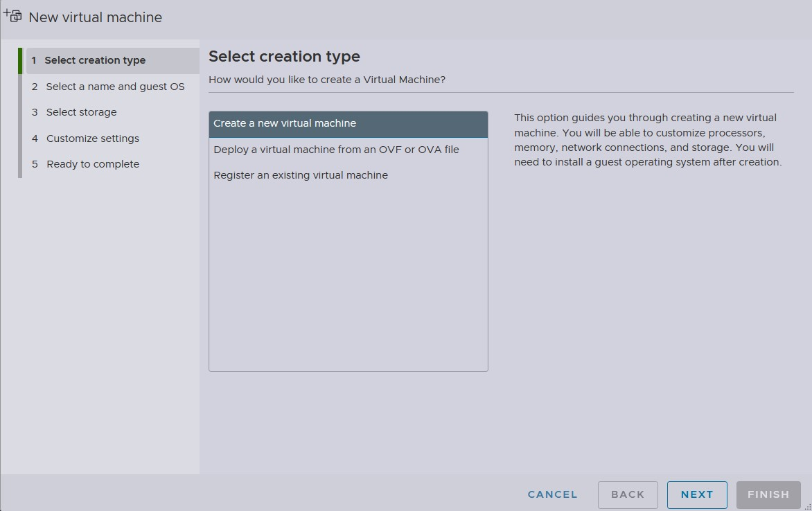](images/opnsense_install/Create_VM1.jpg)

Next we will need to **Select a name and Guest OS**. I will choose the easy name and just call it **opnsense-router** for the guest OS I want to ensure that I choose the following:

- **Compatibilty** - ESXi 8.0 U2 virtual machine
- **Guest OS family** - Other
- **Guest OS version** - FreeBSD 14 or later versions (64-bit)

The **Guest OS version** is important here because if you choose something else, your opnsense vm or installation might not go through because of the different driver options.

[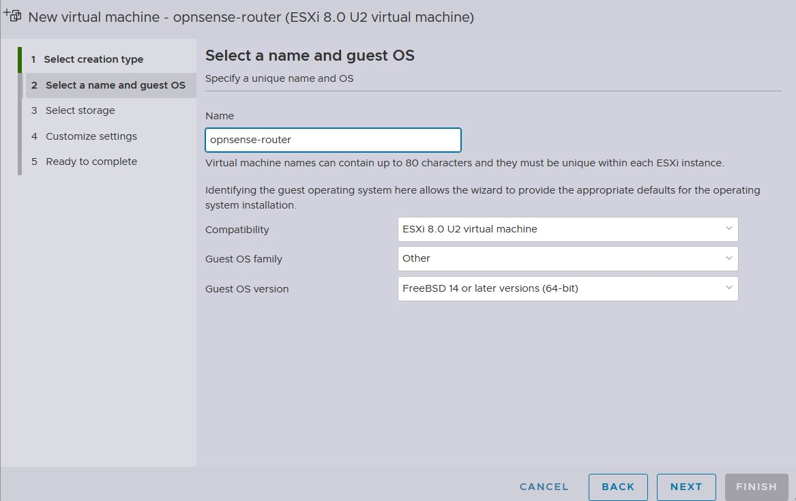](images/opnsense_install/create_vm2.jpg)

**Select storage** is the next option. I have a few different hard drives to choose from so I'll just choose: **DS1-1TB**

Here is the more important settings to choose. The **Customize settings** option is where we will choose how much resources we would like to give to our opnsense router.

For me I will assigned to following resources:

- **CPU** = 2 vCPU
- **Memory** = 2GB
- **Hard Drive** = 30GB
- **Network Adapter 1**
- **Network Adapter 2**

Since this is a router, it will need two networking adapter. One for the WAN traffic to talk out to the internet and the other for the LAN traffic where my Windows Servers will exist.

For my adapter settings. I basically create an internal network that is not able to talk to the main network (10.10.10.0/24), instead I want this network to go through the **WAN interface**. 

You can ignore my naming scheme for my network **Prod-Net** is on the 10.10.10.0/24 network and **PGroup19100** is on the 192.168.100.0/24 network. Of course, the name you gave your network makes a lot more sense that mine.

[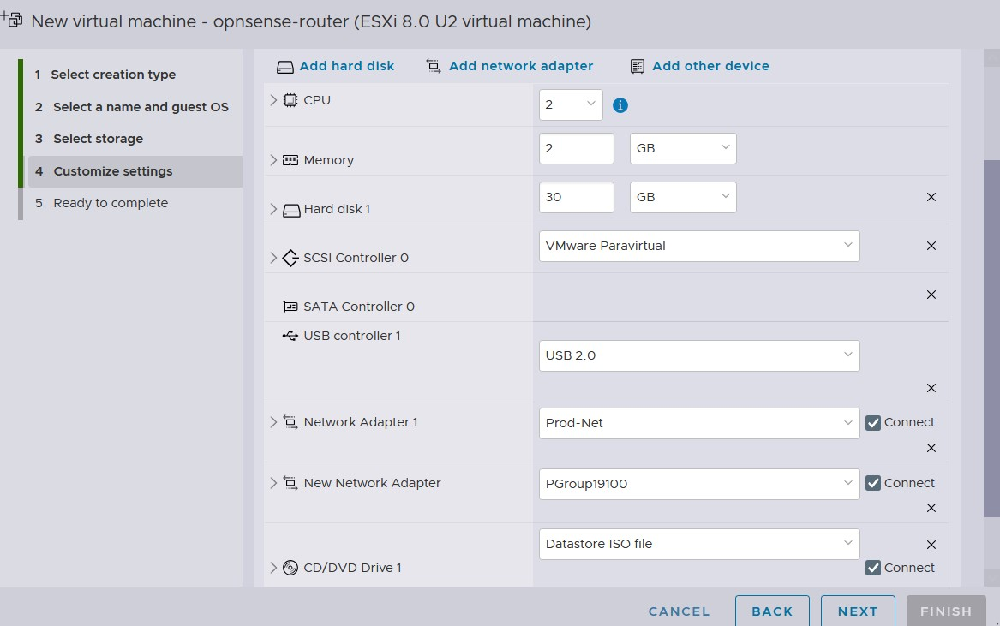](images/opnsense_install/create_vm4.jpg)

Once you're done with this section you can click **Next** then **Finish**

[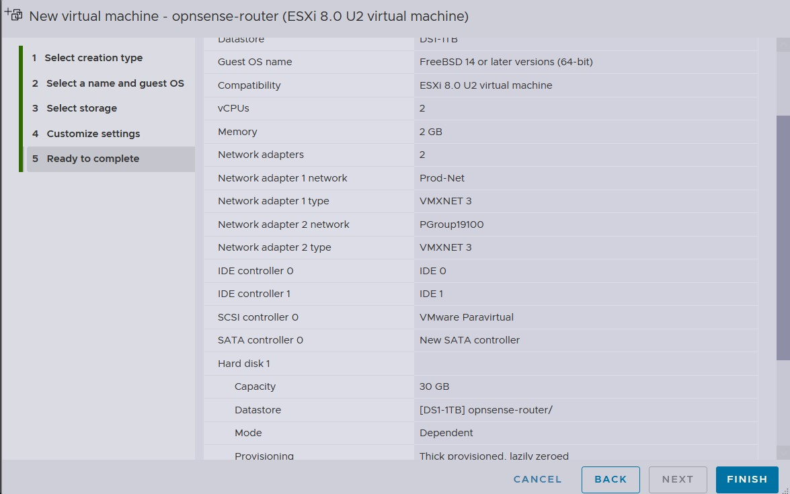](images/opnsense_install/create_vm5.jpg)

## Installing OPNsense

Okay, so we've just completed creating our Virtual Machine, next up we will need to install opnsense on the Virtual Machine that we've just created.

In my ESXi host, I'm going to click on my newly create Virtual Machine called: **opnsense-router** and **Start it up**

[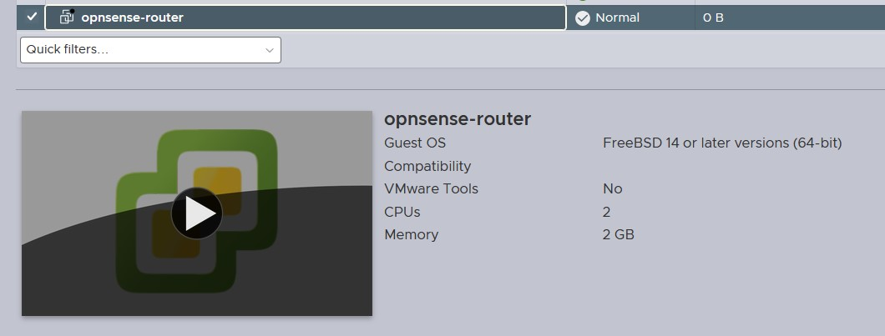](images/opnsense_install/install-os1.jpg)

You will see a very quick boot screen that gives you about 5 seconds to pause if needed. If your opnsense VM does not boot, you have an issue with the ISO image, try downloading it again maybe trying DVD instead of VGA or another option that it provides. It could also be your Virutal DVD drive is not being detected on your because you did not choose the correct **Guest OS version**.

If it does boot successfully, you will see a screen like this:

[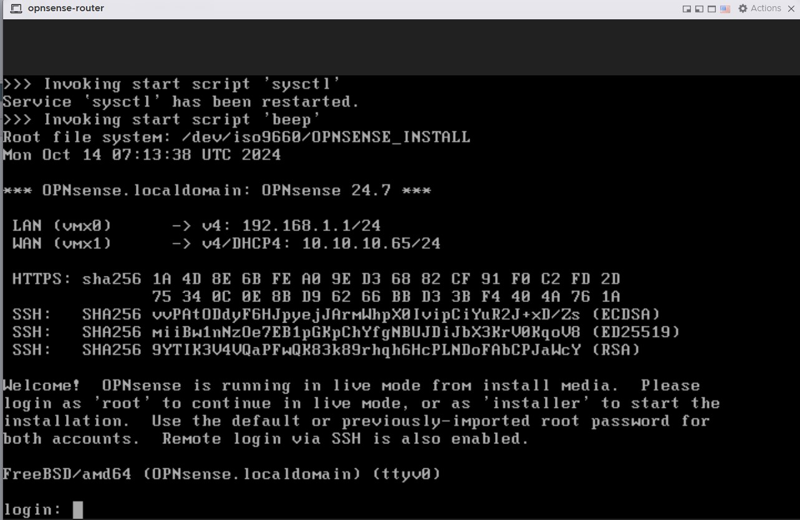](images/opnsense_install/install-os2.jpg)

You might have noticed that **LAN** is assigned to **VMX0** and **WAN** is assigned to **VMX1**. The **LAN** has an IP address of **192.168.1.1/24** but there is nothing assigned to **WAN**. The reason this happened is because opnsense automatically assigned out interfaces for us, but to worry, we do not need to use the default settings that is applied to us. We can change this and many other settings as we go further. For now, we are going to install OPNSense on our virtual machine. To do that, at the screen we're currently on. If you've took the time to read you notice that it tells you what to do. You can sign into the **live** mode where you can make changes and configure the router but please note that changes made here will not survive a reboot. To ensure that our changes are kept we will need to install it. We do that by typing **installer** as the username and **opnsense** as the password. Once we do that the installation process begins:

First thing, we need choose a **Keymap Selection** I will go with the default keymap but you can choose the one that works best for you:

[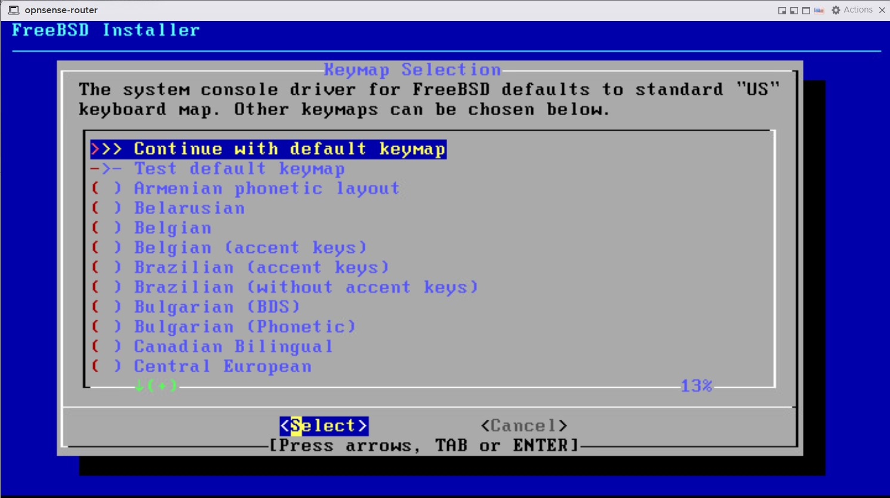](images/opnsense_install/install-os3.jpg)

[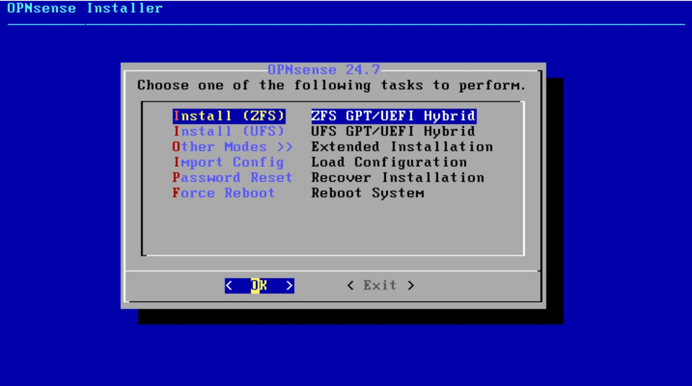](images/opnsense_install/install-os4.jpg)

Next it will ask me to select the **Virtual Device Type**. Here I will choose **stripe**. I will assigned one hard drive to my opnsense installation so that's all I can do. Since this is just a test lab. I do not need to added security of having a mirror or a different RAID setup in the event of a drive failure. **Stripe** will work in my situation.

[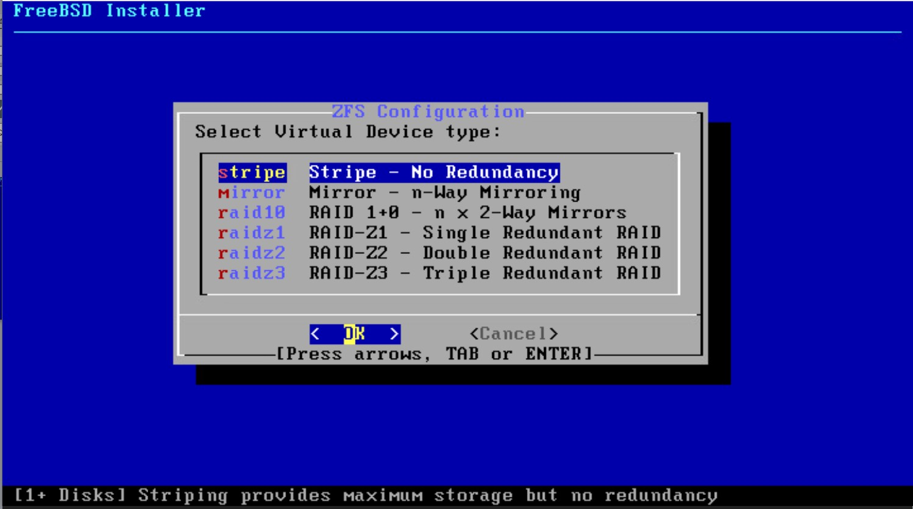](images/opnsense_install/install-os5.jpg)

Next it's going to ask me to confirm which hard drive I will like to install opnsense on. I only have one option so I will press my **spacebar** to select the device then click OK

[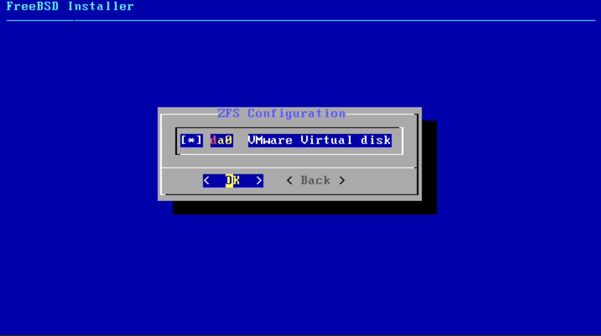](images/opnsense_install/install-os6.jpg)

It warns me that the data on the disk is about the get destoryed, since this is a new disk that doesn't contain any data I will say yes.

[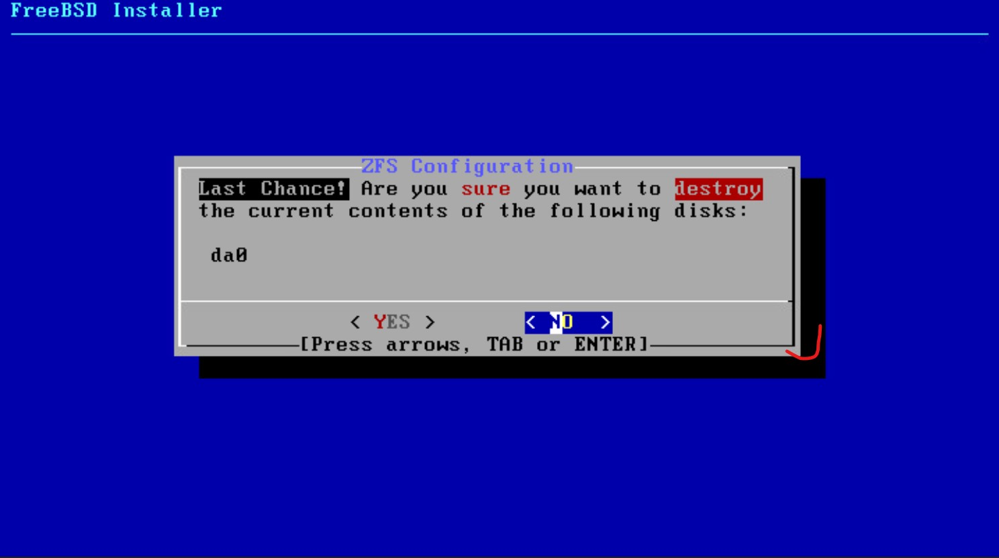](images/opnsense_install/install-os7.jpg)

Click yes will begin the installation:

[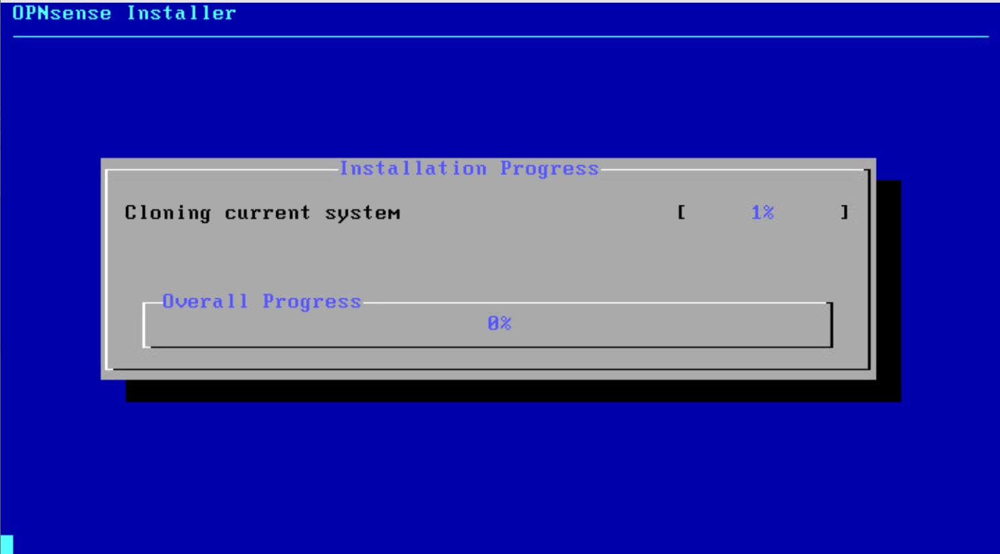](images/opnsense_install/install-os8.jpg)

