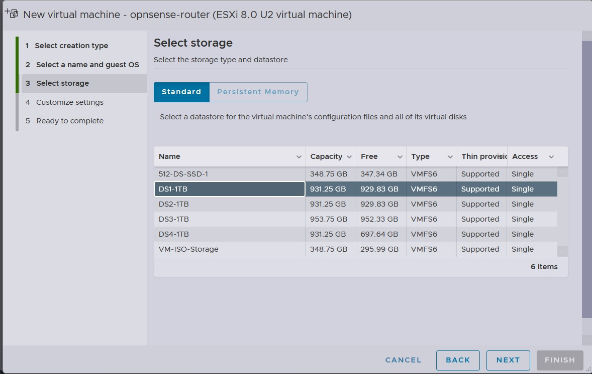

## OPNSense Router Setup

This is an optional step if you're following allowing. The goal behind this router is to give me my own seperate subnet for me to play with, without having to worry about conflicting IP addresses or an IP address that I would like to use but is already in use. The opnsense router is a simple setup except for a some Firewall Rules that will allow me to communication with my main subnet.

First thing we'll want to do is to download the ISO for opnsense. It can be found here: 

[Download OPNSense](https://opnsense.org/download/)

Perfect. I'm going to be uploading the OPNSense ISO File to my VMware ESXi Storage repository. Depending on where you are performing your installation, you'll need to ensure that your Virtual Machine is able to access the ISO since you'll need to mount it.

First thing I will do will be to create my Virtual Machine for OPNSense

In ESXi, I click **Create/Register VM** and then at the **Select creation type** I choose **Create a new virtual Machine**

Next we will need to **Select a name and Guest OS**. I will choose the easy name and just call it **opnsense-router** for the guest OS I want to ensure that I choose the following:

- **Compatibilty** - ESXi 8.0 U2 virtual machine
- **Guest OS family** - Other
- **Guest OS version** - FreeBSD 14 or later versions (64-bit)

The **Guest OS version** is important here because if you choose something else, your opnsense vm or installation might not go through because of the different driver options.

**Select storage** is the next option. I have a few different hard drives to choose from so I'll just choose: **DS1-1TB**

Here is the more important settings to choose. The **Customize settings** option is where we will choose how much resources we would like to give to our opnsense router.

For me I will assigned to following resources:

- **CPU** = 2 vCPU
- **Memory** = 2GB
- **Hard Drive** = 30GB
- **Network Adapter 1**
- **Network Adapter 2**

Since this is a router, it will need two networking adapter. One for the WAN traffic to talk out to the internet and the other for the LAN traffic where my Windows Servers will exist.

For my adapter settings. I'll basically create an internal network that is not able to talk to the main network (192.168.50.0/24 and 10.10.10.0/24), instead I want this network to go through the **WAN interface**. 

You can ignore my naming scheme for my network **PGroup1950** is on the 192.168.50.0/24 network and **PGroup19100** is on the 192.168.100.0/24 network. Of course, the name you gave your network makes a lot more sense that mine.

Once you're done with this section you can click **Next** then **Finish**

## Installing OPNsense

Okay, so we've just completed the creation our Virtual Machine, next up we will need to install opnsense on the Virtual Machine that we've just created.

In my ESXi host, I'm going to click on my newly create Virtual Machine called: **opnsense-router** and **Start it up**

You will see a very quick boot screen that gives you about 5 seconds to pause if needed. If your opnsense VM does not boot, there might be an issue with the ISO image, try downloading it again maybe trying DVD instead of VGA or another option that it provides. It could also be your Virutal DVD drive is not being detected on your because you did not choose the correct **Guest OS version**.

If it does boot successfully, you will see a screen like this:

You might have noticed that OPNSense automatically assigned your **WAN** and **LAN** interfaces. Thankfully OPNSense assigned my interfaces correctly. My **WAN** interface was able to grab an IP address from my Mikrotik Router and my **LAN** interface received the default networking scheme that's created by opnsense.
If your **WAN** interface does not have an IP address, this could be because opnsense incorrectly assigned your interfaces and they need to be swapped. You can swapped these after the installation since you're in a live environment and the changes you make here will not remain after a reboot.

To Begin the installation, type **installer** as the username and **opnsense** as the password to begin the installation process.

First thing, we need choose a **Keymap Selection** I will go with the default keymap but you can choose the one that works best for you:

I'll choose **ZFS** as my filesystem here but you can any other of the options

Next it will ask me to select the **Virtual Device Type**. Here I will choose **stripe**. I will assigned one hard drive to my opnsense installation so that's all I can do. Since this is just a test lab. I do not need to added security of having a mirror or a different RAID setup in the event of a drive failure. **Stripe** will work in my situation.

Next it's going to ask me to confirm which hard drive I will like to install opnsense on. I only have one option so I will press my **spacebar** to select the device then click OK

It warns me that the data on the disk is about the get destroyed, since this is a new disk that doesn't contain any data I will say yes.

Select **Yes** to begin the installation:

If thers is any issues with the hardware you've selected, this will be where you will see it. It will error out and will stop the installation process. If this happens to you and you're using physical hardware, ensure that the hardware you're using is compatible with OPNSense. For Virtual Machines, the biggest roadblock here is your hard drive. Ensure you have the correct Hard Drive Controller. For my installation I had **VMWare Paravirtual** selected as my **SCSI Controller 0**. If everything goes well, you will see this screen:

If you would like to, you can change your root password here but I will complete install and reboot since I will be changing the root password when I log into the web portal.

## Configuring OPNSense

Once your opnsense system is back online, you will be back to the main screen. However, this time it's not longer a live enviroment. And any change you make here will still exist after rebooting.

Let's start configuring our OPNSense Router. First thing we'll log in using the username and credentials. The username is **root** and the password is **opnsense** if you changed it during the installation you can enter the password you created.

Logging in will display information about your Network interfaces and IP adderss as well as a menu where you can configure the system.

If your Network Interfaces needs to be swapped, this is where you can do it. For example, if you have a IP Address for your **LAN** interface but nothing for your **WAN** interface. Then it's possible that opnsense incorrectly assigned your interfaces, so swapping them should resolve your issue.

To do that, Enter the number **1** and press enter:

It will ask you if you want to configure **LAGGs** now, if you know what this is and would like to configure it, you can say yes, if you don't know what this is, you can say no. Notice the **N** is uppercase and the **y** is lowercase.
This is because **N** is the default value so if you just press enter, it will select no by default.

Next it will ask to configure **VLANs**. I will not be using any VLANs for this router so I will say **no**.

Now it will ask you to select your **WAN** interface. Your **WAN** interface is what connects to your gateway that then connects out to the internet. For my setup, the **WAN** interface is **vxm1**. If you mess up here, don't worry you can always go back and change the interfaces.

After selecting my **WAN** interface, it will ask me to select my **LAN** which is **vmx0**

It will ask your to configure an Optional Interface next, since I only have 2 interfaces, I'm not able to configure an optional interface. So I will press enter to proceed.

Once I'm done with all of my configuration. I will type **y** to proceed. Remember you have to enter **y** then press enter. If you just press enter it will select the default option which is **N**. 

Proceeding with the changes, will reload all of the interfaces. Once it's completed, you'll be back at the main screen. From here, hopefully you've been assigned a **WAN** IP address not. if not, and you've already tried swapping your interfaces and you're using a virtual appliance like I am, you might need to take another look at your virtual switch and port groups. Something might be off. You can trying assigned a manual IP address and see if that works. If it does and it looks like it's an issue with your DHCP Service.

To set your IP address interface, select **(2) Set Interface IP Address** and press **Enter**

From here it will ask you select the interface you would like to configure. I'll start with my **LAN** interface, so I will type 1 and press **Enter**

First you will be ask if you would like to configure your **LAN** using DHCP. DHCP started for the **Dynamic Host Configuration Protocol** and it's responsible for automatically handing out IP addresses. I personally did not preconfigure any other DHCP service on my network so I will say no in this situation. If you're not sure you're I would go with no as well.

Next it will ask you for your LAN IP address. I personally like to use the last IP Address in the subnet as my IP address for my routers and gateway, but you can use any that you like. First, last or somewhere in the middle.

This will be the networking scheme I will be using:

- IP address: 192.168.100.254
- Subnet Mask: 255.255.255.0 or 24 bits as it will ask.
- Gateway: None

The last option it ask if for an upstream gateway. For your LAN you don't have to enter anything here as your **WAN** interface will be responsible for forwarding your traffic to the internet. you can just press **Enter** here.

For **IPv6 address LAN interface via WAN tracking** I will just accept the defaults.

For the option to **enable the DHCP server on LAN?** I will say **y**. If you went ahead and said no, that's okay as well. It means you will just have to assign your IP address manually but this can be changed later on when we log into the web portal.

It will ask for a range of IP addresses. By default a /24 or 255.255.255.0 subnet will give you 254 IP addresses that can be used. Since I'm using 192.168.100.254 as my router **LAN** IP address my range will be from 192.168.100.1-192.168.100.253.

So for the questions - **Enter the start address of the IPv4 client address range:** I will enter: **192.168.100.1** and for the **End IP address** I will enter **192.168.100.253**

Once I'm happy with my choices I will press **Enter** to proceed. 

For the other Questions:

**Do you want to change the web GUI protocol from https to http?**: **no** - accept the default
**Do you want to generate a new self-signed web GUI certificate?** : **no** - I will choose no here, but if you are having certificate issues, you can say yes.
**Restore web GUI access defaults?** - **no** - You can say yes, if you're having issues with the web GUI.

Once you're done all of your selections, you can proceed. Opnsense will do another reload to apply the configurations you've just selected.

**Now let's configure our WAN Interface**

Select option **2**: similar to how we did when we configured the **LAN** and then select option **2** to configure your **WAN** interface.

First question it will ask is if you want to configure your **WAN** interface to use DHCP. I will say no to maually set my IP address. For my **WAN** configuration. I will use the following:

- **IP address** - 192.168.50.100
- **Subnet Mask** - 255.255.255.0
- **Gateway** - 192.168.50.254

**Do you want to use the gateway as the IPv4 name server, too?** - I will choose **n** here.

For the name server I will use: **1.1.1.1**

Opnsense will ask you a few questions about configuring the GUI. you can say no to all of these as you won't be logging into the GUI using the **WAN** IP address. OPNsense by default blocks GUI access through the **WAN**

**Configure IPv6 address WAN interface via DHCP6?** - **no**
**Do you want to change the web GUI protocol from https to http?**: **no**
**Do you want to generate a new self-signed web GUI certificate?** : **no**
**Restore web GUI access defaults?** - **no**

Once again. Opnsense will reload to apply the settings you just configured.

