## Active Directory Users and Computers

Our first Stop in Active Directory will be **Active Directory Users and Computers**. If you have or will get a job within IT Operations. **Active Directory Users and Computers** will probably be the one tool you will use the most, if not everyday. This tool is crucial to most IT Operations and it's where we create most objects of Active Directory. This tool can be launched from any **Domain Controller** and can be used to manage and configure Active Directory Domain. This means it doesn't matter if you're logged on to DC-01 or DC-02, whatever action you perform will be replicated over the other domain controller. There is also a client tool you can use on either a Windows 10 or Windows 11 machine. If you're wondering why you would want to do this when you can just logged on to the Domain Controller and perform your work there, well imagine you're the IT Manager for your IT Department and you've recently hired a Junior System Administrator or a Desktop Support Technician. You might not want to give him full control of your Domain Controllers on Day 1, but he will still need to be able to create user accounts and perform password resets. So installing the Active Directory tools on his laptop will make more sense than granting him full access to your domain controller. 

## Launching Active Directory Users and Computers

Now time for us to get our hands dirty. To Launch Active Directory Users and Computers, we can do this a few different ways.

### From Server Manager

Inside of Server Manager, I can click **Tools** and from there I can click **Active Directory Users and Computers**

[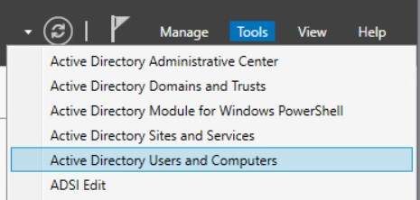](images/ad_users_and_comp/ad_users1.jpg)

### From the Start Menu

Click on the Start Menu, then look for the **Windows Administrative Tools** folder and from there Open **Active Directory Users and Computers**

[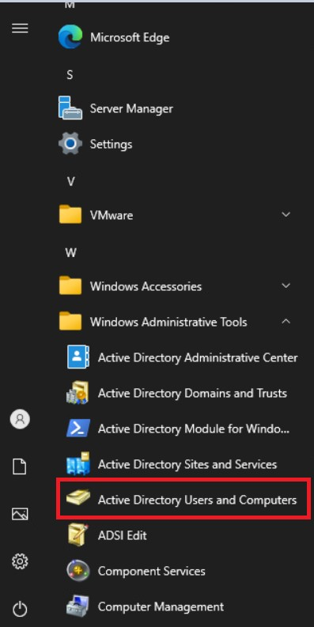](images/ad_users_and_comp/ad_users2.jpg)

### From the Run box

If you press **Win Key + R**, you will launch the run box. From here you can enter, **dsa.msc** then click OK to Launch **Active Directory Users and Computers** 

[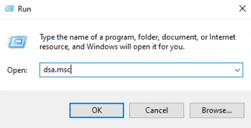](images/ad_users_and_comp/ad_users3.jpg)

Similarly, if you're inside of a powershell session, you can also **dsa.msc** and then press enter, to launch **Active Directory Users and Computers**.

[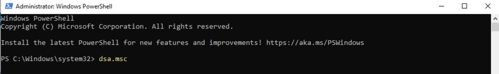](images/ad_users_and_comp/ad_users4.jpg)

All of these methods really accomplishes the same goal, which is to launch **Active Directory Users and Computers**. 

Once the **Active Directory Users and Computers** Microsoft Management Console (MMC) opens, you can now begin to perform your necessary tasks. We've already used this console when we created our User account earlier, but this wil be a bit of a deeper dive into what **Active Directory Users and Computers** is able to do.

[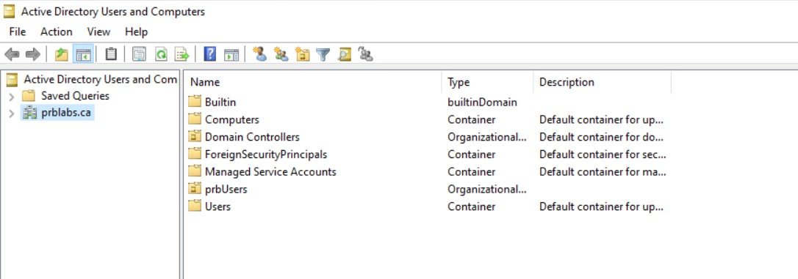](images/ad_users_and_comp/ad_users5.jpg)

At first glance, there are a few things to notice, you can see the name of the console at the top of the Window.

[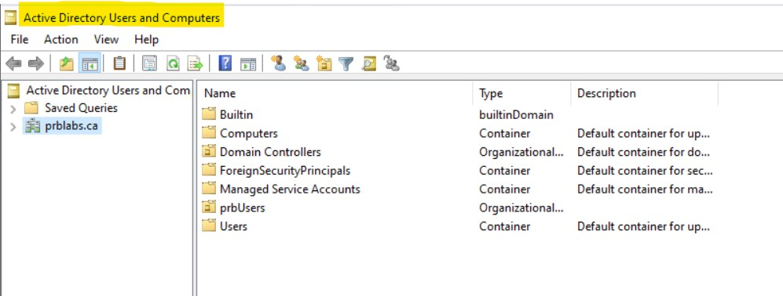](images/ad_users_and_comp/ad_users6.jpg)

You can you the menu bar right below it:

[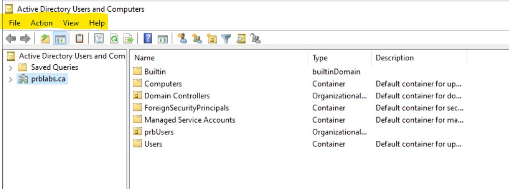](images/ad_users_and_comp/ad_users7.jpg)

Below the menu bar is called the tool bar:

[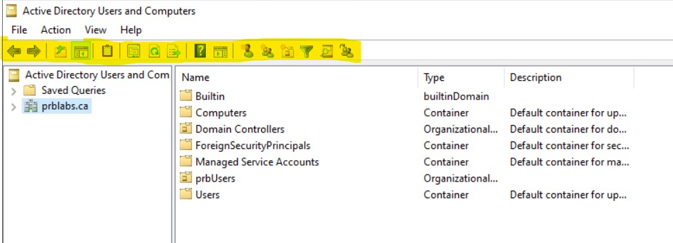](images/ad_users_and_comp/ad_users8.jpg)

And below that, you have the console tree and the navigate pane, where you'll be perform most of your task. 

[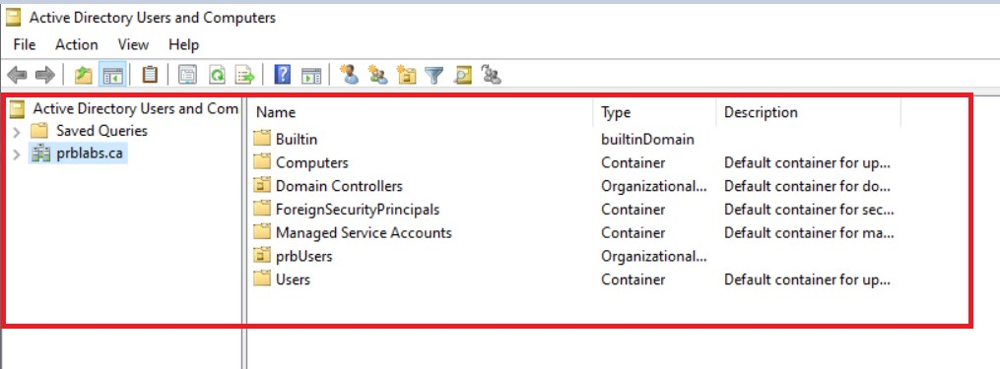](images/ad_users_and_comp/ad_users9.jpg)

### Working with Active Directory Users and Computers

First, thing you'll want to do is, expand your domain name, so you can view all of the relevant options. Simply click on the arrow next to your domain name.

[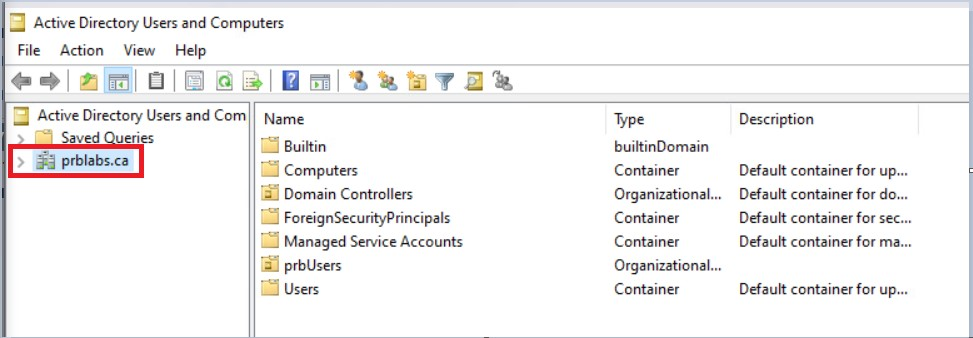](images/ad_users_and_comp/ad_users10.jpg)

[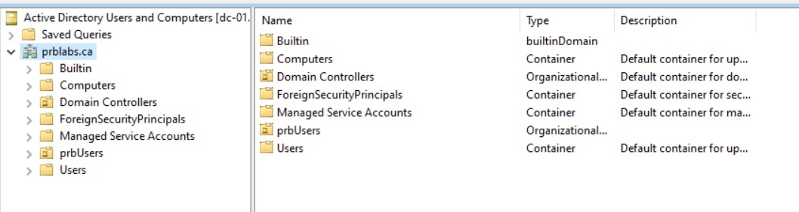](images/ad_users_and_comp/ad_users11.jpg)

You will see that you have a few items that already exist within **Active Directory Users and Computers** which were create during the installation. Although these looks like folders, they are not. These are called **Organizational Units (OU)** and **Containers (CN)**. They they are use to store and organize different objects within **Active Directory Users and Computers**. If you look closely, you'll notice that the icons are different. The icon's that looks like the **Domain Controllers** and **prbUsers** (Note: I created the prbUsers OU during my initial installation of Active Directory on DC-01) are called **Organization Unit (OU)** and the rest of the icons **Builtin**, **Computers**, **Keys** and etc. are called Containers. 

[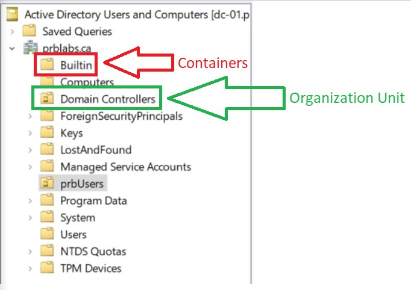](images/ad_users_and_comp/ad_users12.jpg)

If I were to click on the **BuiltIn** container, I will see in the information pane that have various **Security Groups**. I won't go through what each of these groups are for right now, but know that these groups control access to certain resources within the Active Directory Domain. As we continue on in this project, I will using these groups to grant my user access to various resources and privileges.

[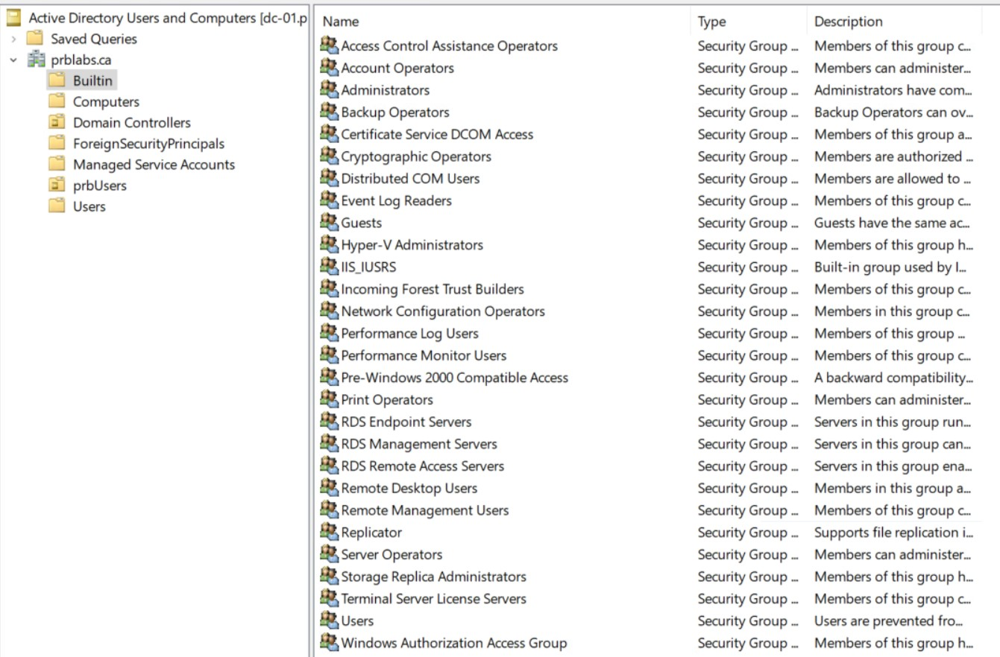](images/ad_users_and_comp/ad_users13.jpg)

The next up is the **Computers** container. If you click on this, you will notice that it's currently empty, unless you've already added a computer to your domain. This Container is the default container used when adding Computers and Servers to our Active Directory Domain. It's empty, but we will add objects to this container in the future.

[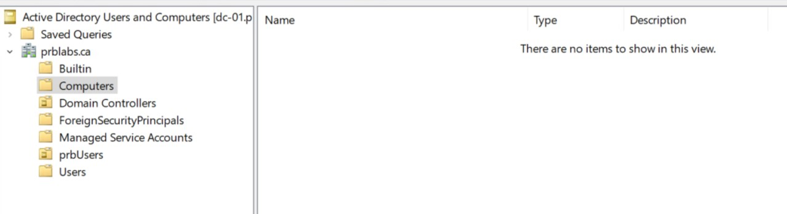](images/ad_users_and_comp/ad_users14.jpg)

Next is the **Domain Controllers** Organizational Unit (OU). Notice I said Organization Unit and not container. In this OU we can see DC-01 and DC-02. By default whenever we add a new domain controller to our Domain, the objects for these computers will be added automatically to this OU. 

[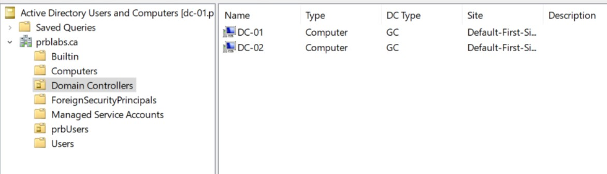](images/ad_users_and_comp/ad_users15.jpg)

I will skip the rest and move on to the **Users** container. In here, you will a mix of users and groups. Similar to the **Builtin** container, there are security groups that exist in this container, and these groups will grant you access to different privileges within Active Directory. Be careful when assigning your users to these groups, granting someone too much privileges can cause major damage to your infrastructure, avoid adding users to any security groups that exist here and in the **Built-in** containers, until you understand what permission and privilege will be granted.

[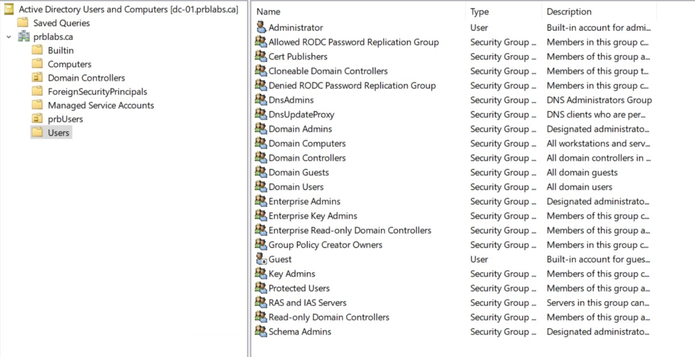](images/ad_users_and_comp/ad_users16.jpg)

### Structuring Active Directory Users and Computers

Although you can use both Organizational Units and Containers to store objects within Active Directory, you can only create Organizational Units, you cannot create Containers, but don't be disappointed there really isn't any different between the two and Organizational Units will more than suffice for what we want to do. Currently our **Active Directory Users and Computers** console looks to be a little empty. If you've ever worked for an Organization that has a well populated **Active Directory Users and Computers**, you might see many different Organizational Units in a tree like structure. Different companies have their own way of organizing their Active Directory Users and Computers, so really there is no one correct way to do it. What works for a large enterprise might not work for a small business. The best way to structure Active Directory Users and Computers is mostly based on your organization size and number of employees. 

Let's say I work for a company called Ontario Biogas and it has 50 employees, below are the list of teams:

- CSuite Leadership - 4 Users 
- Executive Leadership - 5 Users
- Managers - 4 Users
- Accounting Team - 5 users
- HR Team - 4 users
- Field Staff - 10 users
- IT team - 4 users
- Marketing Team - 4 users
- Legal Team - 4 users
- Office team - 6 users

A few ways we can do this, We can create an Organizational Unit for each Team and manage it from there. It will look like this:

[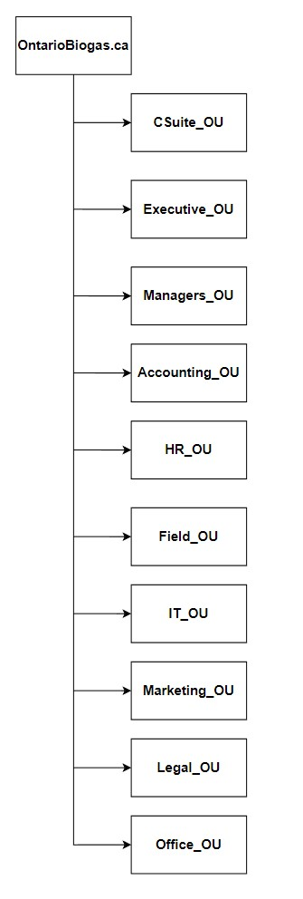](images/ad_users_and_comp/ad_users17.jpg)

Now, this is not a bad way to do it, because later on when we get into **Group Policies** a structure like this will cause is extra work when applying our policies. 

You can also do something like this, to make it simpler: 

[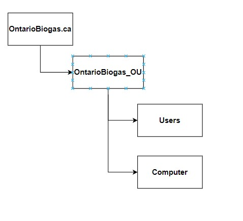](images/ad_users_and_comp/ad_users18.jpg)

This way, we just have one Organization Units for Users and another one for computers, we can also add more OUs to contain things like Security Groups, Distribution groups and Service Accounts.

[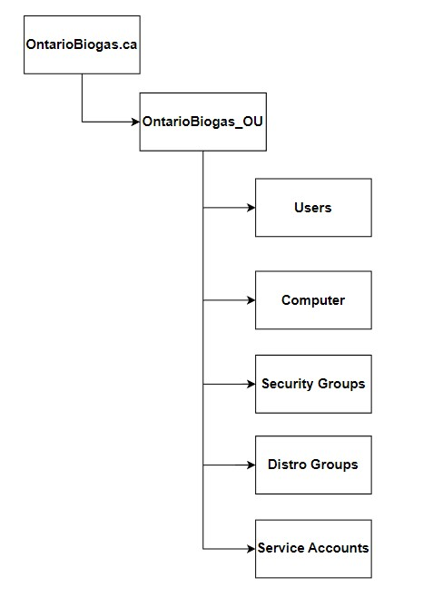](images/ad_users_and_comp/ad_users19.jpg)

This way, we can make things a little bit more clean and organization. However, this is designed based on the current state of Ontario Biogas. However, maybe we should plan for the future. Let's say in 5 years Ontario Biogas who has it's head office in Toronto, ON, opens a branch office in Waterloo, ON and buys another Biogas plan in Alberta. Our structure can now look like this.

[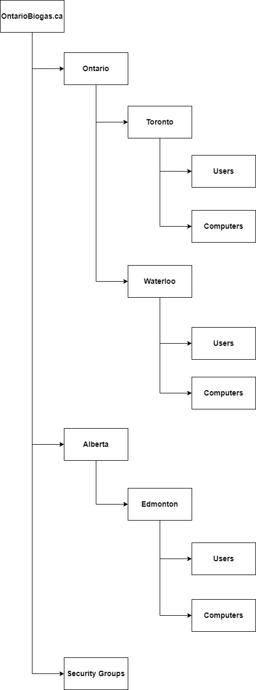](images/ad_users_and_comp/ad_users20.jpg)

As you can see, we have a lot of different ways you can organize your Active Directory Users and Computers Structure. A few things to keep in mind when implementing your structure:

- Group Policies – Having a good OU design will make implementing and managing group policies much easier. I’ve seen a drastic decrease in issues with proper OU design.

- Delegate permissions – Being able to delegate rights at a granular level and auditing those rights is a must. A proper OU structure will allow you to easily delegate permissions at a granular level.

- Administrative tasks – Modifying user accounts, using LDAP queries, reporting, and bulk changes are all common administrative tasks.  If Active Directory is a mess, these simple day-to-day tasks can become difficult for the whole team.

I think it is a good start for you. You can follow any one of my examples for it or you can build your own. Since you're probably doing it in a Homelab environment, you can always delete and re-create your Organization units to find the best structure.

For my organization prblabs.ca, I've already created an Organization Unit called **prbUsers** and I've created two user accounts. Prb Admin and Prb User 1.

I will create my Active Directory Structure in the following way:

[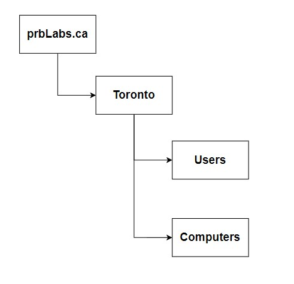](images/ad_users_and_comp/ad_users21.jpg)

### Creating the Active Directory Structure

First I will Right Click on prblabs.ca and choose **New** then **Organizational Unit**

[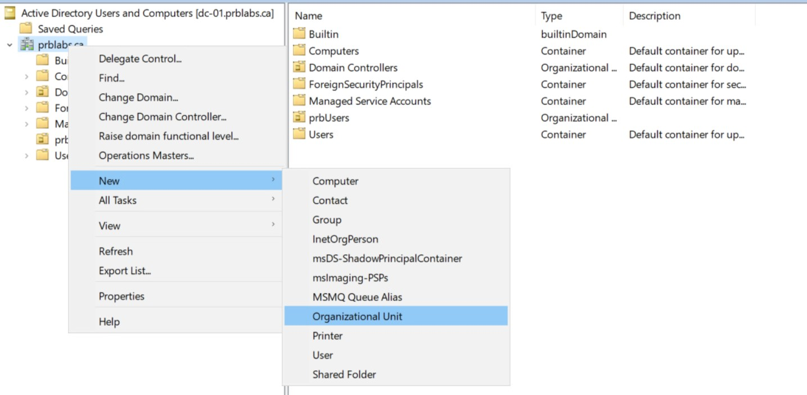](images/ad_users_and_comp/ad_users22.jpg)

Once the **New Object - Organization Unit** Window comes up, you can enter the name of your Organizational unit. I will call mine **Toronto** but you can name yours anything you want. You will see an option at the bottom of that you can uncheck, but really, there is no reason to uncheck it. Having this box checked will prevent users from accidentally or intentionally right clicking and deleting the OU, this check-mark prevents that from happening.

[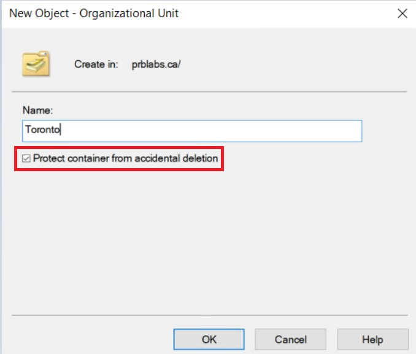](images/ad_users_and_comp/ad_users23.jpg)

Once my **Toronto** OU has been created, I will proceed and create my two child OUs under Toronto. I can do this by Right-Clicking on Toronto and clicking **New** then **Organizational Unit**. 

[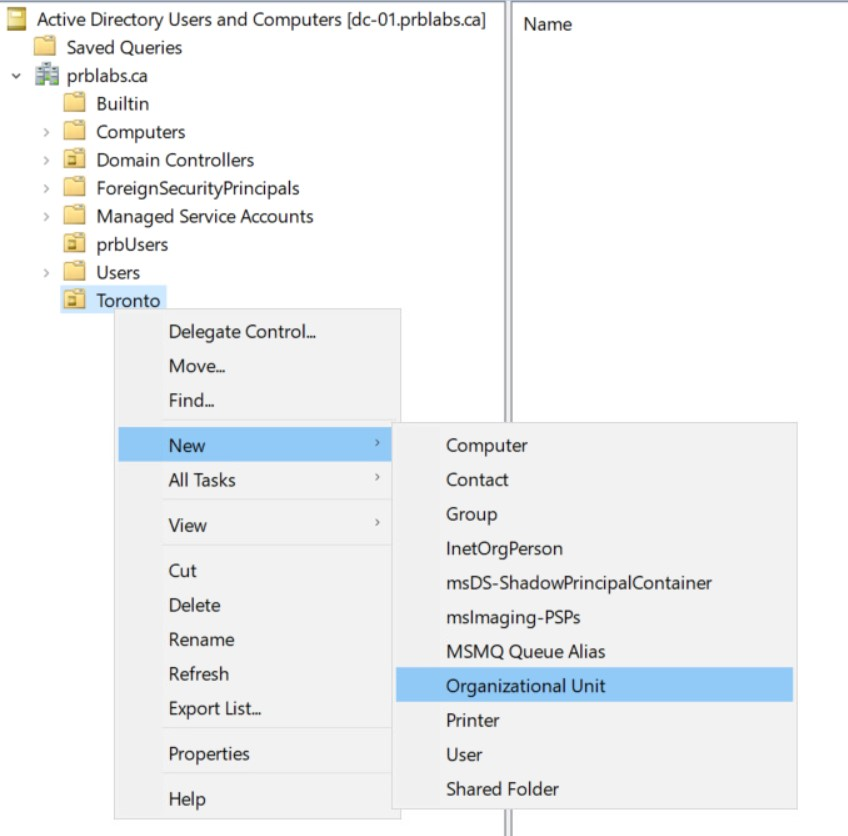](images/ad_users_and_comp/ad_users24.jpg)

I will call this OU **Users** and click **OK**

[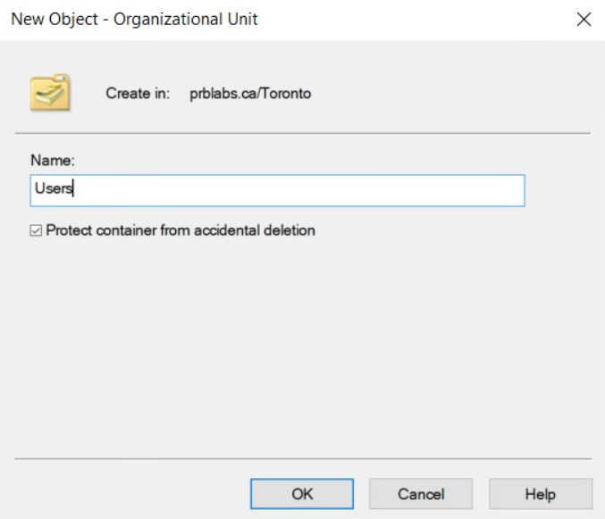](images/ad_users_and_comp/ad_users25.jpg)

I will repeat the same process to create the **Computers**.

[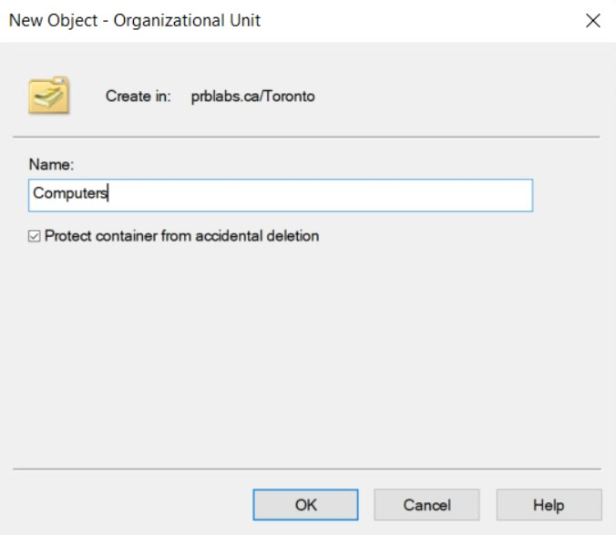](images/ad_users_and_comp/ad_users26.jpg)

With those task completed. I now have a some structure within my Active Directory Tree. Although small, I have some organization for my Users and Computers

[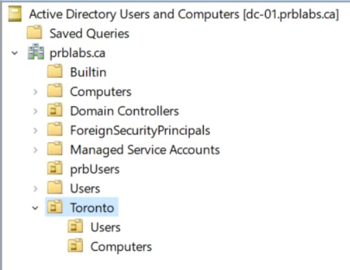](images/ad_users_and_comp/ad_users27.jpg)

## Creating Active Directory Users

To create a user inside of Active Directory, I can right click on any of the **Organizational Units** or **Containers** within Active Directory to create my user account. Since I already have an Organizational Unit for my users I will go ahead and Right Click on my **Users OU** under my **Toronto OU**, to create this user account. Right Click on **Users** then **New** and finally **User**

[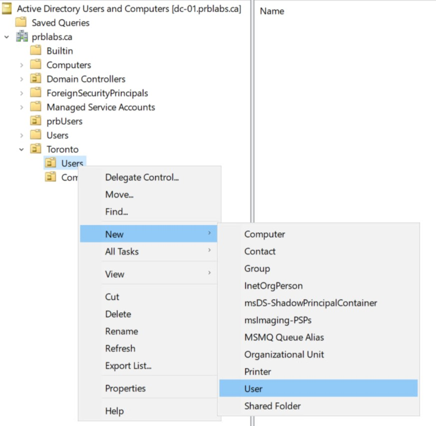](images/ad_users_and_comp/ad_users28.jpg)

Perform this task will bring up the **New Object - User** window. From here you have some information to fill in. Let's see we're creating a user account for our CEO of Prblabs. And his name is Keanu Crane. We can start filling in this information. 

- First Name: Keanu
- Last Name: Crane
- Full Name: Keanu Crane

Keanu doesn't have an middle name or initial so I will skip that. You might also notice when I start to fill in the names for First and Last name, the Full name box is automatically generate with the relevant name.

The next section is the most important and it's especially critical if this is your first Active Directory Domain. The **user logon name** is what a user will enter whenever they are trying to authenticate with the network. Your user logon name can be anything to be honest, your name can be Keanu Crane but your user logon name can be throwaway_david, something that is not even remotely close to your name. Now, if you've taken over an already established Active Directory Environment, my advise would be to use whatever is already the norm. Don't go in and try to make changes, once of the worst things you can do for yourself and your successor is introduce inconsistency if your environment, you will want to follow whatever the standard currently is, even if you don't like it. If you want to change it, this will be a conversation with your Manager and other relevant Stakeholders in the company, basically people who will be affect by the change, but just so you know, doing it will be more pain and sleepless nights than reward. 

Here are some command formats for your **User logon name**:

| Format Type                   | Example                | Notes                             |
|:----------------              | :------------------:   |       -------------------:        |
| First Name + Last Name        | Keanu.Crane@prblabs.ca | Easy to read, good for UPN        |
| First Initial + Last Name     | kcrane@prblabs.ca      | Compact, widely used              |
| First Name + Last Initial	    | keanu.c@prblabs.ca	 | Less common, shorter logon        |
| First Initial + Middle + Last | krcrane@prblabs.ca     | Reduces conflicts with initials   |
| Last Name + First Initial	    | cranek@prblabs.ca	     | Compact, last name emphasized     |
| Employee ID	                | E58456@prblabs.ca  	 | Unique, privacy-friendly          |
| Customizable Format	        | c.keanu@prblabs.ca	 | Adaptable to organization’s needs |

As you can see we have a lot of options we can choose from, and obviously these are not all of them, just the ones that are mostly used. I've seen companies either of these, so really there is no wrong answer to which one you pick. Some organizations like the First Name + Last Name format because the chances of someone having the exact first and last name is very improbably but not impossible. If there is a situation where two people have the same name, sometimes you can add the middle name or initial if they have one, if not, you can consider adding their employee ID, department or position to their name like Keanu.Crane.ceo@prblabs.ca or keanu.crane.HR@prblabs.ca. The same idea will apply to the rest of the examples, because you cannot have two of the same user logon name since all **User logon name** must be unique. 

With all of that being said, I will be using the First Initial + Last Name example for my testing. However, please free feel to use any other example that you find interesting. Since this is a lab environment, you can also experiment with using different kind of examples to see how it works.

For my user Keanu Crane the **User logon name** will be **kcrane@prblabs.ca**. You will notice that the **User logon name (pre-Windows 2000): is also automatically generate. This is really just for legacy protocols and applications. Sometime you might find yourself user it.

[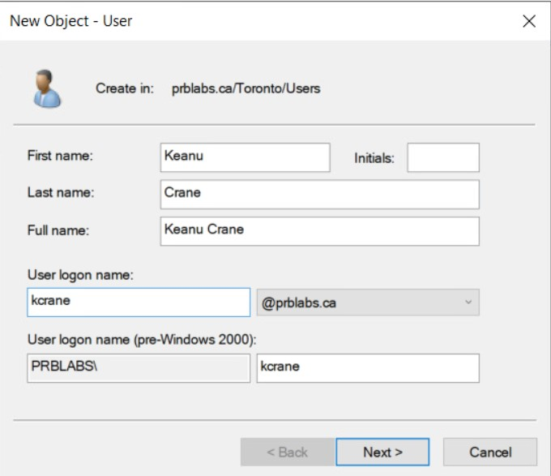](images/ad_users_and_comp/ad_users29.jpg)

Once I've filled in my necessary details I can click **Next**, here it will ask me for a password which I will fill in among some other options.

- **User must change password at next logon**: Fairly straightforward. In IT, we the admins do no under any circumstances need to know the passwords of our users, so whenever we create a password or reset a password, you check this box to force the user to create a new password only they will know. If you do not know, you will have almost your entire company using the same password.

- **User cannot change password**: You can use this option if you've set a really complex password but you do not want to user changing the password, like for example, there is a shared workstation that multiple users log into, if one of the users change the password then go on vacation this can really prevent the remaining users to get their work done if they are not able to log ito the system.

- **Password never expires**: These are mostly used for service accounts. For example, we need an Active Directory user that will be used to sync data from one application to another. This user will be active for the forseeable future. If they password expire while the application syncs the data, then application will fail and imagine it's your Payroll department trying the monthly pay from their vendor. If the password expires and the application fails, then you're not getting paid until you fix the issue.

- **Account is disabled**: If your HR department sends you new user information months in advance, you can get ahead and create the user prior to the using starting, then you can disable the account until the user starts to prevent other people from trying to log into the account.

For my case I will keep all of these boxes unchecked. Then I will click **Next**

[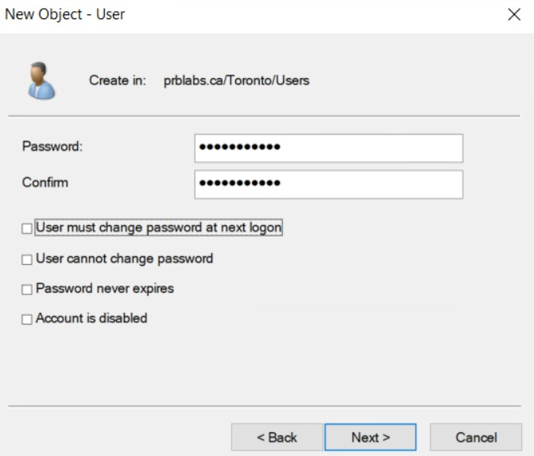](images/ad_users_and_comp/ad_users30.jpg)

I will see a summary information screen for the details but I can click **Finish** to complete the task.

[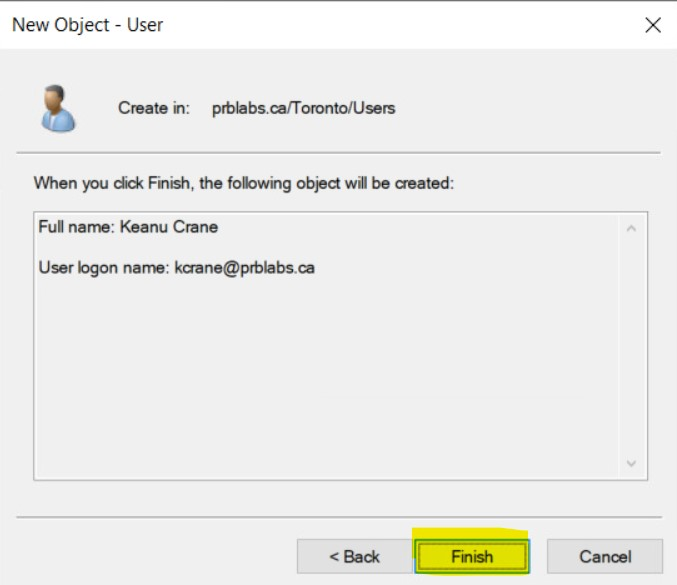](images/ad_users_and_comp/ad_users31.jpg)

Now If I were to look inside of my **Users OU** under my **Toronto OU**. I can see my new User Keanu Crane has been created and is active.

[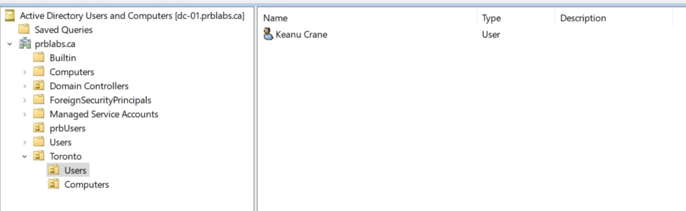](images/ad_users_and_comp/ad_users32.jpg)

Okay, now that our User account has been created, let's take a look at it in much greater details.

If I were to right click on my **Keanu Crane** user account, I can see the following information

- **Copy**: The copy might not do what you think it does. If you're thinking that you can copy the account and paste is inside of another OU, you can mistaken. Let's say for example, you are hiring another accountant for your team, and this new accountant needs the exact same access as Chelsea the current account. Chelsea's **Active Directory User account** already has every security group that the new accountant will need password to. That's what the **Copy** option does, it will take all of the relevant settings from Chelsea and will apply it to the new accountant. Of course it won't apply user details, like first name, last name, user login name, etc but details like address and security groups will be carried over.

Let's use it. I will create an account for our CFO **Cory Holman**, So I will right click on **Keanu Crane** and click **Copy**

[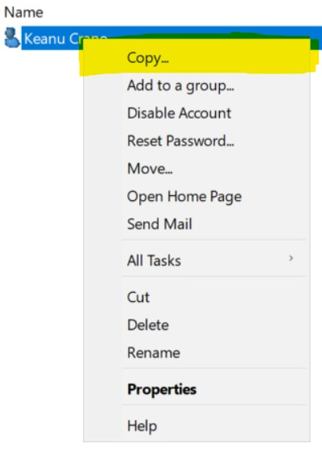](images/ad_users_and_comp/ad_users33.jpg)

From here it will ask me the same information that it ask when I created a new user account. I will fill in the details as follow:

Notice it says **Copy Object - User** as oppose to **New Object - User**:

Then I will fill in the password and will also uncheck all of the boxes:

[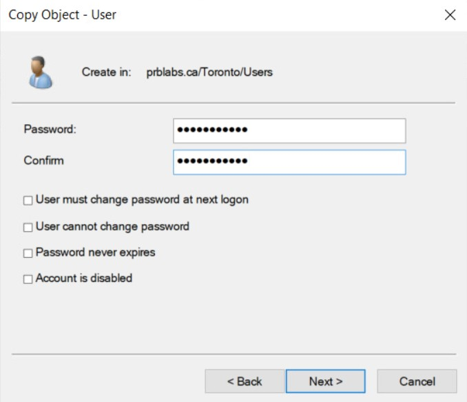](images/ad_users_and_comp/ad_users35.jpg)

Then I will click finish:

[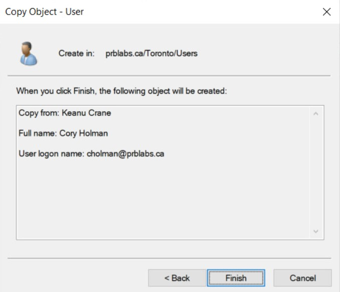](images/ad_users_and_comp/ad_users36.jpg)

And now you can see I have both **Keanu Crane** and **Cory Holman** user accounts setup.

[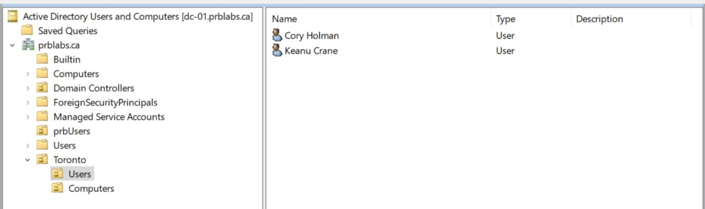](images/ad_users_and_comp/ad_users37.jpg)

And there you know, I just created Cory's account by copying Keanu's. Now, what I just did, doesn't really serve any purpose besides showing you how the copying function works. Keanu isn't added to any security groups or has any details about his account filled in, really not nothing was transferred over to Cory's account, but we will revisit this option later as we continue to build our Windows Server Infrastructure.

- **Add to a group**: This option does exactly what it says it will do, add users to group. Remember you had some builtin groups and other security groups within the **Users** OU, not the one we're in but the one that comes preinstalled with in Active Directory, well using this option, we can add our **Keanu** user to any one of those groups. Let's try this as well. Right Click on **Keanu Crane** account and choose add to group.

[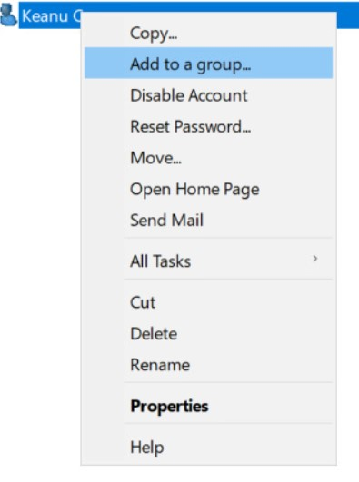](images/ad_users_and_comp/ad_users38.jpg)

From here, in the **Enter the object names to select (examples):** box enter **Domain Admins**, yes we will be making our fictional CEO a **Domain Administrator** don't do this with your real CEO. 

[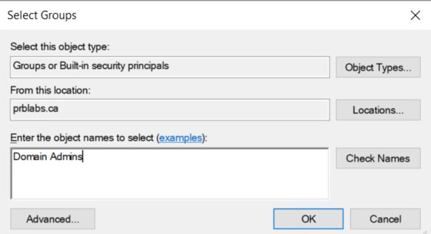](images/ad_users_and_comp/ad_users39.jpg)

Then click **Check Names** and you will see your **Domain Admins** name will now have an underline below it.

[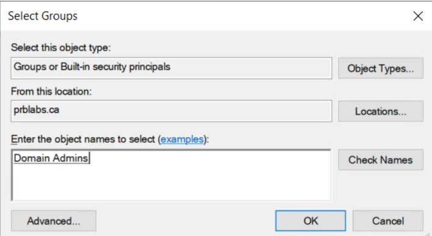](images/ad_users_and_comp/ad_users40.jpg)

Then we will click **OK** and congrats, you've successfully added **Keanu Crane** as a member of the Domain Admin security group. You will even get a pop up box, informing you that the action was indeed successful.

[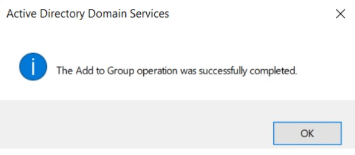](images/ad_users_and_comp/ad_users41.jpg)

This only worked because the **Domain Admin** group exist within Active Directory, if I were to try a group that doesn't exist like **Prb admin** and hit check names. It will come up with name not found, because remember **prb admin** is a **user account** and not a **group account**. Very important to remember.

[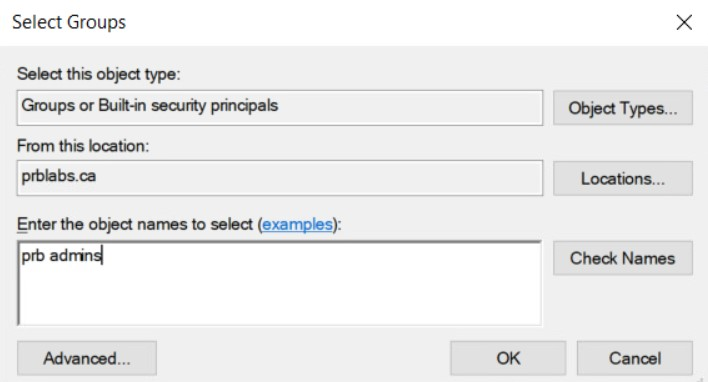](images/ad_users_and_comp/ad_users42.jpg)

[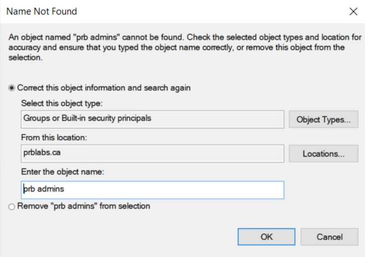](images/ad_users_and_comp/ad_users43.jpg)

Next we have:

- **Disable Account**: If we were to click on this, which I will. 

Click on the Disable option

[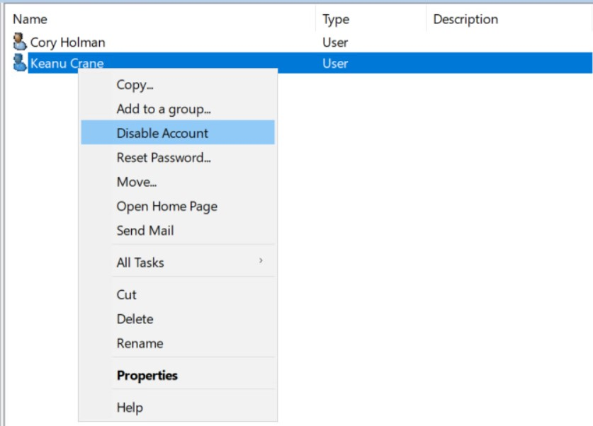](images/ad_users_and_comp/ad_users44.jpg)

Then you will get a pop up informing you that the action is successful and the **Keanu Crane** account is disabled.

[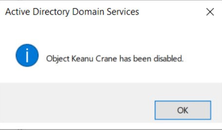](images/ad_users_and_comp/ad_users45.jpg)

If you look within Active Directory as well, you can see a **down arrow** next to **Keanu Crane's** user icon compare to **Cory Holman** who doesn't have one.

[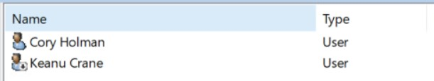](images/ad_users_and_comp/ad_users46.jpg)

A disabled account means that you cannot use the disabled account for authenticating within the **Active Directory Domain** and the user will be locked out of all services. This option is handy whenever an employee leaves the company or if a user's account is compromise. We can simple disable the account to prevent anyone from logging into the account.

To re-enable the account, if you click right again you will notice that the **Disabled** option is not changed to **Enabled**. Click on this option will re-enable **Keanu Crane's** account. 

[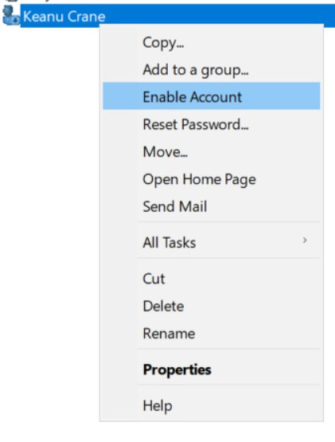](images/ad_users_and_comp/ad_users47.jpg)

Similarly, I will get another pop up to confirm that the account as indeed been enabled. Be careful when re-enabling disabled user accounts within Active Directory. If you've received a call asking you to re-enable a disabled account. Check with your Manager, HR department and others that are knowledgeable about the staffing situation at your company.

Next you have the:

- **Reset Password**: option which is probably the most used action within **Active Directory**. Doing this will reset the user's password, in case they've forgotten it or it expired.

[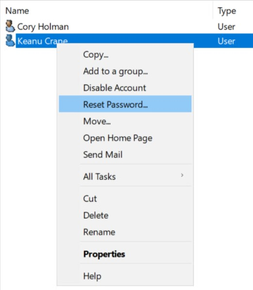](images/ad_users_and_comp/ad_users49.jpg)

You have two check boxes for **User must change password at next logon** which will force then to create a new password and **Unlock the user's account** where if they user has tried to log into and has had many failed attempted, their account will be locked and this is one way how you can unlock it.

[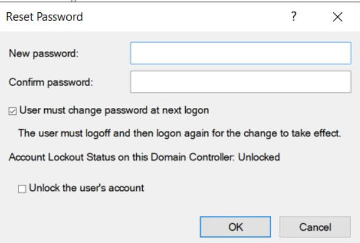](images/ad_users_and_comp/ad_users50.jpg)

- **Move**: allows me to move an object to another Organizational Unit or Container.

[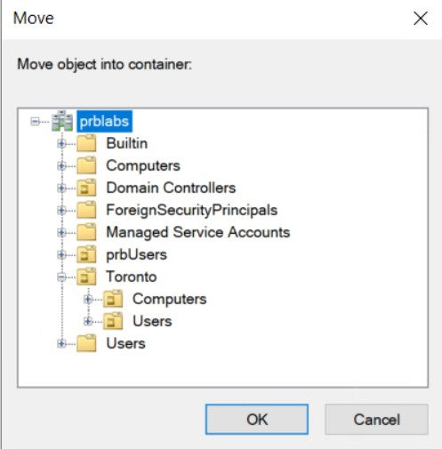](images/ad_users_and_comp/ad_users51.jpg)

- **Open Home Page**: Will navigate to the user's personal website or link to their intranet's account. I do not have this setup so I won't click on it.

- **Send Mail**: If you have an email server configured you can use this option to send an email to the user.

- **All Tasks**: Contains most of the options we just went through plus additional options. **Resultant Set of Policy (Planning)** and **Resultant Set of Policy (Logging)** these are related to group policy which we've yet to cover. 

- **Cut**: Cut is similar to move where you can cut the object out of one OU and paste it inside of another OU.

- **Delete**: This option will delete the user account.

- **Rename**: This option will allow you to modify the user details of the account.

- **Properties**: This will bring up another windows that gives you more options to modify. I will go through this in a separate section.

- **Help**: If you click on this, it will open your browser and bring you to the microsoft documentation site, where you can learn more.

### Active Directory User Properties

Right Click on the **Keanu Crane** user and click **Properties**

[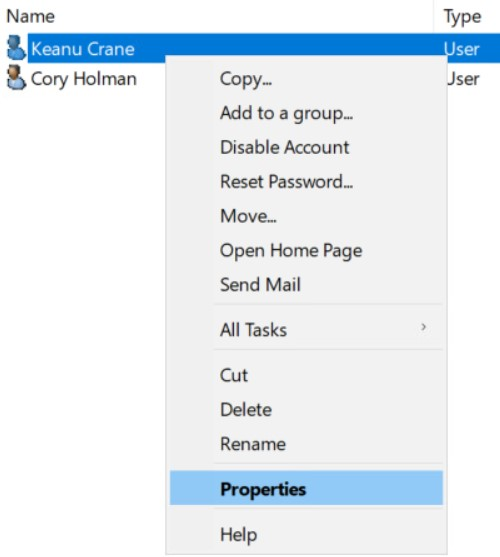](images/ad_users_and_comp/ad_users52.jpg)

This will open up the properties Windows for the user account

[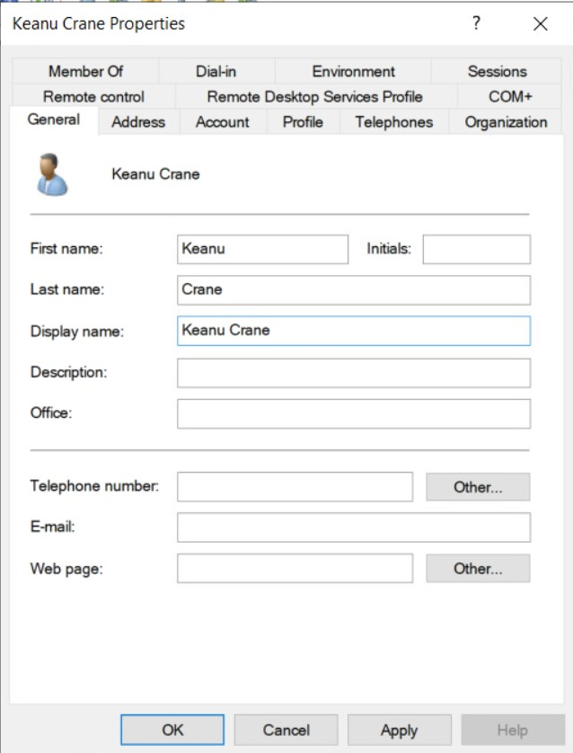](images/ad_users_and_comp/ad_users53.jpg)

The first tab is **General**, here you can fill out the information for the user account. The first name, last name and Display name were all created during logon. I have some more options I can fill in here which I will do now.

- **Description** - The user description be anything, I can use the user's position, like **Accountant** or **Lawyer**, I can add the **Employee ID**. You can add any description you believe will be helpful. I will add the job title for the user which is **Chief Executive Officer**. 

- **Office** - For Office, I will add **Toronto** since this user works out of the **Toronto** office.

- **Telephone Number** - I can add the user's personal number or work number. The format for this doesn't matter, you can use 000.000.0000, 000-000-0000 or 0000000000. It will accept any of these formats. You will notice that there is an **Other...** option here. This is used in the event that a user had more than one phone number and needs all of them added.

- **E-mail** - Currently my user doesn't have an work email address but I will work on configuring an exchange server in the future. For now, I will add a personal email address.

- **Web page** - Currently, we don't have a web page for the company, but this can be anything. You can add your company's internal website of they have one, the company's main website or the user's linkedIN profile. Any of these will work. 

[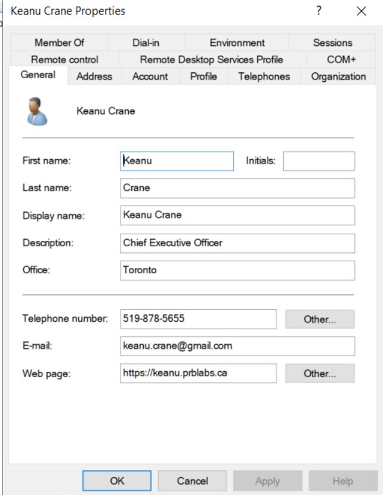](images/ad_users_and_comp/ad_users54.jpg)

Next we have the **Address** tab.

The Address tab is fairly straight forward, the standard is the fill in the address of the user's main work site. If the user is from the main head office, if the user is at a branch office use that address. I will fill in my address as follows:

[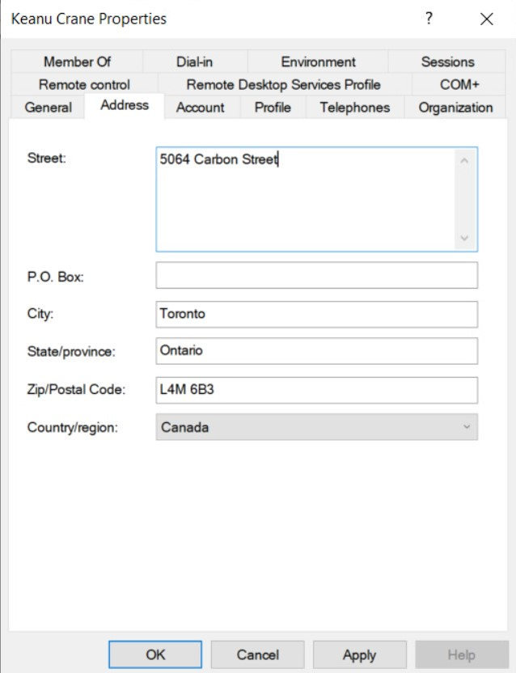](images/ad_users_and_comp/ad_users55.jpg)

Note that this address doesn't really exist. I just made it up.

Next we have the **Account** tab:

- **User Logon Name**: The User Principal Name (UPN) format, typically username@domain.com, is entered here. It is often the same as the user’s email address and is used for user logon, especially in multi-domain environments. While it is possible the change the user logon name, it's advisable to avoid changing the user logon name, unless the account is brand new. Once reason is because, there could be many systems that's tied to the user logon name and changing the name can cause conflicts with other applications and systems.

- **User Logon Name (Pre-Windows 2000)**: Also known as the SAM Account Name, this is in the format DOMAIN\username. This legacy format is compatible with older Windows systems and remains widely used.

**Account Options**

This section contains checkboxes that control specific behaviors of the user account:

- **User must change password at next logon**: Forces the user to change their password the next time they log on. Commonly used when initially creating an account or resetting a password.

- **User cannot change password**: Prevents the user from changing their own password, which can be useful for service accounts or shared accounts.

- **Password never expires**: Prevents the password from expiring, which is often used for service accounts.

- **Store password using reversible encryption**: Stores the password in a way that can be decrypted, which is necessary for some applications but generally avoided due to security concerns.

- **Account is disabled**: Disables the account, preventing the user from logging in. This is useful when a user leaves the organization or when temporarily deactivating an account.

**Logon Hours**

- **Logon Hours**: Allows you to set specific days and times when the user is permitted to log on. Clicking this button opens a schedule grid where you can block or allow hours by highlighting them. Any attempts to log in outside the specified hours will be denied.

- **Log On To**: Allows you to restrict the computers a user can log on to within the domain. By default, users can log on to any computer, but this option enables you to specify a list of authorized computers. This is helpful for restricting access to certain machines, such as limiting administrative users to specific management consoles.

**Account Expires**: Sets an expiration date for the account. You can specify either:
Never (the default setting) or End of a specific date, after which the account will be automatically disabled. This is often used for temporary employees, contractors, or test accounts.

- **Unlock Account**: This option appears if the account has been locked due to failed login attempts. If the Account Lockout Policy is enabled, repeated failed login attempts will lock the account. An administrator can manually unlock the account by checking this box.

- **Account Options (Extended Settings)**:
Additional options may appear depending on your AD version and setup:

- **Smart Card Required for Interactive Logon**: Requires the user to log on with a smart card, adding a layer of security for high-sensitivity accounts.

- **Do Not Require Kerberos Preauthentication**: Disables preauthentication for Kerberos logons, often required only in special configurations for legacy applications or advanced setups.

[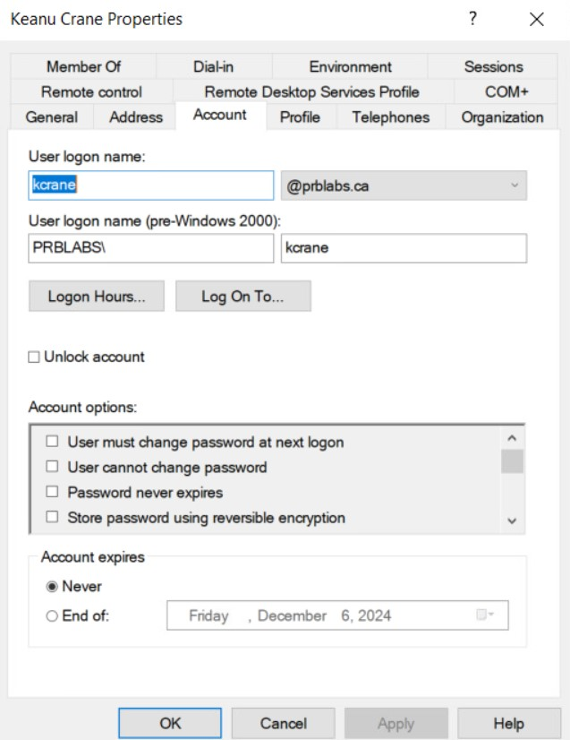](images/ad_users_and_comp/ad_users56.jpg)

Continuing on to the **Profile** tab

The Profile tab in a user’s properties in Active Directory Users and Computers (ADUC) is where administrators can configure settings related to the user's environment, including profile paths, logon scripts, and home folders. These settings help manage the user’s desktop environment, especially in networked or roaming environments. Here’s a breakdown of each field in the Profile tab:

**Profile Path**

Purpose: Specifies the path to a roaming profile for the user, which enables their desktop environment, documents, and settings to follow them to different computers across the network.
Format: Typically, the path is in the format \\ServerName\Profiles\%username%, where %username% is a variable that automatically substitutes the user's logon name.

Use Case: Roaming profiles are useful in environments where users frequently move between workstations, allowing them to retain a consistent desktop experience.

**Logon Script**

Purpose: Allows you to specify a script that runs each time the user logs on. This can be a batch file, PowerShell script, or any executable file.

Format: Enter only the script name (e.g., logon.bat or logon.ps1); the script should be stored in the NETLOGON shared folder (e.g., \\DomainController\NETLOGON\logon.bat), which is accessible to all domain users.

Use Case: Logon scripts can perform tasks like mapping network drives, setting environment variables, or configuring printers based on the user’s role or location.

**Home Folder**

The Home Folder section allows you to specify a dedicated folder on the network or the local system where users can store their personal files.

Local Path: Specifies a folder on the user’s local computer. This is less common, as it’s not ideal for networked environments where users need access from multiple computers.

Example: C:\Users\username\Documents

Connect: Maps the home folder to a network location as a specific drive letter (e.g., H:).

Format: \\ServerName\HomeFolders\%username%

Use Case: This option is commonly used to provide users with a dedicated network drive (e.g., H: drive) for their personal files. By mapping it to a network location, users can access their files from any computer within the domain.

For now I will leave these options blank, but when I get into using a Windows File server, I will create some options for the **User profile** and the **Home folder**

The **Telephones** tab in a user’s properties in Active Directory Users and Computers (ADUC) is used to store contact information for the user. This information can include multiple phone numbers and related details, which can be helpful for directory services, organizational contact lists, or integrated communication systems like Microsoft Exchange. Here’s a breakdown of each field within the Telephones tab:

**Telephone Number**

Purpose: This field is intended for the user’s primary phone number, typically their main office phone or desk phone.

Use Case: This primary number appears in global address lists, contact cards, and other directory-based resources where the user’s contact information is displayed.

**Home**

Purpose: Stores the user’s home phone number if it is relevant to the organization. This field might be used for certain employees who work remotely or need to be reachable at home.

Use Case: This is typically an optional field, used only if the organization requires additional contact information beyond the work number.

**Pager**

Purpose: Stores the number of a pager, if applicable. Although pagers are less common today, some organizations still use them for specific roles, such as on-call medical staff or emergency response teams.

Use Case: This can be useful for departments or roles where quick, on-the-go communication is necessary.

**Mobile**

Purpose: This field is for the user’s mobile phone number, often a corporate cell phone or personal device if allowed.

Use Case: Mobile numbers are frequently added to this field for employees who need to be reachable outside the office, enabling flexibility in contact options.

**IP Phone**

Purpose: Stores the user’s IP phone number or extension, if the organization uses a VoIP (Voice over IP) system.

Use Case: This is useful for organizations with unified communication systems, as it provides a specific point of contact through the IP-based phone network.

**Fax**

Purpose: Contains the user’s fax number, if they have one assigned. Some roles may still require fax capabilities for secure or legal communications.

Use Case: Fax numbers may be entered for employees who frequently deal with official document transfers or regulated industries requiring faxed documents.

**Notes**
Purpose: This field is a general-purpose text area that can store additional contact information or notes related to the user’s telephone setup.

Use Case: Notes might include information such as special instructions for contact, additional extension details, or other relevant notes.

[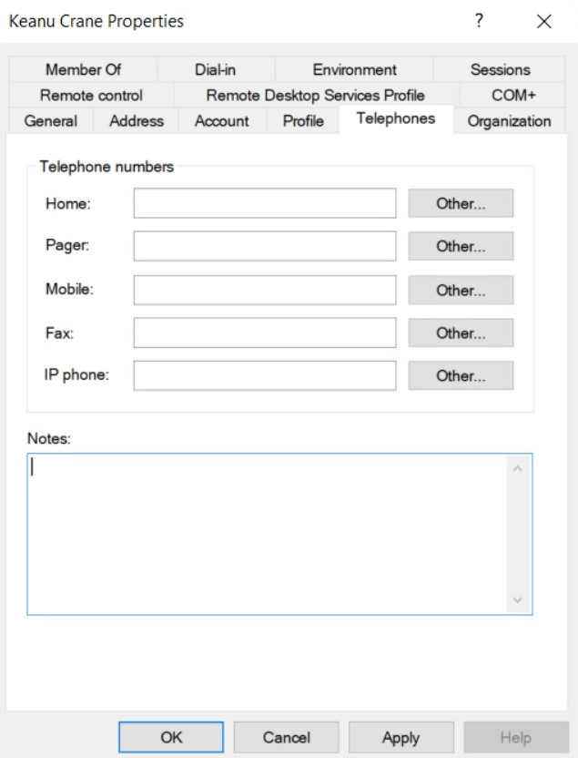](images/ad_users_and_comp/ad_users57.jpg)

The **Organization** tab in a user’s properties in Active Directory Users and Computers (ADUC) is used to specify details related to the user's position within the organization, including their job title, department, and managerial structure. This information is valuable for creating a structured, searchable directory that reflects the organizational hierarchy and helps facilitate internal communication.

Here’s a breakdown of each field within the Organization tab:

**Job Title**

Purpose: Specifies the user’s role or position within the organization.

Use Case: This field helps identify the user’s job function and can be used for search and filtering in directory services, such as the global address list in Microsoft Exchange. It’s also helpful for generating organization charts or reports.

**Department**

Purpose: Indicates the department to which the user belongs (e.g., Marketing, IT, Finance).

Use Case: This field provides context on the user’s function within the organization and can be used for department-based searches or applying group policies and permissions tailored to specific departments.

**Company**

Purpose: Specifies the name of the company or organization the user works for, particularly useful in multi-company environments within the same Active Directory.

Use Case: This is helpful when a single AD environment is used for multiple companies, divisions, or subsidiaries, enabling filtering or grouping by company.

**Manager**

Purpose: Links the user to their direct manager in the organizational hierarchy. This field allows you to specify another user account as the manager.

Use Case: The Manager field is valuable for defining reporting structures, generating organizational charts, and improving workflows in applications like Microsoft Outlook, which can use this information to route approvals, send notifications, or set up communication hierarchies.

**Direct Reports**

Purpose: Although not directly editable in the Organization tab, the Direct Reports field shows users who report to this user if they are listed as their manager in their profiles.

Use Case: This field provides a quick view of the user’s subordinates, if any, helping to visualize the organization’s structure. It’s automatically populated based on entries in the Manager field of other users.

The **Remote Control** tab in Active Directory Users and Computers (ADUC) is specifically used in environments where Remote Desktop Services (RDS) (previously known as Terminal Services) are deployed. This tab allows administrators to configure settings for remotely controlling or monitoring a user’s session on a terminal server.

**Enable Remote Control**

Purpose: Activates the ability for an administrator to view or interact with the user’s session on an RDS server.

Use Case: When enabled, administrators can observe or take control of a user’s session, which can be helpful for troubleshooting, training, or providing support.

**Require User’s Permission**

Purpose: Prompts the user to grant permission before an administrator can view or control their session.

Use Case: This option respects user privacy and ensures that users are aware of and consent to remote control actions.

**Level of Control**

View Session: Allows administrators to only view the user’s session without interacting, useful for monitoring or training.

Interact with Session: Allows administrators to fully control the session, including input via keyboard and mouse. This is helpful for hands-on troubleshooting or guiding the user through complex tasks.

**Use Hotkey to Terminate Control**

Purpose: Specifies a key combination (e.g., Ctrl+*) to terminate the remote control session.

Use Case: Provides a quick way for either the user or administrator to end the session, particularly if issues arise or the session needs to be concluded abruptly.

The **Remote Desktop Services Profile** tab in Active Directory Users and Computers (ADUC) is used to configure settings specific to a user's profile when they connect to Remote Desktop Services (RDS) or Terminal Services. This tab is valuable in environments where users regularly access remote desktop sessions, allowing administrators to define custom profiles, home directories, and session settings specific to RDS.

**Profile Path**

Purpose: Specifies a separate roaming profile path specifically for Remote Desktop Services sessions. This path is used only when the user logs into an RDS session, allowing administrators to provide a different desktop environment for RDS compared to their standard workstation login.

Format: Typically in the format \\ServerName\RDSProfiles\%username%, where %username% substitutes the user’s logon name.

Use Case: Useful for keeping the RDS profile environment isolated from the local desktop environment, preventing settings conflicts and ensuring a smoother RDS experience.

[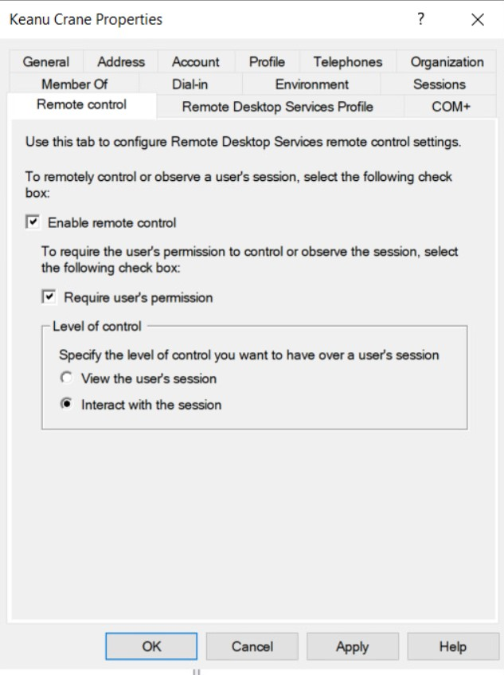](images/ad_users_and_comp/ad_users58.jpg)

The **Remote Desktop Services Profile** tab in Active Directory Users and Computers (ADUC) is used to configure settings specific to a user's profile when they connect to Remote Desktop Services (RDS) or Terminal Services. This tab is valuable in environments where users regularly access remote desktop sessions, allowing administrators to define custom profiles, home directories, and session settings specific to RDS.

**Profile Path**

Purpose: Specifies a separate roaming profile path specifically for Remote Desktop Services sessions. This path is used only when the user logs into an RDS session, allowing administrators to provide a different desktop environment for RDS compared to their standard workstation login.

Format: Typically in the format \\ServerName\RDSProfiles\%username%, where %username% substitutes the user’s logon name.

Use Case: Useful for keeping the RDS profile environment isolated from the local desktop environment, preventing settings conflicts and ensuring a smoother RDS experience.

**Remote Desktop Services Home Folder**

Purpose: Defines a specific home folder that the user accesses when using RDS. This can be different from their standard AD home folder and can be mapped to a particular drive letter in the remote session.

Options:
Local Path: Specifies a local directory on the RDS server.

Connect: Maps a network location as a specified drive (e.g., H:).

Use Case: Helps keep RDS files and data separate from standard local sessions, providing a dedicated location for users to store files created or used within the RDS environment.

**Allow Logon to Remote Desktop Services**

Purpose: Controls whether the user is permitted to log on to Remote Desktop Services. Enabling this option allows the user to initiate RDS sessions.

Use Case: Typically enabled for users who regularly access RDS but may be disabled for accounts that don’t require remote access, such as certain service accounts or limited-access accounts.

**Remote Control**

Purpose: Configures remote control settings for the user's RDS sessions, similar to the Remote Control tab. It allows administrators to view or control the user’s RDS session for support purposes.

Options:

Require User’s Permission: Requests the user’s consent before initiating a remote control session.

Level of Control: Choose between viewing-only or full interactive control.

Use Case: Useful for providing technical support and troubleshooting RDS sessions.

**Time Zone Redirection**

Purpose: Allows the user’s remote session to match the time zone of their local machine instead of the server’s time zone.

Use Case: Particularly helpful for users in different time zones than the RDS server, ensuring the correct time is displayed in their sessions.

[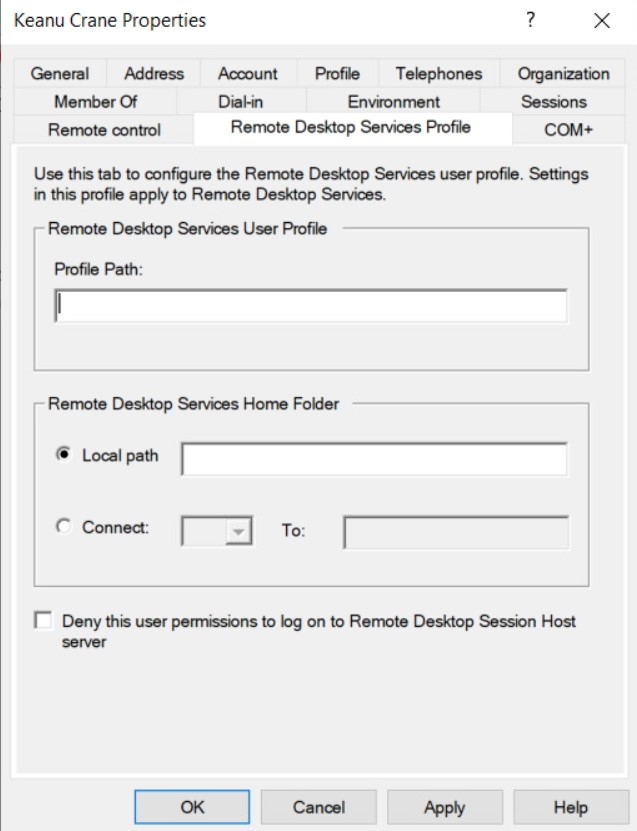](images/ad_users_and_comp/ad_users59.jpg)

The **COM+** tab in Active Directory Users and Computers (ADUC) is used to manage COM+ (Component Object Model Plus) permissions for a user or group. COM+ is a Microsoft technology that provides a framework for developing and deploying distributed applications and services, allowing software components to communicate across networks. This tab is relatively advanced and is typically used in enterprise environments with custom applications that rely on COM+ components.

**Purpose of the COM+ Tab**

The COM+ tab allows administrators to specify which COM+ applications or roles a user or group has permission to access. These permissions control access to specific distributed application components that may rely on COM+ for communication and functionality. It’s especially relevant in scenarios where applications or services require users or groups to have specific access to underlying COM+ components.

**Key Components of the COM+ Tab**

Applications and Roles Assignment

- **Applications**: The COM+ tab displays a list of COM+ applications available on the network. Each application represents a group of components that may require permission for certain users to access.

- **Roles**: Within each COM+ application, roles define specific permissions or access levels. By assigning a user to a role, you can control their level of access to that application.

- **Use Case**: For example, if a financial application relies on a COM+ component for reporting, users who need access to this reporting functionality might be assigned to a specific role for that application through the COM+ tab.

**Assigning Permissions**

Administrators can use the COM+ tab to add or remove a user’s permissions to specific COM+ applications and roles. This assignment ensures that only authorized users can interact with critical components of distributed applications.

**When to Use the COM+ Tab**

The COM+ tab is generally used in advanced scenarios, such as:

**Custom Enterprise Applications**: If the organization has applications developed with dependencies on COM+ components, permissions can be managed through this tab.

**Distributed Application Security**: Assigning COM+ permissions helps secure distributed applications by limiting user access to only the necessary components.

**Service Accounts**: Often, service accounts for applications or automated tasks are assigned COM+ permissions to allow them to interact with specific application components on behalf of users or processes.

[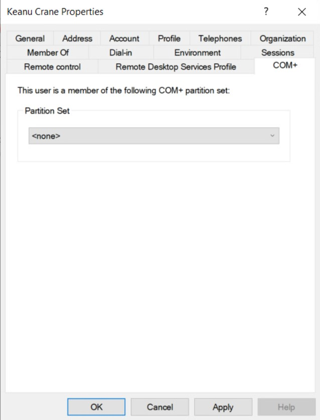](images/ad_users_and_comp/ad_users60.jpg)

The **Member Of** tab in a user’s properties within Active Directory Users and Computers (ADUC) displays and manages the group memberships for that user. This tab is essential for controlling a user's permissions, access rights, and roles within the domain by making them part of specific security or distribution groups.

**Purpose of the Member Of Tab**

The Member Of tab lists all the groups to which the user currently belongs. By adding or removing a user from groups, administrators can manage what resources, permissions, and capabilities the user has access to across the network.

**Key Components of the Member Of Tab**

Group Membership List

This list shows all groups that the user is a member of, including both security groups (which control access to resources) and distribution groups (used for email distribution lists).
Use Case: Viewing a user’s group memberships is helpful when troubleshooting permissions issues or auditing access rights, as it provides a quick overview of all resources and permissions the user can access through their group affiliations.

**Add Button**

Allows administrators to add the user to additional groups. Clicking Add opens a dialog where you can search for and select one or more groups.
Use Case: Assigning a user to a new group might grant them access to additional shared folders, applications, or resources, or include them in new distribution lists for organizational communications.

**Remove Button**

Allows administrators to remove the user from selected groups. Highlight the group in the list and click Remove to revoke membership.
Use Case: Removing a user from a group may be necessary when they no longer require access to certain resources, such as when transferring departments or changing roles.

**Primary Group**

In AD, each user has a primary group (usually Domain Users by default). The Primary Group setting in the Member Of tab allows administrators to change this primary group, but it is rarely necessary for most environments.

Use Case: Changing the primary group is generally only relevant in environments that use UNIX or POSIX compatibility, where the primary group determines the user's default group for file permissions.

**Types of Groups in Member Of Tab**

Security Groups: Used to assign permissions to resources such as files, folders, and printers. When a user is a member of a security group, they inherit the permissions associated with that group.

Distribution Groups: Primarily used for email distribution lists, allowing users to receive emails sent to the group. Distribution groups do not grant permissions to resources.

**Benefits of Using the Member Of Tab**

Centralized Permissions Management: By managing group memberships, you can assign and revoke access to resources efficiently without adjusting permissions for each user individually.

Streamlined Role Management: Adding users to groups based on their roles (e.g., “IT Department,” “Managers”) ensures they have the right permissions and receive relevant communications.

Easier Auditing and Compliance: The Member Of tab provides a quick view of all the groups a user belongs to, which is helpful for access reviews, security audits, and ensuring compliance with organizational policies.

[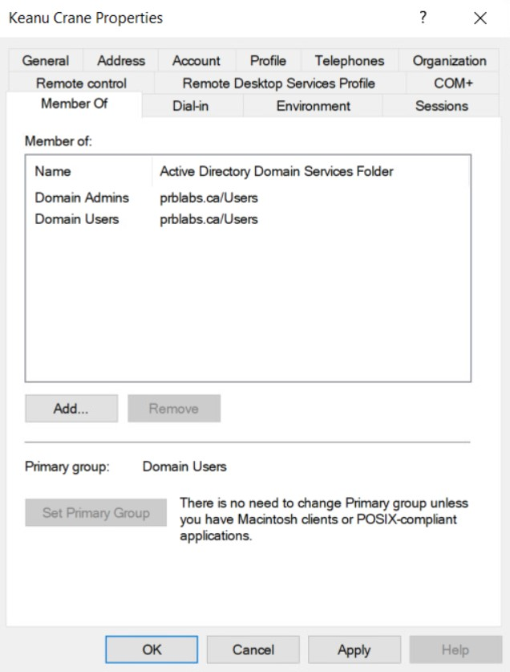](images/ad_users_and_comp/ad_users61.jpg)

The **Dial-in** tab in a user’s properties within Active Directory Users and Computers (ADUC) is used to configure settings related to remote access permissions for that user, typically in the context of dial-up or VPN (Virtual Private Network) connections. This tab is especially useful for controlling and managing remote access to the network, allowing administrators to grant or restrict access and set connection-specific options for users.

**Network Access Permission**

Options:

Allow access: Grants the user permission to connect to the network remotely using dial-up or VPN.

Deny access: Explicitly denies the user permission for remote access, preventing them from connecting via dial-up or VPN.

Control access through NPS Network Policy: Defers access control to Network Policy Server (NPS) policies, formerly known as Remote Access Policies. This is the default setting in many environments, where remote access permissions are managed centrally through NPS.

Use Case: This setting determines whether the user can access the network remotely. In organizations that require secure access, it’s common to use NPS policies to enforce remote access rules based on group memberships, device health checks, and other criteria.

**Verify Caller ID**

Purpose: Specifies a caller ID number for the user, meaning the server will only allow connections from that specific phone number.

Use Case: This feature is primarily used in dial-up scenarios to enhance security by ensuring that only calls from an authorized number can connect. It’s less commonly used in modern VPN setups but can still be relevant in specialized environments.

**Callback Options**

Options:

No callback: No callback will occur, and the user can connect immediately.

Set by caller: The user provides a callback number, and the server will call back to that number after initial authentication. This is used to verify the user’s identity and provide a cost-effective way for remote users to connect (especially relevant in dial-up setups).

Always callback to: Specifies a predefined callback number to which the server will call back after the initial connection.

Use Case: Callback options add an extra layer of security by verifying the caller’s location or providing controlled, cost-efficient connections for remote users. While primarily for dial-up connections, some organizations may use similar methods for VPN security if a callback system is part of their security protocol.

**Apply Static IP Address**

Purpose: Assigns a specific, static IP address to the user’s remote connection. When enabled, the specified IP address will be used for that user’s VPN or dial-up sessions.

Use Case: This is useful in environments where specific IP addresses are required for access control lists, firewall rules, or application configurations. Assigning a static IP ensures consistency in the user's network identity each time they connect.

**Apply Static Routes**

Purpose: Allows administrators to define specific routes that are applied to the user’s connection when they connect remotely.

Use Case: Static routes are helpful when certain network segments need to be accessible through the remote connection. This can ensure that the user has access only to specific parts of the network based on the routing configuration.

[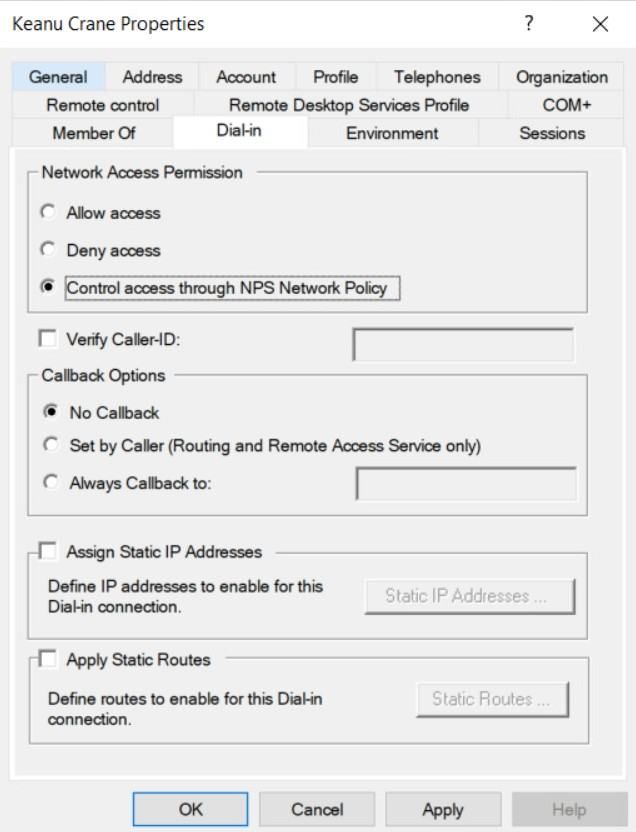](images/ad_users_and_comp/ad_users62.jpg)

The **Environment** tab in a user’s properties within Active Directory Users and Computers (ADUC) is primarily used to configure settings for Remote Desktop Services (RDS), also known as Terminal Services. The settings in this tab help control the user’s experience when connecting to remote desktops or applications, allowing administrators to customize aspects of the environment the user will encounter during their session.

**Starting Program**

Start the following program at logon: This option allows administrators to specify a particular application or program that will automatically launch when the user logs into an RDS session.

Program path and file name: Specifies the path to the executable that will start upon login (e.g., C:\Program Files\AppName\App.exe).

Start in: Specifies the working directory for the program (e.g., C:\Program Files\AppName).

Use Case: This is useful in scenarios where users only need access to a single application (such as a specific business or data entry application). Instead of presenting the full desktop, this option starts the specified program, and the session will log off once the user closes it. This setup simplifies the user experience and limits access to only what’s necessary for their tasks.

**Client Device Redirection**

These options allow administrators to control whether certain local resources from the user’s device can be redirected (accessed or used) within the RDS session.

Connect client drives at logon: When enabled, this setting automatically connects the user’s local drives (such as C: or USB drives) in the remote session. This allows the user to access files on their local drives directly from the remote environment.

Use Case: Useful in situations where users need access to documents or files stored locally on their own machines while working in a remote session. This can improve productivity but may have security implications if sensitive files are transferred.
Connect client printers at logon: When enabled, this option automatically redirects the user’s locally installed printers, making them available within the remote session.

Use Case: Particularly helpful for remote workers who need to print documents locally from a remote session. This setting allows them to use their own printers without requiring additional configurations.

Default to main client printer: This setting, when enabled, makes the user’s default local printer their default printer within the remote session.

Use Case: Simplifies the user experience by ensuring their default printer remains the same in both local and remote environments, reducing confusion and time spent switching printers.

**Remote Desktop Session Configuration Options**

Override user settings: This option forces the Environment tab settings to apply to this user, regardless of other settings they might have.

Use Case: Ensures that the settings defined in this tab will apply to the user’s session even if they have custom configurations elsewhere, which is useful for enforcing specific requirements for particular roles or environments.

[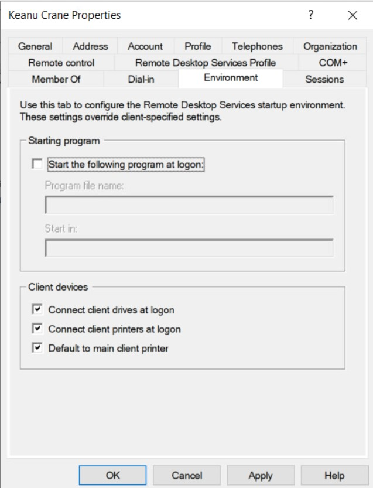](images/ad_users_and_comp/ad_users63.jpg)

The **Session** tab in a user’s properties within Active Directory Users and Computers (ADUC) is used to configure Remote Desktop Services (RDS) session settings for that user. These settings help manage the duration and behavior of remote sessions, allowing administrators to control session time limits, disconnection behavior, and reconnection options. Configuring these options can improve resource management on RDS servers and enhance security by controlling inactive or disconnected sessions.

**Session Limit Settings**

These settings control how long a user’s RDS session can remain active, idle, or disconnected before specific actions are taken.

End a disconnected session: Specifies the maximum amount of time an RDS session can remain disconnected before it is automatically ended (logged off).

Options: Times can be set to specific durations, such as 5, 10, 30 minutes, 1 hour, or Never (default).

Use Case: Automatically ending disconnected sessions can free up server resources and improve performance, especially on shared or limited-capacity RDS servers.

Active session limit: Sets a time limit on how long a user can remain actively connected in a single RDS session.

Options: Options include predefined durations (e.g., 2 hours, 4 hours) or Unlimited (no limit).

Use Case: Limiting active session time is useful in environments where users should not remain connected indefinitely or need to be automatically logged out after a certain period.

Idle session limit: Defines the maximum time a session can remain idle (no activity) before it is automatically disconnected or ended.

Options: Options include various durations or Unlimited.

Use Case: Automatically disconnecting or ending idle sessions helps conserve server resources by freeing up inactive sessions and improving security.

**Session Reconnection Settings**

These settings control how a user can reconnect to an RDS session if they disconnect.

When session limit is reached or connection is broken: Specifies what happens when the session duration limit is reached or if the user’s connection is unexpectedly broken.

Options:

Disconnect from session: Keeps the session open but in a disconnected state, allowing the user to reconnect later.

End session: Logs the user out entirely, ending the session and requiring a new login next time.

Use Case: Setting the option to Disconnect allows users to reconnect to their existing session, which can be useful for continuity. End session is helpful when security policies require users to re-authenticate if they are disconnected.

Allow reconnection: Controls whether the user can reconnect to their session and, if so, from where.

**Options:**

From any client: Allows the user to reconnect from any device.

From the same client: Limits the user to reconnecting from the same device they originally connected from.

Use Case: This setting is useful in secure environments where users should only reconnect from a specific device, adding an extra layer of control and security over session continuity.

**Override User Settings**

Override user settings: When checked, this option forces the Session tab settings to apply to this user, even if there are other session policies in place.

Use Case: This setting is useful for enforcing specific session configurations for certain users, regardless of broader RDS policies, to meet security or resource management needs.

[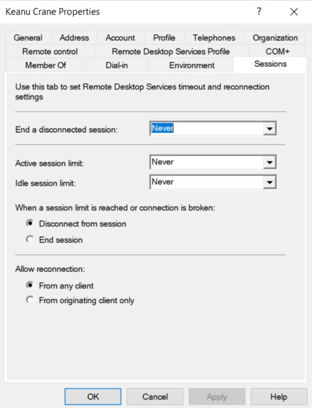](images/ad_users_and_comp/ad_users64.jpg)

### Logging in with an Active Directory Users