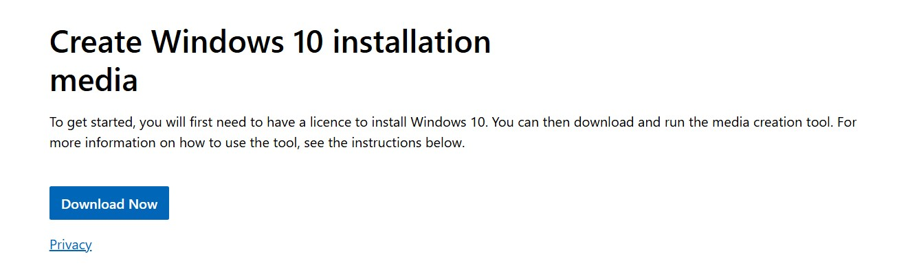

## Creating a Windows 10 Virtual Machine on VMWare ESXi

This guide will walk you through creating a Windows 10 Virtual Machine inside of VMWare ESXi.

### Download the Windows 10 ISO file

My VMWare Server is located at the IP Address: https://10.10.10.50.

This is a small diagram as the how my network is connected.

First you're going to need to Download the Windows 10 Virtual Machine. You can get a free copy of Windows 10 from: https://www.microsoft.com/en-ca/software-download/windows10

Simply download the Windows 10 Media Creation tool:

Open the tool and then hit Accept at the first option:

Then next on **Create Installation media (USB Flash Drive, DVD, or ISO File) for another PC** to begin the download.

Select next on the **Select language, architecture, and edition**

Select **ISO file** and click next.

Choose the location for your download and click next to begin the download.

Click **Finish** once the download is completed

### Uploading the ISO to VMWare

Log into your ESXi instance. For me, all of my ISO files are stored in: **Storage > VMware-ISO-Storage**, then click upload

Find the location for the Windows 10 ISO and click **Open**

Once the upload is completed, your ISO file will be available for use.

### Creating a Windows 10 Virtual Machine

Ensure you're at the Virtual Machine Tab, then click **Create/Register VM**

At the **Select creation type** click **Create a new virtual machine** then click **NEXT**

Enter and select the following:

- Name: Win10-1
- Compatibility: ESXi 8.0.U2 Virtual Machine
- Guest OS family: Windows
- Guest OS version: Microsoft Windows 10 (64-bit)

Select a storage location for your Virtual Machine and click next:

